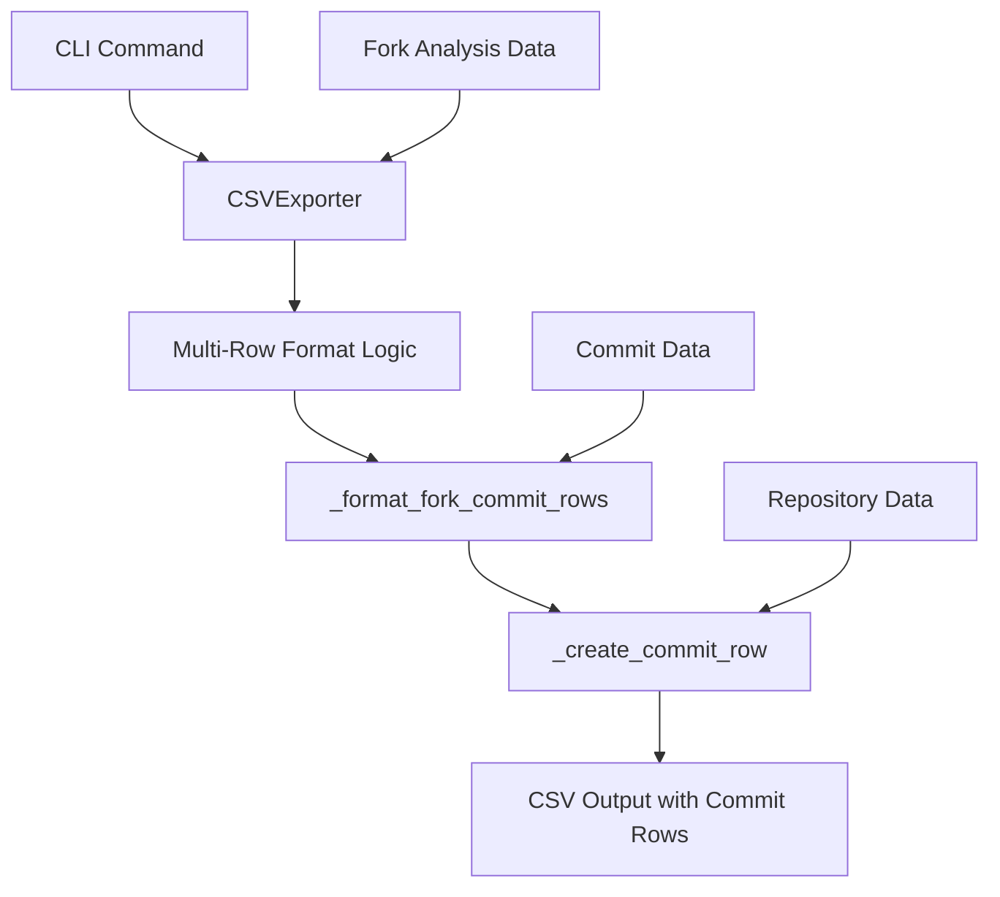

# Design Document

## Overview

The CSV export commit enhancement replaces the existing Forkscout CSV export functionality to provide better commit data representation. The design transforms the current single-row-per-fork format into a more granular multi-row format where each commit gets its own row, while maintaining complete repository context on every row.

This enhancement modifies the existing CSV export system by updating the `CSVExporter` class methods to use the new multi-row format as the default and only behavior.

## Architecture

The enhancement builds upon the existing CSV export architecture with minimal changes to the core system:



### Core Components

1. **Updated CSVExporter**: Modified to use multi-row format by default
2. **Multi-Row Formatter**: New methods for creating commit-based rows
3. **Commit Row Generator**: Logic for expanding fork data into multiple commit rows
4. **Enhanced Column Headers**: New column structure for commit-specific data
5. **Simplified Export Logic**: Single format approach without configuration complexity

## Data Model Extensions

### Updated CSVExportConfig

```python
@dataclass
class CSVExportConfig:
    # Existing fields remain unchanged...
    max_commits_per_fork: int = 10
    """Maximum number of commits to include per fork (existing field)."""
    
    commit_date_format: str = "%Y-%m-%d"
    """Date format for commit dates in CSV output."""
```

### New Column Structure

**New Multi-Row Format (replaces old format):**
- fork_name, owner, stars, forks_count, commits_ahead, commits_behind, is_active, features_count, commit_date, commit_sha, commit_description

**Key Changes:**
- Removed: recent_commits column (concatenated data)
- Added: commit_date, commit_sha, commit_description columns (separate data)
- Result: Each commit gets its own row with complete fork context

## Implementation Strategy

### Phase 1: Configuration Enhancement

1. **Update CSVExportConfig**: Add `commit_date_format` option for date formatting
2. **Remove Old Logic**: Clean up existing recent_commits column handling
3. **Configuration Validation**: Ensure new configuration options are properly validated

### Phase 2: Multi-Row Formatting Logic

1. **Create Commit Row Expansion**: Implement logic to expand single fork into multiple commit rows
2. **Repository Data Duplication**: Ensure fork metadata is consistently repeated across commit rows
3. **Commit Data Extraction**: Extract individual commit information (date, SHA, message)
4. **Empty Row Handling**: Handle forks with no commits gracefully

### Phase 3: CSV Generation Enhancement

1. **Enhanced Header Generation**: Create new column headers for multi-row format
2. **Row Generation Logic**: Implement commit-based row creation
3. **Data Consistency**: Ensure repository data is identical across all commit rows for the same fork
4. **CSV Escaping**: Properly handle special characters in commit messages

### Phase 4: Integration and Testing

1. **CLI Command Integration**: Update all CSV export commands to use new format
2. **Legacy Code Removal**: Remove old single-row formatting methods
3. **Error Handling**: Implement robust error handling for edge cases
4. **Performance Optimization**: Optimize for large datasets with many commits

## Detailed Design

### Multi-Row Format Generation

```python
def _generate_fork_commit_rows(self, analysis: ForkAnalysis) -> List[Dict[str, Any]]:
    """Generate multiple rows for a fork, one per commit."""
    base_fork_data = self._extract_base_fork_data(analysis)
    commits = self._get_commits_for_export(analysis)
    
    if not commits:
        # Create single row with empty commit columns
        return [self._create_empty_commit_row(base_fork_data)]
    
    rows = []
    for commit in commits:
        commit_row = base_fork_data.copy()
        commit_row.update({
            'commit_date': self._format_commit_date(commit.date),
            'commit_sha': commit.sha[:7],  # Short SHA
            'commit_description': self._escape_commit_message(commit.message)
        })
        rows.append(commit_row)
    
    return rows

def _extract_base_fork_data(self, analysis: ForkAnalysis) -> Dict[str, Any]:
    """Extract repository data that will be repeated across commit rows."""
    fork = analysis.fork
    repo = fork.repository
    
    return {
        'fork_name': repo.name,
        'owner': fork.owner.login,
        'stars': repo.stars,
        'forks_count': repo.forks_count,
        'commits_ahead': fork.commits_ahead,
        'commits_behind': fork.commits_behind,
        'is_active': fork.is_active,
        'features_count': len(analysis.features),
        # Include other fork metadata as needed
    }

def _create_empty_commit_row(self, base_data: Dict[str, Any]) -> Dict[str, Any]:
    """Create a row for forks with no commits."""
    row = base_data.copy()
    row.update({
        'commit_date': '',
        'commit_sha': '',
        'commit_description': ''
    })
    return row
```

### Enhanced Column Headers

```python
def _generate_enhanced_fork_analysis_headers(self) -> List[str]:
    """Generate headers for multi-row commit format."""
    headers = [
        'fork_name',
        'owner', 
        'stars',
        'forks_count',
        'commits_ahead',
        'commits_behind',
        'is_active',
        'features_count'
    ]
    
    if self.config.include_urls:
        headers.extend(['fork_url', 'owner_url'])
    
    if self.config.detail_mode:
        headers.extend([
            'language',
            'description',
            'last_activity',
            'created_date',
            'updated_date',
            'pushed_date',
            'size_kb',
            'open_issues',
            'is_archived',
            'is_private'
        ])
    
    # Add commit-specific columns
    headers.extend([
        'commit_date',
        'commit_sha', 
        'commit_description'
    ])
    
    if self.config.include_urls:
        headers.append('commit_url')
    
    return headers
```

### Commit Message Escaping

```python
def _escape_commit_message(self, message: str) -> str:
    """Properly escape commit message for CSV output."""
    if not message:
        return ''
    
    # Remove or replace newlines
    cleaned_message = message.replace('\n', ' ').replace('\r', ' ')
    
    # Remove extra whitespace
    cleaned_message = ' '.join(cleaned_message.split())
    
    # The CSV writer will handle quote escaping automatically
    return cleaned_message

def _format_commit_date(self, date: datetime | None) -> str:
    """Format commit date for CSV output."""
    if date is None:
        return ''
    return date.strftime(self.config.commit_date_format)
```

## Integration Points

### CLI Command Enhancement

```python
@click.option(
    '--commit-rows',
    is_flag=True,
    default=False,
    help='Create separate rows for each commit instead of single fork rows'
)
def analyze(repo_url: str, commit_rows: bool, **kwargs):
    """Enhanced analyze command with commit rows support."""
    config = CSVExportConfig(
        commit_rows_enabled=commit_rows,
        # ... other config options
    )
    # ... rest of command implementation
```

### Backward Compatibility

The design ensures complete backward compatibility:

1. **Default Behavior**: When `--commit-rows` is not specified, the system uses the existing format
2. **Configuration Isolation**: New configuration options don't affect existing functionality
3. **Method Preservation**: Existing CSV export methods remain unchanged
4. **Output Format**: Traditional single-row format is preserved exactly

## Error Handling Strategy

### Graceful Degradation

1. **Missing Commit Data**: When commit information is unavailable, create rows with empty commit columns
2. **Invalid Dates**: Handle malformed or missing dates by using empty values
3. **Large Messages**: Handle very long commit messages without truncation
4. **Special Characters**: Properly escape CSV special characters in all text fields

### Error Recovery

```python
def _safe_format_commit_row(self, base_data: Dict[str, Any], commit: Commit) -> Dict[str, Any]:
    """Safely format a commit row with error handling."""
    try:
        return self._format_commit_row(base_data, commit)
    except Exception as e:
        logger.warning(f"Error formatting commit {commit.sha}: {e}")
        # Return row with empty commit data
        return self._create_empty_commit_row(base_data)
```

## Performance Considerations

### Memory Optimization

1. **Streaming Processing**: Process commits in batches to avoid memory issues with large datasets
2. **Data Reuse**: Efficiently reuse base fork data across multiple commit rows
3. **Lazy Loading**: Only load commit details when multi-row format is requested

### Processing Efficiency

1. **Minimal Duplication**: Optimize repository data duplication across rows
2. **Batch Operations**: Group similar operations for better performance
3. **Early Filtering**: Apply commit limits before row generation

## Testing Strategy

### Unit Tests

1. **Configuration Tests**: Verify new configuration options work correctly
2. **Row Generation Tests**: Test multi-row generation with various commit scenarios
3. **Escaping Tests**: Verify proper CSV escaping of special characters
4. **Edge Case Tests**: Test with empty commits, missing dates, and malformed data

### Integration Tests

1. **CLI Integration**: Test new `--commit-rows` flag with various commands
2. **Format Comparison**: Compare traditional and enhanced formats for consistency
3. **Large Dataset Tests**: Verify performance with repositories having many commits
4. **Real Data Tests**: Test with actual repository data to ensure robustness

### Compatibility Tests

1. **Backward Compatibility**: Ensure existing functionality remains unchanged
2. **Spreadsheet Import**: Test CSV imports in Excel, Google Sheets, and other tools
3. **Data Analysis**: Verify enhanced format works well with common analysis workflows

## Migration and Deployment

### Rollout Strategy

1. **Feature Flag**: Deploy with feature disabled by default
2. **Gradual Enablement**: Allow users to opt-in via CLI flag
3. **Documentation**: Provide clear examples of both formats
4. **Feedback Collection**: Gather user feedback on enhanced format usability

### Documentation Updates

1. **CLI Help**: Update command help text to describe new flag
2. **README Examples**: Add examples showing both CSV formats
3. **Migration Guide**: Help users understand when to use each format
4. **Best Practices**: Provide guidance on analyzing the enhanced CSV format

This design provides a comprehensive enhancement to the CSV export functionality while maintaining full backward compatibility and ensuring robust handling of edge cases.