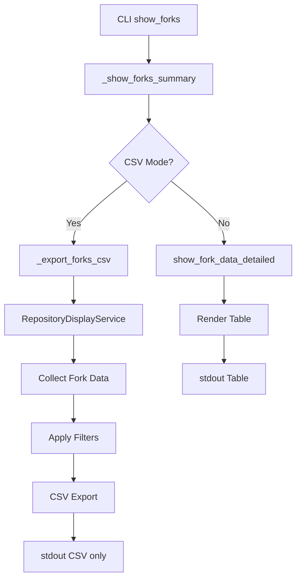
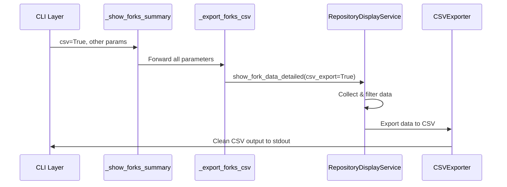

# Design Document

## Overview

This design addresses the CSV export bug in the `forklift show-forks` command where the `--csv` flag fails to properly suppress table output and export collected data. The issue stems from incorrect flow control between the CLI layer, repository display service, and CSV export components.

## Root Cause Analysis

### Current Problem Flow

1. **CLI Layer**: `show_forks()` command detects `--csv` flag and sets `csv=True`
2. **Display Service**: `_show_forks_summary()` calls `display_service.show_fork_data_detailed()` with `csv_export=False` (incorrect)
3. **Repository Display**: `show_fork_data_detailed()` renders table instead of CSV due to incorrect parameter
4. **CSV Export**: `_export_forks_csv()` is called but receives empty or incorrect data
5. **Result**: Table is displayed + "No data to export" message

### Key Issues Identified

1. **Parameter Mismatch**: The `csv` parameter from CLI is not properly passed as `csv_export` to display service methods
2. **Flow Control**: CSV export logic is executed after table rendering instead of replacing it
3. **Data Loss**: Collected fork data is not properly passed to CSV export functions
4. **Output Mixing**: Table output and CSV output are both sent to stdout

## Architecture

### Component Interaction Flow



### Data Flow Correction



## Components

### 1. CLI Layer Fixes (`src/forklift/cli.py`)

#### Modified `_show_forks_summary()` Function

```python
async def _show_forks_summary(
    config: ForkliftConfig,
    repository_url: str,
    max_forks: int | None,
    verbose: bool,
    detail: bool = False,
    show_commits: int = 0,
    force_all_commits: bool = False,
    ahead_only: bool = False,
    csv: bool = False,
    interaction_mode: InteractionMode = InteractionMode.FULLY_INTERACTIVE,
    supports_prompts: bool = True,
) -> None:
    """Show forks summary with corrected CSV export flow."""
    
    async with GitHubClient(config.github) as github_client:
        # Create console for stderr output only in CSV mode
        if csv:
            # In CSV mode, use stderr for any status messages
            status_console = Console(file=sys.stderr, soft_wrap=False, width=None)
            content_console = Console(file=sys.stdout, soft_wrap=False, width=None)
        else:
            # Normal mode uses stdout for content
            status_console = Console(file=sys.stderr, soft_wrap=False, width=None)
            content_console = Console(file=sys.stdout, soft_wrap=False, width=None)
        
        display_service = RepositoryDisplayService(github_client, content_console)
        
        try:
            if csv:
                # CSV export mode - direct to CSV processing
                await _export_forks_csv(
                    display_service,
                    repository_url,
                    max_forks,
                    detail,
                    show_commits,
                    force_all_commits,
                    ahead_only
                )
            else:
                # Normal table display mode
                if detail:
                    fork_data_result = await display_service.show_fork_data_detailed(
                        repository_url,
                        max_forks=max_forks,
                        disable_cache=False,
                        show_commits=show_commits,
                        force_all_commits=force_all_commits,
                        ahead_only=ahead_only,
                        csv_export=False,  # Explicitly set to False for table mode
                    )
                else:
                    fork_data_result = await display_service.show_fork_data(
                        repository_url,
                        exclude_archived=False,
                        exclude_disabled=False,
                        sort_by="stars",
                        show_all=True,
                        disable_cache=False,
                        show_commits=show_commits,
                        force_all_commits=force_all_commits,
                        ahead_only=ahead_only,
                        csv_export=False,  # Explicitly set to False for table mode
                    )
                
                # Display summary only in non-CSV mode
                if verbose:
                    total_forks = fork_data_result["total_forks"]
                    displayed_forks = fork_data_result["displayed_forks"]
                    api_calls_made = fork_data_result.get("api_calls_made", 0)
                    content_console.print(
                        f"\n[green]✓ Displayed {displayed_forks} of {total_forks} forks[/green]"
                    )
                    if detail:
                        content_console.print(
                            f"[blue]Made {api_calls_made} additional API calls for commit comparison[/blue]"
                        )

        except Exception as e:
            logger.error(f"Failed to display forks data: {e}")
            if isinstance(e, (ForkliftOutputError, ForkliftUnicodeError)):
                raise
            elif isinstance(e, UnicodeError):
                raise ForkliftUnicodeError(f"Unicode error in fork display: {e}")
```

#### Modified `_export_forks_csv()` Function

```python
async def _export_forks_csv(
    display_service: "RepositoryDisplayService",
    repository_url: str,
    max_forks: int | None,
    detail: bool,
    show_commits: int,
    force_all_commits: bool,
    ahead_only: bool
) -> None:
    """Export fork data in CSV format with corrected data flow."""
    
    from forklift.reporting.csv_exporter import CSVExportConfig
    from forklift.reporting.csv_output_manager import create_csv_context
    
    try:
        # Configure CSV export with multi-row format
        csv_config = CSVExportConfig(
            include_commits=(show_commits > 0),
            detail_mode=detail,
            include_explanations=False,
            max_commits_per_fork=min(show_commits, 10) if show_commits > 0 else 0,
            escape_newlines=True,
            include_urls=True,
            date_format="%Y-%m-%d %H:%M:%S",
            commit_date_format="%Y-%m-%d"
        )
        
        # Create CSV output context to suppress progress indicators
        with create_csv_context(suppress_progress=True) as csv_manager:
            csv_manager.configure_exporter(csv_config)
            
            # Collect fork data with CSV export mode enabled
            if detail:
                fork_data_result = await display_service.show_fork_data_detailed(
                    repository_url,
                    max_forks=max_forks,
                    disable_cache=False,
                    show_commits=show_commits,
                    force_all_commits=force_all_commits,
                    ahead_only=ahead_only,
                    csv_export=True,  # Enable CSV export mode
                )
            else:
                fork_data_result = await display_service.show_fork_data(
                    repository_url,
                    exclude_archived=False,
                    exclude_disabled=False,
                    sort_by="stars",
                    show_all=True,
                    disable_cache=False,
                    show_commits=show_commits,
                    force_all_commits=force_all_commits,
                    ahead_only=ahead_only,
                    csv_export=True,  # Enable CSV export mode
                )
            
            # Extract fork data for CSV export
            if fork_data_result and "collected_forks" in fork_data_result:
                collected_forks = fork_data_result["collected_forks"]
                if collected_forks:
                    # Convert collected fork data to format expected by CSV exporter
                    csv_data = _convert_collected_forks_to_csv_format(
                        collected_forks, show_commits, detail
                    )
                    csv_manager.export_to_stdout(csv_data)
                else:
                    # Export empty CSV with headers only
                    csv_manager.export_empty_csv_with_headers()
            else:
                # Export empty CSV with headers only
                csv_manager.export_empty_csv_with_headers()
                
    except UnicodeError as e:
        raise ForkliftUnicodeError(f"Unicode error in CSV export: {e}")
    except Exception as e:
        if isinstance(e, (ForkliftOutputError, ForkliftUnicodeError)):
            raise
        else:
            raise ForkliftOutputError(f"CSV export failed: {e}")
```

### 2. Repository Display Service Fixes (`src/forklift/display/repository_display_service.py`)

#### Modified `show_fork_data_detailed()` Method

```python
async def show_fork_data_detailed(
    self,
    repo_url: str,
    max_forks: int | None = None,
    disable_cache: bool = False,
    show_commits: int = 0,
    force_all_commits: bool = False,
    ahead_only: bool = False,
    csv_export: bool = False,
) -> dict[str, Any]:
    """Display detailed fork data with exact commit counts ahead."""
    
    # ... existing data collection logic ...
    
    # Key fix: Only render table if NOT in CSV export mode
    if not csv_export:
        table_context = {
            "owner": owner,
            "repo": repo_name,
            "has_exact_counts": True,
            "mode": "detailed",
            "api_calls_made": total_api_calls,
            "api_calls_saved": api_calls_saved,
            "qualification_result": qualification_result,
            "fork_data_list": detailed_forks
        }

        await self._render_fork_table(
            detailed_forks, table_context, show_commits, force_all_commits, csv_export=False
        )
    
    # Return data for CSV export or summary display
    return {
        "total_forks": original_count,
        "displayed_forks": len(detailed_forks),
        "collected_forks": detailed_forks,  # Key: return collected data
        "api_calls_made": total_api_calls,
        "api_calls_saved": api_calls_saved,
        "qualification_result": qualification_result,
    }
```

#### Modified `_render_fork_table()` Method

```python
async def _render_fork_table(
    self,
    fork_data_list: list,
    table_context: dict,
    show_commits: int = 0,
    force_all_commits: bool = False,
    csv_export: bool = False
) -> None:
    """Universal fork table rendering method."""
    
    # Key fix: Early return for CSV export mode
    if csv_export:
        # In CSV export mode, do not render any table
        return
    
    # ... existing table rendering logic ...
```

### 3. CSV Output Manager Enhancements (`src/forklift/reporting/csv_output_manager.py`)

#### New Method: `export_empty_csv_with_headers()`

```python
def export_empty_csv_with_headers(self) -> None:
    """Export empty CSV with proper headers instead of 'No data to export' message."""
    try:
        # Generate empty CSV with headers based on current configuration
        empty_csv_content = self.exporter.generate_empty_csv_with_headers()
        
        # Write to stdout
        self._write_to_stdout(empty_csv_content)
        
        self._has_output = True
        
    except Exception as e:
        if isinstance(e, (ForkliftOutputError, ForkliftUnicodeError)):
            raise
        else:
            raise ForkliftOutputError(f"Failed to export empty CSV: {e}")
```

### 4. CSV Exporter Enhancements (`src/forklift/reporting/csv_exporter.py`)

#### Modified `export_to_csv()` Method

```python
def export_to_csv(
    self,
    data: (
        ForksPreview
        | list[ForkAnalysis]
        | list[RankedFeature]
        | list[CommitWithExplanation]
    ),
    output_file: str | TextIO | None = None,
    **kwargs,
) -> str:
    """Export data to CSV format with automatic type detection."""
    
    # ... existing type detection logic ...
    
    elif isinstance(data, list) and len(data) == 0:
        # Empty list - create proper CSV with headers only
        csv_content = self.generate_empty_csv_with_headers()
    else:
        raise ValueError(f"Unsupported data type: {type(data)}")

    # ... rest of method unchanged ...
```

#### New Method: `generate_empty_csv_with_headers()`

```python
def generate_empty_csv_with_headers(self) -> str:
    """Generate empty CSV with proper headers based on configuration."""
    
    output = io.StringIO()
    
    # Determine which headers to use based on configuration
    if self.config.include_commits:
        headers = self._generate_enhanced_fork_analysis_headers()
    else:
        headers = self._generate_forks_preview_headers()
    
    writer = csv.DictWriter(output, fieldnames=headers, quoting=csv.QUOTE_MINIMAL)
    writer.writeheader()
    
    return output.getvalue()
```

## Data Models

### Fork Data Conversion

```python
def _convert_collected_forks_to_csv_format(
    collected_forks: list,
    show_commits: int,
    detail_mode: bool
) -> ForksPreview:
    """Convert collected fork data to format expected by CSV exporter."""
    
    fork_preview_items = []
    
    for fork_data in collected_forks:
        # Extract basic information
        metrics = fork_data.metrics
        
        # Create ForkPreviewItem
        preview_item = ForkPreviewItem(
            name=metrics.name,
            owner=metrics.full_name.split('/')[0],
            stars=metrics.stargazers_count,
            commits_ahead=getattr(fork_data, 'exact_commits_ahead', 0),
            activity_status="active" if getattr(fork_data, 'is_active', True) else "inactive",
            fork_url=metrics.html_url,
            last_push_date=metrics.pushed_at,
            recent_commits=_format_commits_for_csv(fork_data, show_commits) if show_commits > 0 else None
        )
        
        fork_preview_items.append(preview_item)
    
    return ForksPreview(
        total_forks=len(fork_preview_items),
        forks=fork_preview_items
    )
```

## Error Handling

### CSV Export Error Strategy

1. **Data Collection Errors**: Continue with partial data, log errors to stderr
2. **Unicode Errors**: Apply safe encoding with replacement characters
3. **Export Errors**: Output empty CSV with headers, report error to stderr
4. **Individual Fork Errors**: Skip problematic forks, continue with others

### Error Reporting

```python
def handle_csv_export_error(error: Exception, context: str) -> None:
    """Handle CSV export errors by logging to stderr and providing fallback."""
    
    # Log error to stderr (not stdout to keep CSV clean)
    error_message = f"CSV Export Error in {context}: {error}"
    sys.stderr.write(f"{error_message}\n")
    sys.stderr.flush()
    
    # Determine appropriate fallback action
    if isinstance(error, UnicodeError):
        raise ForkliftUnicodeError(f"Unicode error in {context}: {error}")
    elif isinstance(error, (IOError, OSError)):
        raise ForkliftOutputError(f"Output error in {context}: {error}")
    else:
        raise ForkliftOutputError(f"Unexpected error in {context}: {error}")
```

## Testing Strategy

### Unit Tests

1. **CLI Parameter Flow**: Test that `--csv` flag properly sets `csv_export=True`
2. **Data Collection**: Test that fork data is collected correctly in CSV mode
3. **CSV Generation**: Test that collected data is properly converted to CSV format
4. **Error Handling**: Test error scenarios with appropriate stderr output

### Integration Tests

1. **End-to-End CSV Export**: Test complete flow from CLI to CSV output
2. **Flag Combinations**: Test all flag combinations with CSV export
3. **Empty Data Scenarios**: Test CSV export when no forks are found
4. **Unicode Handling**: Test CSV export with Unicode repository names

### Contract Tests

1. **CSV Format Validation**: Ensure CSV output matches expected schema
2. **Header Consistency**: Verify headers match configuration settings
3. **Data Integrity**: Ensure no data loss during conversion process

## Performance Considerations

### Optimization Strategies

1. **Single Data Collection**: Collect fork data once and reuse for CSV export
2. **Streaming Output**: Write CSV data directly to stdout without buffering
3. **Memory Management**: Process large fork lists in batches if needed
4. **API Call Efficiency**: Maintain existing API optimization in CSV mode

### Resource Usage

- **Memory**: Minimal additional memory usage for CSV conversion
- **API Calls**: No additional API calls beyond normal data collection
- **Processing Time**: Negligible overhead for CSV formatting

## Migration Strategy

### Backward Compatibility

- All existing CSV export functionality remains unchanged
- New behavior only affects the bug fix scenarios
- No breaking changes to CSV output format

### Deployment Approach

1. **Phase 1**: Fix CLI parameter flow and data collection
2. **Phase 2**: Enhance CSV export with proper empty data handling
3. **Phase 3**: Add comprehensive error handling and logging
4. **Phase 4**: Performance optimization and testing

This design ensures that the CSV export functionality works correctly while maintaining all existing features and providing proper error handling for edge cases.