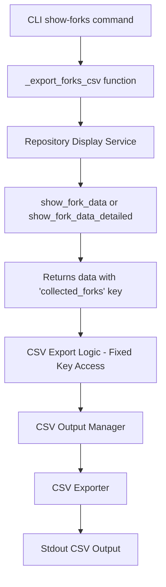

# Design Document

## Overview

This design addresses the CSV export bug in the `show-forks` command where no output is generated due to a data structure key mismatch. The issue occurs because the CSV export logic expects a `"forks"` key in the returned data, but both `show_fork_data` and `show_fork_data_detailed` methods return data with a `"collected_forks"` key.

## Architecture

### Current Architecture Issues

The current CSV export flow has a critical mismatch:

1. **Repository Display Service** returns: `{"collected_forks": [...], "total_forks": N, ...}`
2. **CSV Export Logic** expects: `{"forks": [...], ...}`
3. **Result**: `fork_data["forks"]` returns `None`, triggering empty CSV output

### Proposed Architecture



## Components and Interfaces

### 1. CSV Export Logic Fix (`_export_forks_csv` function)

**Current Implementation:**
```python
if fork_data and "forks" in fork_data:
    csv_manager.export_to_stdout(fork_data["forks"])
else:
    csv_manager.export_to_stdout([])
```

**Fixed Implementation:**
```python
# Handle both possible key names for backward compatibility
fork_list = None
if fork_data:
    if "collected_forks" in fork_data:
        fork_list = fork_data["collected_forks"]
    elif "forks" in fork_data:
        fork_list = fork_data["forks"]

if fork_list:
    csv_manager.export_to_stdout(fork_list)
else:
    csv_manager.export_to_stdout([])
```

### 2. Data Structure Validation

Add validation to ensure consistent data structure handling:

```python
def _validate_fork_data_structure(fork_data: dict) -> list:
    """Validate and extract fork list from data structure.
    
    Args:
        fork_data: Dictionary returned from repository display service
        
    Returns:
        List of fork objects for CSV export
        
    Raises:
        ValueError: If data structure is invalid
    """
    if not fork_data or not isinstance(fork_data, dict):
        return []
    
    # Try different possible key names
    for key in ["collected_forks", "forks"]:
        if key in fork_data:
            fork_list = fork_data[key]
            if isinstance(fork_list, list):
                return fork_list
    
    # Log warning about unexpected structure
    logger.warning(f"Unexpected fork data structure: {list(fork_data.keys())}")
    return []
```

### 3. Error Handling Enhancement

Improve error handling to provide better debugging information:

```python
try:
    fork_list = _validate_fork_data_structure(fork_data)
    if fork_list:
        csv_manager.export_to_stdout(fork_list)
    else:
        logger.info("No fork data available for CSV export")
        csv_manager.export_to_stdout([])
except Exception as e:
    logger.error(f"CSV export failed: {e}")
    logger.debug(f"Fork data structure: {fork_data.keys() if fork_data else 'None'}")
    raise ForkscoutOutputError(f"CSV export failed: {e}")
```

## Data Models

### Fork Data Structure Consistency

Both `show_fork_data` and `show_fork_data_detailed` should return consistent structure:

```python
{
    "total_forks": int,
    "displayed_forks": int,
    "collected_forks": List[ForkData],  # This is the key we need to use
    "api_calls_made": int,
    "api_calls_saved": int,
    # ... other metadata
}
```

### CSV Export Configuration

The CSV export should handle different data types properly:

```python
@dataclass
class CSVExportConfig:
    include_commits: bool = False
    detail_mode: bool = False
    include_explanations: bool = False
    max_commits_per_fork: int = 10
    escape_newlines: bool = True
    include_urls: bool = True
    date_format: str = "%Y-%m-%d %H:%M:%S"
    commit_date_format: str = "%Y-%m-%d"
```

## Error Handling

### 1. Data Structure Validation Errors

- **Issue**: Unexpected data structure from repository display service
- **Handling**: Log warning, return empty list, continue with empty CSV export
- **User Impact**: Empty CSV with headers instead of crash

### 2. CSV Generation Errors

- **Issue**: Fork data cannot be converted to CSV format
- **Handling**: Log error with data structure details, raise ForkscoutOutputError
- **User Impact**: Clear error message indicating CSV export failure

### 3. Output Errors

- **Issue**: Cannot write CSV to stdout
- **Handling**: Raise ForkscoutOutputError with Unicode handling
- **User Impact**: Error message about output redirection issues

## Testing Strategy

### 1. Unit Tests

- Test `_validate_fork_data_structure` with various input structures
- Test CSV export with both `"collected_forks"` and `"forks"` keys
- Test error handling for invalid data structures
- Test empty data handling

### 2. Integration Tests

- Test full CSV export flow with real repository data
- Test CSV export with different flag combinations
- Test CSV export with ahead-only filtering
- Test CSV export with commit details

### 3. Contract Tests

- Verify repository display service returns expected data structure
- Verify CSV exporter handles fork data correctly
- Verify output format matches expected CSV schema

### 4. End-to-End Tests

- Test complete command execution with CSV output
- Test output redirection to files
- Test CSV parsing by external tools
- Test performance with large repositories

## Implementation Plan

### Phase 1: Core Fix
1. Fix the key mismatch in `_export_forks_csv` function
2. Add data structure validation helper
3. Improve error handling and logging

### Phase 2: Robustness
1. Add comprehensive unit tests
2. Add integration tests for CSV export
3. Add error handling for edge cases

### Phase 3: Validation
1. Test with real repositories
2. Verify CSV output format
3. Test with various flag combinations
4. Performance testing with large datasets