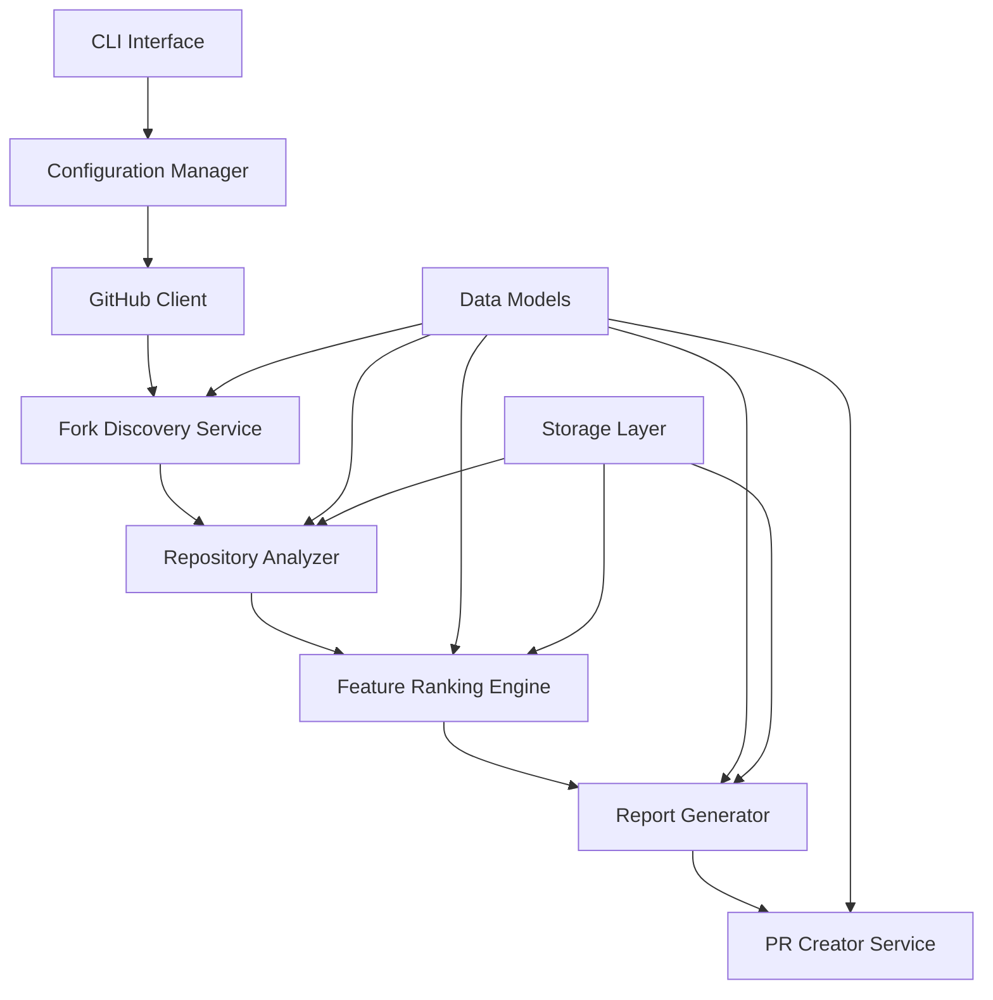

# Design Document

## Overview

The Forklift tool is designed as a modular Python 3.12 application using uv for package management. The system follows a pipeline architecture where data flows through distinct stages: discovery, analysis, ranking, reporting, and optional PR creation. The design emphasizes scalability, maintainability, and robust error handling to manage the complexities of GitHub API interactions and large-scale repository analysis.

## Architecture

The system uses a layered architecture with clear separation of concerns:



### Core Components

1. **CLI Interface**: Entry point using Click framework for command-line interactions
2. **Configuration Manager**: Handles settings, API tokens, and user preferences
3. **GitHub Client**: Wrapper around GitHub API with rate limiting and authentication
4. **Fork Discovery Service**: Discovers and catalogs all repository forks
5. **Repository Analyzer**: Analyzes individual forks for unique contributions
6. **Feature Ranking Engine**: Scores and ranks discovered features
7. **Report Generator**: Creates human-readable analysis reports
8. **PR Creator Service**: Automates pull request creation for valuable features
9. **Data Models**: Pydantic models for type safety and validation
10. **Storage Layer**: Local caching and persistence using SQLite

## Components and Interfaces

### GitHub Client
```python
class GitHubClient:
    def __init__(self, token: str, rate_limit_handler: RateLimitHandler)
    async def get_repository(self, owner: str, repo: str) -> Repository
    async def get_forks(self, owner: str, repo: str) -> List[Fork]
    async def get_commits_ahead(self, fork: Fork, base_repo: Repository) -> List[Commit]
    async def create_pull_request(self, pr_data: PullRequestData) -> PullRequest
```

### Fork Discovery Service
```python
class ForkDiscoveryService:
    def __init__(self, github_client: GitHubClient)
    async def discover_forks(self, repository_url: str) -> List[Fork]
    async def filter_active_forks(self, forks: List[Fork]) -> List[Fork]
    async def get_unique_commits(self, fork: Fork, base_repo: Repository) -> List[Commit]
```

### Repository Analyzer
```python
class RepositoryAnalyzer:
    def __init__(self, github_client: GitHubClient)
    async def analyze_fork(self, fork: Fork, base_repo: Repository) -> ForkAnalysis
    async def extract_features(self, commits: List[Commit]) -> List[Feature]
    async def categorize_changes(self, commits: List[Commit]) -> Dict[str, List[Commit]]
```

### Feature Ranking Engine
```python
class FeatureRankingEngine:
    def __init__(self, scoring_config: ScoringConfig)
    def calculate_feature_score(self, feature: Feature, fork_metrics: ForkMetrics) -> float
    def rank_features(self, features: List[Feature]) -> List[RankedFeature]
    def group_similar_features(self, features: List[Feature]) -> List[FeatureGroup]
```

## Data Models

### Core Models
```python
@dataclass
class Repository:
    owner: str
    name: str
    url: str
    default_branch: str
    stars: int
    forks_count: int

@dataclass
class Fork:
    repository: Repository
    parent: Repository
    last_activity: datetime
    commits_ahead: int
    commits_behind: int

@dataclass
class Commit:
    sha: str
    message: str
    author: str
    date: datetime
    files_changed: List[str]
    additions: int
    deletions: int

@dataclass
class Feature:
    id: str
    title: str
    description: str
    category: FeatureCategory
    commits: List[Commit]
    files_affected: List[str]
    source_fork: Fork

@dataclass
class RankedFeature:
    feature: Feature
    score: float
    ranking_factors: Dict[str, float]
    similar_implementations: List[Feature]

@dataclass
class ForkAnalysis:
    fork: Fork
    features: List[Feature]
    metrics: ForkMetrics
    analysis_date: datetime
```

### Configuration Models
```python
@dataclass
class ScoringConfig:
    code_quality_weight: float = 0.3
    community_engagement_weight: float = 0.2
    test_coverage_weight: float = 0.2
    documentation_weight: float = 0.15
    recency_weight: float = 0.15

@dataclass
class ForkliftConfig:
    github_token: str
    min_score_threshold: float = 70.0
    auto_pr_enabled: bool = False
    excluded_file_patterns: List[str]
    max_forks_to_analyze: int = 100
    cache_duration_hours: int = 24
```

## Error Handling

### Rate Limiting Strategy
- Implement exponential backoff with jitter for GitHub API rate limits
- Use token bucket algorithm for request throttling
- Support multiple GitHub tokens for increased rate limits
- Cache responses to minimize API calls

### Error Recovery
```python
class ErrorHandler:
    async def handle_api_error(self, error: GitHubAPIError) -> ErrorAction
    async def handle_network_error(self, error: NetworkError) -> ErrorAction
    async def handle_analysis_error(self, fork: Fork, error: Exception) -> None
    def log_error_with_context(self, error: Exception, context: Dict[str, Any]) -> None
```

### Resilience Patterns
- Circuit breaker pattern for external API calls
- Retry logic with exponential backoff
- Graceful degradation when individual fork analysis fails
- Comprehensive logging and monitoring

## Testing Strategy

### Unit Testing
- Test individual components in isolation using pytest
- Mock GitHub API responses for consistent testing
- Test error handling scenarios and edge cases
- Achieve >90% code coverage

### Integration Testing
- Test GitHub API integration with real repositories
- Validate end-to-end workflow with test repositories
- Test rate limiting and error recovery mechanisms
- Verify report generation and PR creation workflows

### Performance Testing
- Load testing with repositories having many forks
- Memory usage profiling for large-scale analysis
- API rate limit compliance testing
- Concurrent processing performance validation

### Test Data Management
```python
# Test fixtures for consistent testing
@pytest.fixture
def sample_repository():
    return Repository(
        owner="test-owner",
        name="test-repo",
        url="https://github.com/test-owner/test-repo",
        default_branch="main",
        stars=100,
        forks_count=50
    )

@pytest.fixture
def mock_github_client():
    return Mock(spec=GitHubClient)
```

## Storage and Caching

### Local Storage
- SQLite database for caching fork analysis results
- JSON files for configuration and reports
- Temporary storage for cloned repositories during analysis

### Cache Strategy
- Cache fork metadata and commit information
- Invalidate cache based on repository activity
- Implement cache warming for frequently analyzed repositories
- Support cache cleanup and maintenance operations

## Security Considerations

### API Token Management
- Secure storage of GitHub tokens using environment variables
- Support for GitHub App authentication for enhanced security
- Token rotation and validation mechanisms
- Audit logging for API access

### Data Privacy
- No storage of sensitive repository content
- Respect private repository access permissions
- Anonymization options for generated reports
- Compliance with GitHub's terms of service

## Deployment and Distribution

### Package Structure
```
forklift/
├── src/
│   └── forklift/
│       ├── __init__.py
│       ├── cli.py
│       ├── config/
│       ├── github/
│       ├── analysis/
│       ├── ranking/
│       ├── reporting/
│       └── models/
├── tests/
├── docs/
├── pyproject.toml
└── README.md
```

### Dependencies Management
- Use uv for fast dependency resolution and virtual environment management
- Pin dependencies for reproducible builds
- Separate development and production dependencies
- Regular security updates for dependencies

### CLI Design
```bash
# Basic usage
forklift analyze https://github.com/owner/repo

# With configuration
forklift analyze --config config.yaml --output report.md

# Auto-create PRs
forklift analyze --auto-pr --min-score 80

# Scheduled analysis
forklift schedule --cron "0 0 * * 0" --config config.yaml
```