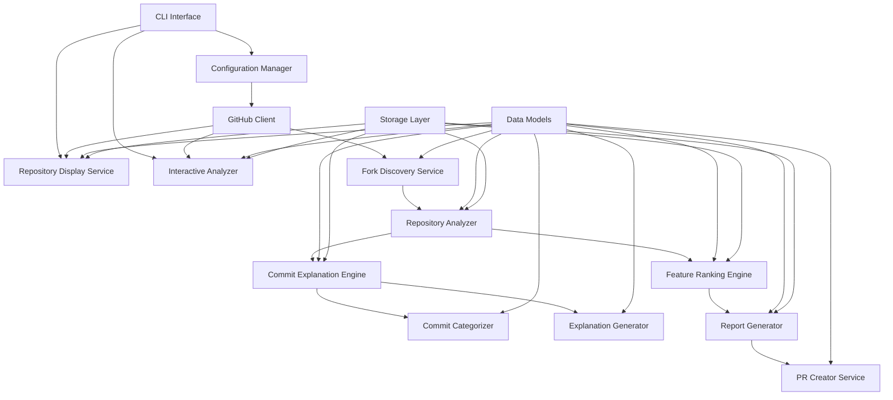
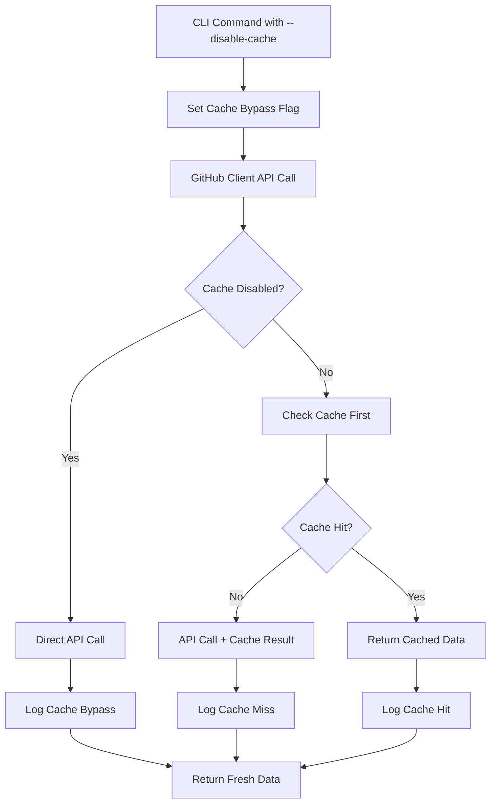

# Design Document

## Overview

The Forklift tool is designed as a modular Python 3.12 application using uv for package management. The system follows a pipeline architecture where data flows through distinct stages: discovery, analysis, ranking, reporting, and optional PR creation. The design emphasizes scalability, maintainability, and robust error handling to manage the complexities of GitHub API interactions and large-scale repository analysis.

## Architecture

The system uses a layered architecture with clear separation of concerns:



### Core Components

1. **CLI Interface**: Entry point using Click framework for command-line interactions
2. **Configuration Manager**: Handles settings, API tokens, and user preferences
3. **GitHub Client**: Wrapper around GitHub API with rate limiting and authentication
4. **Fork Discovery Service**: Discovers and catalogs all repository forks
5. **Repository Analyzer**: Analyzes individual forks for unique contributions
6. **Commit Explanation Engine**: Orchestrates commit analysis and explanation generation
7. **Commit Categorizer**: Analyzes commits to determine their type (feature, bugfix, refactor, etc.)
8. **Explanation Generator**: Creates simple, human-readable explanations of what commits do
9. **Feature Ranking Engine**: Scores and ranks discovered features
10. **Report Generator**: Creates human-readable analysis reports
11. **PR Creator Service**: Automates pull request creation for valuable features
12. **Repository Display Service**: Handles step-by-step repository information display
13. **Interactive Analyzer**: Provides focused analysis for specific forks and branches
14. **Data Models**: Pydantic models for type safety and validation
15. **Storage Layer**: Local caching and persistence using SQLite

## Commit Explanation Design Philosophy

The commit explanation system is designed with simplicity and clarity as primary goals. Rather than complex scoring algorithms, the system focuses on answering two key questions for each commit:

1. **What does this commit do?** - A simple 1-2 sentence description in plain language
2. **Could this help the main repository?** - A straightforward yes/no/unclear assessment

### Design Principles

- **Simplicity First**: Avoid complex technical analysis in favor of clear, understandable explanations
- **Focus on Value**: Prioritize determining if a commit could benefit the main repository
- **Single Purpose Preference**: Flag commits that do multiple things as more complex to integrate
- **Plain Language**: Use simple, non-technical language that any maintainer can understand
- **Quick Assessment**: Enable rapid decision-making about which commits deserve deeper review

### Explanation Workflow

1. **Categorize**: Determine if the commit is a feature, bugfix, refactor, docs, test, chore, or other
2. **Describe**: Generate a brief description of what changed
3. **Assess Value**: Determine if the change could be useful for the main repository
4. **Flag Complexity**: Identify commits that do multiple things at once
5. **Generate Links**: Create direct GitHub commit URLs for easy navigation
6. **Format Output**: Present information in a clear, scannable format with visual separation between descriptions and evaluations

## AI-Powered Commit Summary Design Philosophy

The AI commit summary system complements the existing explanation system by providing deeper, more contextual analysis using OpenAI's GPT-4 mini model. This system is designed for cases where maintainers need comprehensive understanding of complex commits.

### AI Summary Design Principles

- **Comprehensive Analysis**: Provide detailed understanding of what changed, why it changed, and potential implications
- **Context Awareness**: Use both commit messages and diff content to understand the full scope of changes
- **Cost Efficiency**: Use GPT-4 mini model to balance quality with cost considerations
- **Optional Enhancement**: AI summaries are opt-in via `--ai-summary` flag, not replacing existing explanations
- **Error Resilience**: Gracefully handle API failures and continue processing remaining commits
- **Rate Limit Respect**: Implement proper backoff and batching to respect OpenAI API limits

### AI Summary Workflow

1. **Validate Prerequisites**: Check for OpenAI API key and validate configuration
2. **Prepare Context**: Combine commit message and truncated diff for optimal token usage
3. **Generate Prompt**: Use structured prompt to guide AI analysis toward actionable insights
4. **Process Response**: Parse AI response into structured components (what/why/side effects)
5. **Handle Errors**: Log failures and continue with remaining commits
6. **Display Results**: Format AI summaries with clear visual distinction from standard explanations
7. **Track Usage**: Monitor API usage and costs for transparency

## Components and Interfaces

### GitHub Client
```python
class GitHubClient:
    def __init__(self, token: str, rate_limit_handler: RateLimitHandler, cache_manager: Optional[CacheManager] = None)
    async def get_repository(self, owner: str, repo: str, disable_cache: bool = False) -> Repository
    async def get_forks(self, owner: str, repo: str, disable_cache: bool = False) -> List[Fork]
    async def get_commits_ahead(self, fork: Fork, base_repo: Repository, disable_cache: bool = False) -> List[Commit]
    async def create_pull_request(self, pr_data: PullRequestData) -> PullRequest
    
    # Enhanced pagination methods
    async def get_all_repository_forks(self, owner: str, repo: str, max_forks: int = None, progress_callback: Callable = None, disable_cache: bool = False) -> List[Fork]
    async def get_paginated_commits(self, owner: str, repo: str, branch: str = None, max_commits: int = None, progress_callback: Callable = None, disable_cache: bool = False) -> AsyncIterator[List[Commit]]
    async def get_repository_branches_paginated(self, owner: str, repo: str, max_branches: int = None, disable_cache: bool = False) -> List[Branch]
    
    # Cache management methods
    def set_cache_disabled(self, disabled: bool) -> None
    def is_cache_disabled(self) -> bool
    async def _get_with_cache(self, cache_key: str, fetch_func: Callable, disable_cache: bool = False) -> Any
    def _log_cache_operation(self, operation: str, cache_key: str, hit: bool) -> None
```

### Pagination Manager
```python
class PaginationManager:
    def __init__(self, github_client: GitHubClient, max_concurrent_requests: int = 5)
    async def paginate_with_progress(self, endpoint: str, params: dict, max_items: int = None, progress_callback: Callable = None) -> AsyncIterator[List[dict]]
    async def paginate_concurrent(self, requests: List[PaginationRequest]) -> Dict[str, List[dict]]
    def calculate_pagination_stats(self, total_items: int, per_page: int) -> PaginationStats
    async def resume_pagination(self, checkpoint: PaginationCheckpoint) -> AsyncIterator[List[dict]]
    def create_checkpoint(self, current_page: int, total_pages: int, context: dict) -> PaginationCheckpoint
```

### Progress Tracking
```python
class PaginationProgressTracker:
    def __init__(self, total_estimated_pages: int = None)
    def update_progress(self, current_page: int, items_fetched: int, total_items: int = None) -> None
    def estimate_completion_time(self, pages_per_second: float) -> timedelta
    def get_progress_stats(self) -> ProgressStats
    def format_progress_display(self) -> str
```

### Fork Discovery Service
```python
class ForkDiscoveryService:
    def __init__(self, github_client: GitHubClient)
    async def discover_forks(self, repository_url: str, disable_cache: bool = False) -> List[Fork]
    async def filter_active_forks(self, forks: List[Fork], disable_cache: bool = False) -> List[Fork]
    async def get_unique_commits(self, fork: Fork, base_repo: Repository, disable_cache: bool = False) -> List[Commit]
```

### Repository Analyzer
```python
class RepositoryAnalyzer:
    def __init__(self, github_client: GitHubClient, explanation_engine: Optional[CommitExplanationEngine] = None, cache_manager: Optional[CacheManager] = None)
    async def analyze_fork(self, fork: Fork, base_repo: Repository, explain: bool = False, disable_cache: bool = False) -> ForkAnalysis
    async def extract_features(self, commits: List[Commit]) -> List[Feature]
    async def categorize_changes(self, commits: List[Commit]) -> Dict[str, List[Commit]]
    async def _analyze_commits_with_explanations(self, commits: List[Commit], context: AnalysisContext) -> List[CommitWithExplanation]
```

### Commit Explanation Engine
```python
class CommitExplanationEngine:
    def __init__(self, categorizer: CommitCategorizer, generator: ExplanationGenerator)
    async def explain_commit(self, commit: Commit, context: AnalysisContext) -> CommitExplanation
    async def explain_commits_batch(self, commits: List[Commit], context: AnalysisContext) -> List[CommitExplanation]
    def is_explanation_enabled(self) -> bool
```

### Commit Categorizer
```python
class CommitCategorizer:
    def __init__(self, patterns: CategoryPatterns)
    def categorize_commit(self, commit: Commit, file_changes: List[FileChange]) -> CommitCategory
    def _analyze_commit_message(self, message: str) -> CategoryType
    def _analyze_file_changes(self, changes: List[FileChange]) -> CategoryType
    def _determine_category(self, message_category: CategoryType, files_category: CategoryType) -> CategoryType
```

### Explanation Generator
```python
class ExplanationGenerator:
    def __init__(self, templates: ExplanationTemplates)
    def generate_explanation(self, commit: Commit, category: CategoryType, file_changes: List[FileChange]) -> str
    def _describe_what_changed(self, commit: Commit, file_changes: List[FileChange]) -> str
    def _assess_main_repo_value(self, commit: Commit, category: CategoryType, file_changes: List[FileChange]) -> str
    def _ensure_brevity(self, explanation: str, max_sentences: int = 2) -> str
    def _generate_github_commit_url(self, commit: Commit, repository: Repository) -> str
```

### AI Commit Summary Engine
```python
class AICommitSummaryEngine:
    def __init__(self, openai_client: OpenAIClient, config: AISummaryConfig)
    async def generate_commit_summary(self, commit: Commit, diff_text: str) -> AISummary
    async def generate_batch_summaries(self, commits_with_diffs: List[Tuple[Commit, str]]) -> List[AISummary]
    def _create_summary_prompt(self, commit_message: str, diff_text: str) -> str
    def _truncate_diff_for_tokens(self, diff_text: str, max_chars: int = 8000) -> str
    async def _call_openai_api(self, prompt: str) -> str
    def _handle_api_error(self, error: Exception) -> None
    def _log_api_usage(self, tokens_used: int, cost_estimate: float) -> None

class OpenAIClient:
    def __init__(self, api_key: str, model: str = "gpt-4o-mini")
    async def create_chat_completion(self, messages: List[dict], max_tokens: int = 500) -> dict
    async def __aenter__(self) -> 'OpenAIClient'
    async def __aexit__(self, exc_type, exc_val, exc_tb) -> None
    def _validate_api_key(self) -> None
    def _handle_rate_limit(self, retry_after: int) -> None
```

### GitHub Link Generator
```python
class GitHubLinkGenerator:
    @staticmethod
    def generate_commit_url(owner: str, repo: str, commit_sha: str) -> str
    @staticmethod
    def validate_github_url(url: str) -> bool
    @staticmethod
    def format_clickable_link(url: str, text: str = None) -> str
```

### Explanation Formatter
```python
class ExplanationFormatter:
    def __init__(self, use_colors: bool = True, use_icons: bool = True)
    def format_commit_explanation(self, commit: Commit, explanation: CommitExplanation, github_url: str) -> str
    def format_explanation_table(self, explanations: List[CommitWithExplanation]) -> str
    def format_category_with_icon(self, category: CategoryType) -> str
    def format_impact_indicator(self, impact: str) -> str
    def separate_description_from_evaluation(self, explanation: CommitExplanation) -> Tuple[str, str]
```

### Feature Ranking Engine
```python
class FeatureRankingEngine:
    def __init__(self, scoring_config: ScoringConfig)
    def calculate_feature_score(self, feature: Feature, fork_metrics: ForkMetrics) -> float
    def rank_features(self, features: List[Feature]) -> List[RankedFeature]
    def group_similar_features(self, features: List[Feature]) -> List[FeatureGroup]
```

### CLI Command Handlers
```python
class RepositoryDisplayService:
    def __init__(self, github_client: GitHubClient, cache_manager: Optional[CacheManager] = None, ai_summary_engine: Optional[AICommitSummaryEngine] = None)
    async def show_repository_details(self, repo_url: str, disable_cache: bool = False) -> RepositoryDetails
    async def list_forks_preview(self, repo_url: str, disable_cache: bool = False) -> ForksPreview
    async def show_forks_summary(self, repo_url: str, disable_cache: bool = False) -> ForksSummary
    async def show_promising_forks(self, repo_url: str, filters: PromisingForksFilter, disable_cache: bool = False) -> List[Fork]
    async def show_fork_details(self, fork_url: str, disable_cache: bool = False) -> ForkDetails
    async def show_commits(self, fork_url: str, branch: str, limit: int, disable_cache: bool = False, ai_summary: bool = False) -> List[CommitDetails]
    async def _generate_ai_summaries(self, commits: List[Commit], repository: Repository) -> Dict[str, AISummary]
    def _format_commit_with_ai_summary(self, commit: CommitDetails, ai_summary: Optional[AISummary]) -> str

class InteractiveAnalyzer:
    def __init__(self, github_client: GitHubClient, analyzer: RepositoryAnalyzer, cache_manager: Optional[CacheManager] = None)
    async def analyze_specific_fork(self, fork_url: str, branch: str, disable_cache: bool = False) -> ForkAnalysisResult
    def format_repository_display(self, repo: Repository) -> str
    def format_forks_table(self, forks: List[Fork]) -> str
    def format_commits_display(self, commits: List[Commit]) -> str

class InteractiveAnalysisOrchestrator:
    def __init__(self, github_client: GitHubClient, analyzer: RepositoryAnalyzer, config: InteractiveConfig, cache_manager: Optional[CacheManager] = None)
    async def run_interactive_analysis(self, repo_url: str, disable_cache: bool = False) -> InteractiveAnalysisResult
    async def execute_step(self, step: InteractiveStep) -> StepResult
    async def get_user_confirmation(self, step_name: str, results: Any) -> UserChoice
    def display_step_results(self, step_name: str, results: Any) -> None
    def handle_step_error(self, step_name: str, error: Exception) -> UserChoice

class InteractiveStep:
    def __init__(self, name: str, description: str)
    async def execute(self, context: AnalysisContext) -> StepResult
    def display_results(self, results: StepResult) -> str
    def get_confirmation_prompt(self, results: StepResult) -> str
    def format_completion_summary(self, results: StepResult) -> str
    def get_metrics_display(self, results: StepResult) -> Dict[str, Any]

class CacheBypassManager:
    def __init__(self, cache_manager: CacheManager)
    def is_cache_disabled(self) -> bool
    def set_cache_disabled(self, disabled: bool) -> None
    async def bypass_cache_get(self, key: str) -> None
    async def bypass_cache_set(self, key: str, value: Any) -> None
    def log_cache_bypass(self, operation: str, key: str) -> None
    def get_bypass_statistics(self) -> Dict[str, Any]
```

## Data Models

### Core Models
```python
@dataclass
class Repository:
    owner: str
    name: str
    url: str
    default_branch: str
    stars: int
    forks_count: int

@dataclass
class Fork:
    repository: Repository
    parent: Repository
    last_activity: datetime
    commits_ahead: int
    commits_behind: int

@dataclass
class Commit:
    sha: str
    message: str
    author: str
    date: datetime
    files_changed: List[str]
    additions: int
    deletions: int

@dataclass
class Feature:
    id: str
    title: str
    description: str
    category: FeatureCategory
    commits: List[Commit]
    files_affected: List[str]
    source_fork: Fork

@dataclass
class RankedFeature:
    feature: Feature
    score: float
    ranking_factors: Dict[str, float]
    similar_implementations: List[Feature]

@dataclass
class ForkAnalysis:
    fork: Fork
    features: List[Feature]
    metrics: ForkMetrics
    analysis_date: datetime
    commit_explanations: Optional[List[CommitExplanation]] = None
    explanation_summary: Optional[str] = None

@dataclass
class RepositoryDetails:
    repository: Repository
    languages: Dict[str, int]
    license: Optional[str]
    topics: List[str]
    last_commit_date: datetime

@dataclass
class ForksPreview:
    total_forks: int
    forks: List[ForkPreviewItem]

@dataclass
class ForkPreviewItem:
    name: str
    owner: str
    stars: int
    last_push_date: datetime
    fork_url: str

@dataclass
class ForksSummary:
    total_forks: int
    active_forks: int
    forks: List[ForkSummaryItem]

@dataclass
class ForkSummaryItem:
    fork: Fork
    commits_ahead: int
    commits_behind: int
    last_activity: datetime
    activity_status: str  # "active", "stale", "inactive"

@dataclass
class PromisingForksFilter:
    min_stars: int = 0
    min_commits_ahead: int = 1
    max_days_since_activity: int = 365
    min_activity_score: float = 0.0

@dataclass
class ForkDetails:
    fork: Fork
    branches: List[BranchInfo]
    total_commits: int
    contributors: List[str]

@dataclass
class BranchInfo:
    name: str
    commit_count: int
    last_commit_date: datetime
    commits_ahead_of_main: int

@dataclass
class CommitDetails:
    commit: Commit
    files_changed_count: int
    lines_added: int
    lines_removed: int
    commit_url: str
    ai_summary: Optional['AISummary'] = None

@dataclass
class AISummary:
    commit_sha: str
    summary_text: str
    what_changed: str
    why_changed: str
    potential_side_effects: str
    generated_at: datetime
    model_used: str
    tokens_used: int
    processing_time_ms: float
    error: Optional[str] = None

@dataclass
class AISummaryConfig:
    enabled: bool = False
    model: str = "gpt-4o-mini"
    max_tokens: int = 500
    max_diff_chars: int = 8000
    temperature: float = 0.3
    timeout_seconds: int = 30
    retry_attempts: int = 3
    cost_tracking: bool = True
    batch_size: int = 5  # Process commits in batches to manage rate limits

@dataclass
class CommitExplanation:
    commit_sha: str
    category: CategoryType
    what_changed: str  # Simple description of what the commit does
    main_repo_value: str  # "yes", "no", or "unclear" - could this help the main repo?
    explanation: str  # 1-2 sentence explanation
    is_complex: bool  # True if commit does multiple things
    github_url: str  # Direct link to GitHub commit page
    generated_at: datetime

@dataclass
class FormattedExplanation:
    """Formatted explanation with separated description and evaluation"""
    commit_sha: str
    github_url: str
    category_display: str  # Category with icon/color formatting
    description: str  # Factual "what changed" description
    evaluation: str  # System assessment/verdict
    impact_indicator: str  # Visual impact level indicator
    is_complex: bool

@dataclass
class CommitWithExplanation:
    commit: Commit
    explanation: Optional[CommitExplanation] = None
    explanation_error: Optional[str] = None

@dataclass
class AnalysisContext:
    repository: Repository
    fork: Fork
    project_type: Optional[str]  # web, library, cli, etc.
    main_language: Optional[str]
    critical_files: List[str]

@dataclass
class FileChange:
    filename: str
    status: str  # added, modified, deleted, renamed
    additions: int
    deletions: int
    patch: Optional[str]

class CategoryType(Enum):
    FEATURE = "feature"
    BUGFIX = "bugfix"
    REFACTOR = "refactor"
    DOCS = "docs"
    TEST = "test"
    CHORE = "chore"
    PERFORMANCE = "performance"
    SECURITY = "security"
    OTHER = "other"

class MainRepoValue(Enum):
    YES = "yes"      # This change could be useful for the main repository
    NO = "no"        # This change is not relevant for the main repository  
    UNCLEAR = "unclear"  # Cannot determine if this would be useful
```

### Configuration Models
```python
@dataclass
class ScoringConfig:
    code_quality_weight: float = 0.3
    community_engagement_weight: float = 0.2
    test_coverage_weight: float = 0.2
    documentation_weight: float = 0.15
    recency_weight: float = 0.15

@dataclass
class ExplanationConfig:
    enabled: bool = False
    max_sentences: int = 2  # Keep explanations to 1-2 sentences
    show_complex_commits: bool = True  # Whether to flag commits that do multiple things
    simple_language: bool = True  # Use simple, non-technical language
    include_github_links: bool = True  # Include direct GitHub commit links
    use_colors: bool = True  # Use color coding for categories and impact
    use_icons: bool = True  # Use icons for visual category identification
    separate_description_evaluation: bool = True  # Visually separate facts from assessments

@dataclass
class PaginationConfig:
    max_per_page: int = 100  # GitHub API maximum
    max_concurrent_requests: int = 5
    enable_progress_tracking: bool = True
    enable_resumable_pagination: bool = True
    checkpoint_interval: int = 10  # Save checkpoint every N pages
    streaming_threshold: int = 1000  # Use streaming for datasets larger than this
    batch_size: int = 100  # Items to process in each batch
    memory_limit_mb: int = 500  # Memory limit for cached pagination data

@dataclass
class PaginationStats:
    total_pages: int
    current_page: int
    items_per_page: int
    total_items: int
    items_fetched: int
    pages_remaining: int
    estimated_completion_time: Optional[timedelta]
    api_calls_made: int
    api_calls_remaining: int

@dataclass
class PaginationCheckpoint:
    endpoint: str
    current_page: int
    total_pages: int
    items_fetched: int
    context: dict
    timestamp: datetime
    
@dataclass
class PaginationRequest:
    endpoint: str
    params: dict
    max_items: Optional[int]
    priority: int = 0  # Higher priority requests processed first

@dataclass
class ProgressStats:
    current_page: int
    total_pages: Optional[int]
    items_fetched: int
    total_items: Optional[int]
    pages_per_second: float
    estimated_completion: Optional[datetime]
    memory_usage_mb: float

@dataclass
class InteractiveConfig:
    enabled: bool = False
    confirmation_timeout_seconds: int = 30  # Auto-continue after timeout
    default_choice: str = "continue"  # "continue", "abort"
    show_detailed_results: bool = True
    enable_step_rollback: bool = True
    save_session_state: bool = True
    session_state_file: str = ".forklift_session.json"

@dataclass
class StepResult:
    step_name: str
    success: bool
    data: Any
    summary: str
    error: Optional[Exception] = None
    metrics: Optional[Dict[str, Any]] = None

@dataclass
class InteractiveAnalysisResult:
    completed_steps: List[StepResult]
    final_result: Optional[Any]
    user_aborted: bool
    session_duration: timedelta
    total_confirmations: int

class UserChoice(Enum):
    CONTINUE = "continue"
    ABORT = "abort"

@dataclass
class CacheConfig:
    enabled: bool = True
    duration_hours: int = 24
    max_cache_size_mb: int = 500
    cleanup_interval_hours: int = 6
    bypass_on_error: bool = True
    log_cache_operations: bool = False

@dataclass
class ForkliftConfig:
    github_token: str
    openai_api_key: Optional[str] = None
    min_score_threshold: float = 70.0
    auto_pr_enabled: bool = False
    excluded_file_patterns: List[str]
    max_forks_to_analyze: int = 100
    cache_duration_hours: int = 24
    explanation: ExplanationConfig = field(default_factory=ExplanationConfig)
    ai_summary: AISummaryConfig = field(default_factory=AISummaryConfig)
    pagination: PaginationConfig = field(default_factory=PaginationConfig)
    interactive: InteractiveConfig = field(default_factory=InteractiveConfig)
    cache: CacheConfig = field(default_factory=CacheConfig)
```

## Error Handling

### Rate Limiting Strategy
- Implement exponential backoff with jitter for GitHub API rate limits
- Use token bucket algorithm for request throttling
- Support multiple GitHub tokens for increased rate limits
- Cache responses to minimize API calls (unless cache is disabled)
- Maintain rate limiting even when cache is disabled to respect GitHub API limits

### Cache Bypass Error Handling
When cache is disabled, the system must handle increased API load and potential failures:

```python
class CacheBypassErrorHandler:
    def __init__(self, rate_limiter: RateLimiter)
    async def handle_increased_api_load(self, operation: str) -> None
    async def handle_rate_limit_with_bypass(self, error: RateLimitError) -> None
    def warn_user_about_performance_impact(self, estimated_calls: int) -> None
    def log_cache_bypass_impact(self, operation: str, duration: float, api_calls: int) -> None
```

### Error Recovery
```python
class ErrorHandler:
    async def handle_api_error(self, error: GitHubAPIError) -> ErrorAction
    async def handle_network_error(self, error: NetworkError) -> ErrorAction
    async def handle_analysis_error(self, fork: Fork, error: Exception) -> None
    async def handle_cache_bypass_error(self, error: Exception, operation: str) -> ErrorAction
    async def handle_openai_error(self, error: OpenAIError, commit_sha: str) -> ErrorAction
    def log_error_with_context(self, error: Exception, context: Dict[str, Any]) -> None

class OpenAIErrorHandler:
    def __init__(self, retry_config: RetryConfig)
    async def handle_rate_limit_error(self, error: RateLimitError) -> None
    async def handle_authentication_error(self, error: AuthenticationError) -> None
    async def handle_token_limit_error(self, error: TokenLimitError, diff_text: str) -> str
    async def handle_timeout_error(self, error: TimeoutError) -> None
    def should_retry(self, error: Exception, attempt: int) -> bool
    def calculate_backoff_delay(self, attempt: int, base_delay: float = 1.0) -> float
```

### Resilience Patterns
- Circuit breaker pattern for external API calls
- Retry logic with exponential backoff (more aggressive when cache is disabled)
- Graceful degradation when individual fork analysis fails
- Comprehensive logging and monitoring
- Performance impact warnings for cache-disabled operations

## Testing Strategy

### Unit Testing
- Test individual components in isolation using pytest
- Mock GitHub API responses for consistent testing
- Test error handling scenarios and edge cases
- Achieve >90% code coverage

### Integration Testing
- Test GitHub API integration with real repositories
- Validate end-to-end workflow with test repositories
- Test rate limiting and error recovery mechanisms
- Verify report generation and PR creation workflows

### Performance Testing
- Load testing with repositories having many forks
- Memory usage profiling for large-scale analysis
- API rate limit compliance testing
- Concurrent processing performance validation

### Test Data Management
```python
# Test fixtures for consistent testing
@pytest.fixture
def sample_repository():
    return Repository(
        owner="test-owner",
        name="test-repo",
        url="https://github.com/test-owner/test-repo",
        default_branch="main",
        stars=100,
        forks_count=50
    )

@pytest.fixture
def mock_github_client():
    return Mock(spec=GitHubClient)
```

## Storage and Caching

### Local Storage
- SQLite database for caching fork analysis results
- JSON files for configuration and reports
- Temporary storage for cloned repositories during analysis
- Pagination checkpoint storage for resumable operations

### Cache Strategy
- Cache fork metadata and commit information
- Invalidate cache based on repository activity
- Implement cache warming for frequently analyzed repositories
- Support cache cleanup and maintenance operations
- Cache pagination results to avoid re-fetching during interruptions

### Cache Disabling Architecture

The cache disabling functionality is designed to provide users with fresh data when needed while maintaining system performance and respecting API rate limits:

#### Design Principles
- **Selective Bypass**: Cache disabling affects only data retrieval, not rate limiting or error handling
- **Performance Awareness**: Users are warned about increased API usage and longer execution times
- **Consistent Interface**: All commands support the same `--disable-cache` flag with consistent behavior
- **Logging and Monitoring**: Cache bypass operations are logged for debugging and performance analysis
- **Configuration Flexibility**: Cache behavior can be configured globally or per-operation

#### Cache Bypass Flow


### Pagination Optimization Storage
```python
class PaginationCache:
    def __init__(self, cache_dir: str, max_cache_size_mb: int = 100)
    async def cache_page_results(self, endpoint: str, page: int, data: List[dict]) -> None
    async def get_cached_page(self, endpoint: str, page: int) -> Optional[List[dict]]
    async def cache_checkpoint(self, checkpoint: PaginationCheckpoint) -> None
    async def load_checkpoint(self, endpoint: str) -> Optional[PaginationCheckpoint]
    async def cleanup_expired_cache(self, max_age_hours: int = 24) -> None
    def get_cache_stats(self) -> CacheStats

class CacheManager:
    def __init__(self, cache_config: CacheConfig)
    async def get(self, key: str, disable_cache: bool = False) -> Optional[Any]
    async def set(self, key: str, value: Any, disable_cache: bool = False) -> None
    async def invalidate(self, pattern: str) -> None
    def is_cache_disabled(self) -> bool
    def set_cache_disabled(self, disabled: bool) -> None
    def get_cache_statistics(self) -> CacheStatistics
    def log_cache_operation(self, operation: str, key: str, hit: bool, bypass: bool) -> None

@dataclass
class CacheStatistics:
    total_requests: int
    cache_hits: int
    cache_misses: int
    cache_bypasses: int
    hit_rate: float
    bypass_rate: float
    api_calls_saved: int
    performance_impact_ms: float
```

## Documentation and Evaluation Criteria Design

### Evaluation Criteria Documentation Structure

The system will include comprehensive documentation of evaluation criteria to ensure transparency and user understanding:

```markdown
# Evaluation Criteria

## Commit Categorization
- **Feature**: New functionality, enhancements, API additions
- **Bugfix**: Error corrections, issue resolutions, stability improvements  
- **Refactor**: Code restructuring, performance improvements, cleanup
- **Docs**: Documentation updates, README changes, comment additions
- **Test**: Test additions, test improvements, coverage enhancements
- **Chore**: Build changes, dependency updates, maintenance tasks
- **Other**: Changes that don't fit standard categories

## Impact Assessment Factors
- **File Criticality**: Core files (main modules) vs. peripheral files (docs, tests)
- **Change Magnitude**: Lines changed, files affected, complexity of modifications
- **Test Coverage Impact**: Whether changes include or affect tests
- **Documentation Impact**: Whether changes include documentation updates

## Value Assessment Criteria
- **Yes**: Changes that clearly benefit all users of the main repository
- **No**: Changes specific to the fork's use case or environment
- **Unclear**: Changes that require deeper analysis to determine value
```

### Documentation Components

1. **README Evaluation Section**: Comprehensive guide to understanding system decisions
2. **Decision Trees**: Visual flowcharts for categorization logic
3. **Example Gallery**: Real commit examples with explanations of categorization
4. **Troubleshooting Guide**: Common questions about evaluation results
5. **Configuration Guide**: How to customize evaluation behavior

### Visual Design for Explanations

```
┌─ Commit: abc1234 ──────────────────────────────────────────┐
│ 🔗 https://github.com/owner/repo/commit/abc1234567890      │
│                                                            │
│ 📝 Description: Added user authentication middleware       │
│                                                            │
│ ⚖️  Assessment: Value for main repo: YES                   │
│    Category: 🚀 Feature                                    │
│    Impact: 🔴 High                                         │
└────────────────────────────────────────────────────────────┘
```

## Security Considerations

### API Token Management
- Secure storage of GitHub tokens using environment variables
- Secure storage of OpenAI API keys using environment variables
- Support for GitHub App authentication for enhanced security
- Token rotation and validation mechanisms
- Audit logging for API access
- OpenAI API key validation and error handling

### Data Privacy
- No storage of sensitive repository content
- Respect private repository access permissions
- Anonymization options for generated reports
- Compliance with GitHub's terms of service
- OpenAI data handling compliance - commit diffs sent to OpenAI for analysis
- User consent and awareness of external AI processing
- No persistent storage of AI-generated summaries unless explicitly configured
- Truncation of large diffs to prevent sensitive data exposure

### AI-Specific Security Considerations
- API key validation before processing any commits
- Diff content sanitization to remove potential secrets
- Rate limiting to prevent excessive API usage and costs
- Error handling to prevent API key exposure in logs
- Cost monitoring and usage tracking for transparency
- Timeout handling to prevent hanging requests

## Deployment and Distribution

### Package Structure
```
forklift/
├── src/
│   └── forklift/
│       ├── __init__.py
│       ├── cli.py
│       ├── config/
│       ├── github/
│       ├── analysis/
│       ├── ranking/
│       ├── reporting/
│       └── models/
├── tests/
├── docs/
├── pyproject.toml
└── README.md
```

### Dependencies Management
- Use uv for fast dependency resolution and virtual environment management
- Pin dependencies for reproducible builds
- Separate development and production dependencies
- Regular security updates for dependencies

### CLI Design
```bash
# Step-by-step analysis commands
forklift show-repo https://github.com/owner/repo
forklift list-forks https://github.com/owner/repo
forklift show-forks https://github.com/owner/repo
forklift show-promising https://github.com/owner/repo --min-stars 5 --min-commits-ahead 10
forklift show-fork-details https://github.com/fork-owner/repo
forklift analyze-fork https://github.com/fork-owner/repo --branch feature-branch
forklift show-commits https://github.com/fork-owner/repo --branch main --limit 20

# Comprehensive batch analysis (existing)
forklift analyze https://github.com/owner/repo

# With commit explanations
forklift analyze https://github.com/owner/repo --explain

# Interactive mode with user confirmation stops
forklift analyze https://github.com/owner/repo --interactive

# Interactive mode with explanations
forklift analyze https://github.com/owner/repo --interactive --explain

# Disable caching for fresh data
forklift analyze https://github.com/owner/repo --disable-cache

# Disable cache with explanations and interactive mode
forklift analyze https://github.com/owner/repo --disable-cache --explain --interactive

# Step-by-step commands with explanations
forklift analyze-fork https://github.com/fork-owner/repo --branch feature-branch --explain
forklift show-commits https://github.com/fork-owner/repo --branch main --limit 20 --explain

# Step-by-step commands with cache disabled
forklift show-forks https://github.com/owner/repo --disable-cache
forklift analyze-fork https://github.com/fork-owner/repo --branch feature-branch --disable-cache

# With configuration
forklift analyze --config config.yaml --output report.md

# Auto-create PRs
forklift analyze --auto-pr --min-score 80

# Scheduled analysis
forklift schedule --cron "0 0 * * 0" --config config.yaml
```