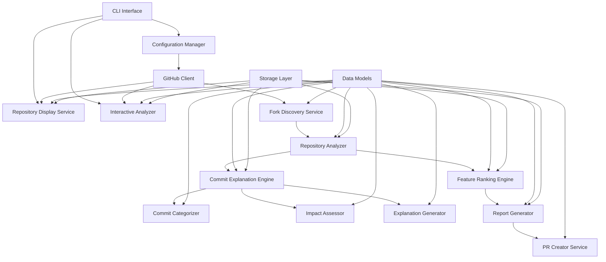

# Design Document

## Overview

The Forklift tool is designed as a modular Python 3.12 application using uv for package management. The system follows a pipeline architecture where data flows through distinct stages: discovery, analysis, ranking, reporting, and optional PR creation. The design emphasizes scalability, maintainability, and robust error handling to manage the complexities of GitHub API interactions and large-scale repository analysis.

## Architecture

The system uses a layered architecture with clear separation of concerns:



### Core Components

1. **CLI Interface**: Entry point using Click framework for command-line interactions
2. **Configuration Manager**: Handles settings, API tokens, and user preferences
3. **GitHub Client**: Wrapper around GitHub API with rate limiting and authentication
4. **Fork Discovery Service**: Discovers and catalogs all repository forks
5. **Repository Analyzer**: Analyzes individual forks for unique contributions
6. **Commit Explanation Engine**: Orchestrates commit analysis and explanation generation
7. **Commit Categorizer**: Analyzes commits to determine their type (feature, bugfix, refactor, etc.)
8. **Impact Assessor**: Evaluates the potential impact and value of commits
9. **Explanation Generator**: Creates human-readable explanations based on analysis results
10. **Feature Ranking Engine**: Scores and ranks discovered features
11. **Report Generator**: Creates human-readable analysis reports
12. **PR Creator Service**: Automates pull request creation for valuable features
13. **Repository Display Service**: Handles step-by-step repository information display
14. **Interactive Analyzer**: Provides focused analysis for specific forks and branches
15. **Data Models**: Pydantic models for type safety and validation
16. **Storage Layer**: Local caching and persistence using SQLite

## Components and Interfaces

### GitHub Client
```python
class GitHubClient:
    def __init__(self, token: str, rate_limit_handler: RateLimitHandler)
    async def get_repository(self, owner: str, repo: str) -> Repository
    async def get_forks(self, owner: str, repo: str) -> List[Fork]
    async def get_commits_ahead(self, fork: Fork, base_repo: Repository) -> List[Commit]
    async def create_pull_request(self, pr_data: PullRequestData) -> PullRequest
```

### Fork Discovery Service
```python
class ForkDiscoveryService:
    def __init__(self, github_client: GitHubClient)
    async def discover_forks(self, repository_url: str) -> List[Fork]
    async def filter_active_forks(self, forks: List[Fork]) -> List[Fork]
    async def get_unique_commits(self, fork: Fork, base_repo: Repository) -> List[Commit]
```

### Repository Analyzer
```python
class RepositoryAnalyzer:
    def __init__(self, github_client: GitHubClient, explanation_engine: Optional[CommitExplanationEngine] = None)
    async def analyze_fork(self, fork: Fork, base_repo: Repository, explain: bool = False) -> ForkAnalysis
    async def extract_features(self, commits: List[Commit]) -> List[Feature]
    async def categorize_changes(self, commits: List[Commit]) -> Dict[str, List[Commit]]
    async def _analyze_commits_with_explanations(self, commits: List[Commit], context: AnalysisContext) -> List[CommitWithExplanation]
```

### Commit Explanation Engine
```python
class CommitExplanationEngine:
    def __init__(self, categorizer: CommitCategorizer, impact_assessor: ImpactAssessor, generator: ExplanationGenerator)
    async def explain_commit(self, commit: Commit, context: AnalysisContext) -> CommitExplanation
    async def explain_commits_batch(self, commits: List[Commit], context: AnalysisContext) -> List[CommitExplanation]
    def is_explanation_enabled(self) -> bool
```

### Commit Categorizer
```python
class CommitCategorizer:
    def __init__(self, patterns: CategoryPatterns)
    def categorize_commit(self, commit: Commit, file_changes: List[FileChange]) -> CommitCategory
    def _analyze_commit_message(self, message: str) -> CategoryHints
    def _analyze_file_changes(self, changes: List[FileChange]) -> CategoryHints
    def _determine_primary_category(self, hints: List[CategoryHints]) -> CommitCategory
```

### Impact Assessor
```python
class ImpactAssessor:
    def __init__(self, config: ImpactConfig)
    def assess_impact(self, commit: Commit, file_changes: List[FileChange], context: AnalysisContext) -> ImpactAssessment
    def _calculate_change_magnitude(self, changes: List[FileChange]) -> float
    def _assess_file_criticality(self, files: List[str], context: AnalysisContext) -> float
    def _evaluate_test_coverage_impact(self, changes: List[FileChange]) -> float
```

### Explanation Generator
```python
class ExplanationGenerator:
    def __init__(self, templates: ExplanationTemplates)
    def generate_explanation(self, commit: Commit, category: CommitCategory, impact: ImpactAssessment) -> str
    def _format_explanation(self, template: str, context: ExplanationContext) -> str
    def _ensure_conciseness(self, explanation: str, max_length: int = 200) -> str
```

### Feature Ranking Engine
```python
class FeatureRankingEngine:
    def __init__(self, scoring_config: ScoringConfig)
    def calculate_feature_score(self, feature: Feature, fork_metrics: ForkMetrics) -> float
    def rank_features(self, features: List[Feature]) -> List[RankedFeature]
    def group_similar_features(self, features: List[Feature]) -> List[FeatureGroup]
```

### CLI Command Handlers
```python
class RepositoryDisplayService:
    def __init__(self, github_client: GitHubClient)
    async def show_repository_details(self, repo_url: str) -> RepositoryDetails
    async def list_forks_preview(self, repo_url: str) -> ForksPreview
    async def show_forks_summary(self, repo_url: str) -> ForksSummary
    async def show_promising_forks(self, repo_url: str, filters: PromisingForksFilter) -> List[Fork]
    async def show_fork_details(self, fork_url: str) -> ForkDetails
    async def show_commits(self, fork_url: str, branch: str, limit: int) -> List[CommitDetails]

class InteractiveAnalyzer:
    def __init__(self, github_client: GitHubClient, analyzer: RepositoryAnalyzer)
    async def analyze_specific_fork(self, fork_url: str, branch: str) -> ForkAnalysisResult
    def format_repository_display(self, repo: Repository) -> str
    def format_forks_table(self, forks: List[Fork]) -> str
    def format_commits_display(self, commits: List[Commit]) -> str
```

## Data Models

### Core Models
```python
@dataclass
class Repository:
    owner: str
    name: str
    url: str
    default_branch: str
    stars: int
    forks_count: int

@dataclass
class Fork:
    repository: Repository
    parent: Repository
    last_activity: datetime
    commits_ahead: int
    commits_behind: int

@dataclass
class Commit:
    sha: str
    message: str
    author: str
    date: datetime
    files_changed: List[str]
    additions: int
    deletions: int

@dataclass
class Feature:
    id: str
    title: str
    description: str
    category: FeatureCategory
    commits: List[Commit]
    files_affected: List[str]
    source_fork: Fork

@dataclass
class RankedFeature:
    feature: Feature
    score: float
    ranking_factors: Dict[str, float]
    similar_implementations: List[Feature]

@dataclass
class ForkAnalysis:
    fork: Fork
    features: List[Feature]
    metrics: ForkMetrics
    analysis_date: datetime
    commit_explanations: Optional[List[CommitExplanation]] = None
    explanation_summary: Optional[str] = None

@dataclass
class RepositoryDetails:
    repository: Repository
    languages: Dict[str, int]
    license: Optional[str]
    topics: List[str]
    last_commit_date: datetime

@dataclass
class ForksPreview:
    total_forks: int
    forks: List[ForkPreviewItem]

@dataclass
class ForkPreviewItem:
    name: str
    owner: str
    stars: int
    last_push_date: datetime
    fork_url: str

@dataclass
class ForksSummary:
    total_forks: int
    active_forks: int
    forks: List[ForkSummaryItem]

@dataclass
class ForkSummaryItem:
    fork: Fork
    commits_ahead: int
    commits_behind: int
    last_activity: datetime
    activity_status: str  # "active", "stale", "inactive"

@dataclass
class PromisingForksFilter:
    min_stars: int = 0
    min_commits_ahead: int = 1
    max_days_since_activity: int = 365
    min_activity_score: float = 0.0

@dataclass
class ForkDetails:
    fork: Fork
    branches: List[BranchInfo]
    total_commits: int
    contributors: List[str]

@dataclass
class BranchInfo:
    name: str
    commit_count: int
    last_commit_date: datetime
    commits_ahead_of_main: int

@dataclass
class CommitDetails:
    commit: Commit
    files_changed_count: int
    lines_added: int
    lines_removed: int
    commit_url: str

@dataclass
class CommitExplanation:
    commit_sha: str
    category: CommitCategory
    impact_level: ImpactLevel
    explanation: str
    confidence_score: float
    generated_at: datetime

@dataclass
class CommitWithExplanation:
    commit: Commit
    explanation: Optional[CommitExplanation] = None
    explanation_error: Optional[str] = None

@dataclass
class CommitCategory:
    primary: CategoryType
    secondary: List[CategoryType]
    confidence: float

@dataclass
class ImpactAssessment:
    level: ImpactLevel  # LOW, MEDIUM, HIGH
    score: float  # 0.0 to 1.0
    factors: Dict[str, float]
    reasoning: str

@dataclass
class AnalysisContext:
    repository: Repository
    fork: Fork
    project_type: Optional[str]  # web, library, cli, etc.
    main_language: Optional[str]
    critical_files: List[str]

@dataclass
class FileChange:
    filename: str
    status: str  # added, modified, deleted, renamed
    additions: int
    deletions: int
    patch: Optional[str]

class CategoryType(Enum):
    FEATURE = "feature"
    BUGFIX = "bugfix"
    REFACTOR = "refactor"
    DOCS = "docs"
    TEST = "test"
    CHORE = "chore"
    PERFORMANCE = "performance"
    SECURITY = "security"
    OTHER = "other"

class ImpactLevel(Enum):
    LOW = "low"
    MEDIUM = "medium"
    HIGH = "high"
```

### Configuration Models
```python
@dataclass
class ScoringConfig:
    code_quality_weight: float = 0.3
    community_engagement_weight: float = 0.2
    test_coverage_weight: float = 0.2
    documentation_weight: float = 0.15
    recency_weight: float = 0.15

@dataclass
class ExplanationConfig:
    enabled: bool = False
    max_explanation_length: int = 200
    confidence_threshold: float = 0.7
    include_low_confidence: bool = False
    template_style: str = "concise"  # concise, detailed, technical

@dataclass
class ForkliftConfig:
    github_token: str
    min_score_threshold: float = 70.0
    auto_pr_enabled: bool = False
    excluded_file_patterns: List[str]
    max_forks_to_analyze: int = 100
    cache_duration_hours: int = 24
    explanation: ExplanationConfig = field(default_factory=ExplanationConfig)
```

## Error Handling

### Rate Limiting Strategy
- Implement exponential backoff with jitter for GitHub API rate limits
- Use token bucket algorithm for request throttling
- Support multiple GitHub tokens for increased rate limits
- Cache responses to minimize API calls

### Error Recovery
```python
class ErrorHandler:
    async def handle_api_error(self, error: GitHubAPIError) -> ErrorAction
    async def handle_network_error(self, error: NetworkError) -> ErrorAction
    async def handle_analysis_error(self, fork: Fork, error: Exception) -> None
    def log_error_with_context(self, error: Exception, context: Dict[str, Any]) -> None
```

### Resilience Patterns
- Circuit breaker pattern for external API calls
- Retry logic with exponential backoff
- Graceful degradation when individual fork analysis fails
- Comprehensive logging and monitoring

## Testing Strategy

### Unit Testing
- Test individual components in isolation using pytest
- Mock GitHub API responses for consistent testing
- Test error handling scenarios and edge cases
- Achieve >90% code coverage

### Integration Testing
- Test GitHub API integration with real repositories
- Validate end-to-end workflow with test repositories
- Test rate limiting and error recovery mechanisms
- Verify report generation and PR creation workflows

### Performance Testing
- Load testing with repositories having many forks
- Memory usage profiling for large-scale analysis
- API rate limit compliance testing
- Concurrent processing performance validation

### Test Data Management
```python
# Test fixtures for consistent testing
@pytest.fixture
def sample_repository():
    return Repository(
        owner="test-owner",
        name="test-repo",
        url="https://github.com/test-owner/test-repo",
        default_branch="main",
        stars=100,
        forks_count=50
    )

@pytest.fixture
def mock_github_client():
    return Mock(spec=GitHubClient)
```

## Storage and Caching

### Local Storage
- SQLite database for caching fork analysis results
- JSON files for configuration and reports
- Temporary storage for cloned repositories during analysis

### Cache Strategy
- Cache fork metadata and commit information
- Invalidate cache based on repository activity
- Implement cache warming for frequently analyzed repositories
- Support cache cleanup and maintenance operations

## Security Considerations

### API Token Management
- Secure storage of GitHub tokens using environment variables
- Support for GitHub App authentication for enhanced security
- Token rotation and validation mechanisms
- Audit logging for API access

### Data Privacy
- No storage of sensitive repository content
- Respect private repository access permissions
- Anonymization options for generated reports
- Compliance with GitHub's terms of service

## Deployment and Distribution

### Package Structure
```
forklift/
├── src/
│   └── forklift/
│       ├── __init__.py
│       ├── cli.py
│       ├── config/
│       ├── github/
│       ├── analysis/
│       ├── ranking/
│       ├── reporting/
│       └── models/
├── tests/
├── docs/
├── pyproject.toml
└── README.md
```

### Dependencies Management
- Use uv for fast dependency resolution and virtual environment management
- Pin dependencies for reproducible builds
- Separate development and production dependencies
- Regular security updates for dependencies

### CLI Design
```bash
# Step-by-step analysis commands
forklift show-repo https://github.com/owner/repo
forklift list-forks https://github.com/owner/repo
forklift show-forks https://github.com/owner/repo
forklift show-promising https://github.com/owner/repo --min-stars 5 --min-commits-ahead 10
forklift show-fork-details https://github.com/fork-owner/repo
forklift analyze-fork https://github.com/fork-owner/repo --branch feature-branch
forklift show-commits https://github.com/fork-owner/repo --branch main --limit 20

# Comprehensive batch analysis (existing)
forklift analyze https://github.com/owner/repo

# With commit explanations
forklift analyze https://github.com/owner/repo --explain

# Step-by-step commands with explanations
forklift analyze-fork https://github.com/fork-owner/repo --branch feature-branch --explain
forklift show-commits https://github.com/fork-owner/repo --branch main --limit 20 --explain

# With configuration
forklift analyze --config config.yaml --output report.md

# Auto-create PRs
forklift analyze --auto-pr --min-score 80

# Scheduled analysis
forklift schedule --cron "0 0 * * 0" --config config.yaml
```