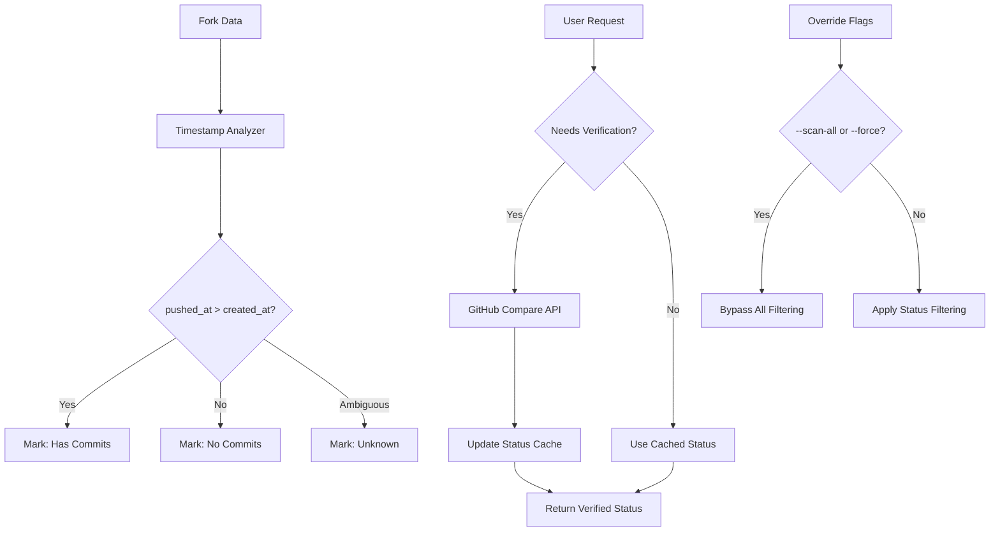
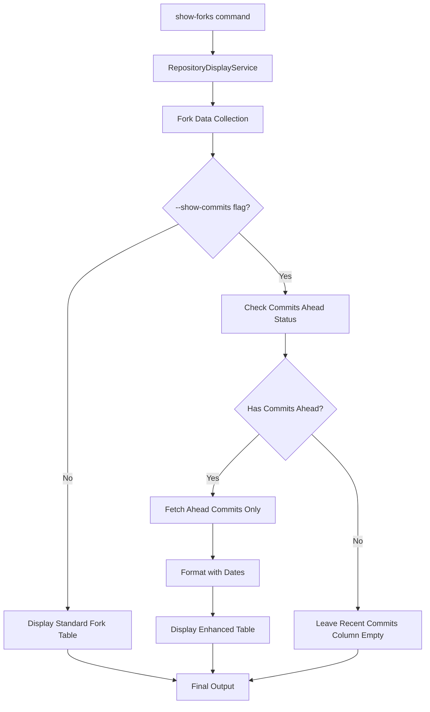
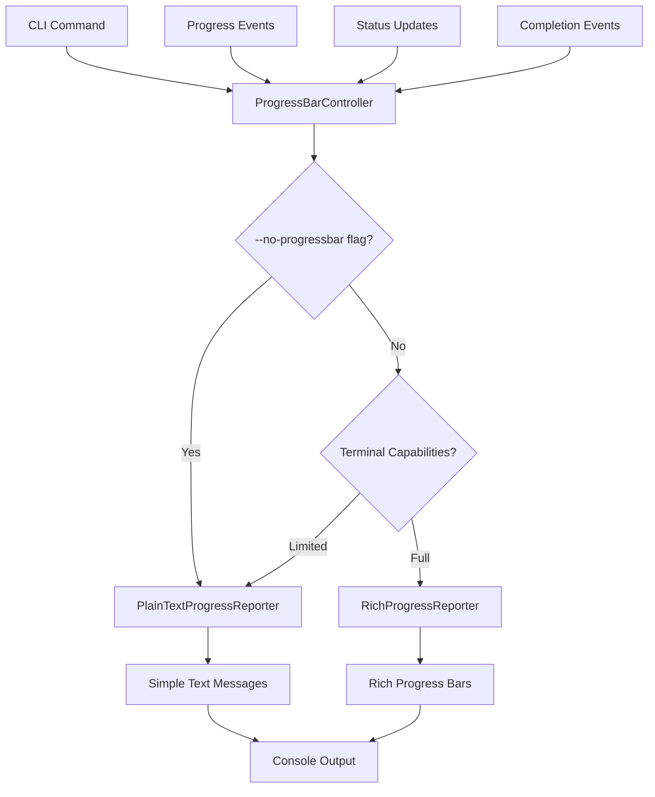
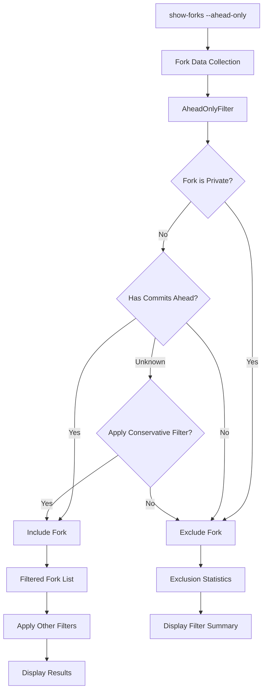

# Design Document

## Overview

The Forklift tool is designed as a modular Python 3.12 application using uv for package management. The system follows a pipeline architecture where data flows through distinct stages: discovery, analysis, ranking, reporting, and optional PR creation. The design emphasizes scalability, maintainability, and robust error handling to manage the complexities of GitHub API interactions and large-scale repository analysis.

## Architecture

The system uses a layered architecture with clear separation of concerns:


### Core Components

1. **CLI Interface**: Entry point using Click framework for command-line interactions
2. **Configuration Manager**: Handles settings, API tokens, and user preferences
3. **GitHub Client**: Wrapper around GitHub API with rate limiting and authentication
4. **Fork Discovery Service**: Discovers and catalogs all repository forks
5. **Repository Analyzer**: Analyzes individual forks for unique contributions
6. **Commit Explanation Engine**: Orchestrates commit analysis and explanation generation
7. **Commit Categorizer**: Analyzes commits to determine their type (feature, bugfix, refactor, etc.)
8. **Explanation Generator**: Creates simple, human-readable explanations of what commits do
9. **Feature Ranking Engine**: Scores and ranks discovered features
10. **Report Generator**: Creates human-readable analysis reports
11. **PR Creator Service**: Automates pull request creation for valuable features
12. **Repository Display Service**: Handles step-by-step repository information display
13. **Interactive Analyzer**: Provides focused analysis for specific forks and branches
14. **Data Models**: Pydantic models for type safety and validation
15. **Storage Layer**: Local caching and persistence using SQLite

## Commit Explanation Design Philosophy

The commit explanation system is designed with simplicity and clarity as primary goals. Rather than complex scoring algorithms, the system focuses on answering two key questions for each commit:

1. **What does this commit do?** - A simple 1-2 sentence description in plain language
2. **Could this help the main repository?** - A straightforward yes/no/unclear assessment

### Design Principles

- **Simplicity First**: Avoid complex technical analysis in favor of clear, understandable explanations
- **Focus on Value**: Prioritize determining if a commit could benefit the main repository
- **Single Purpose Preference**: Flag commits that do multiple things as more complex to integrate
- **Plain Language**: Use simple, non-technical language that any maintainer can understand
- **Quick Assessment**: Enable rapid decision-making about which commits deserve deeper review

### Explanation Workflow

1. **Categorize**: Determine if the commit is a feature, bugfix, refactor, docs, test, chore, or other
2. **Describe**: Generate a brief description of what changed
3. **Assess Value**: Determine if the change could be useful for the main repository
4. **Flag Complexity**: Identify commits that do multiple things at once
5. **Generate Links**: Create direct GitHub commit URLs for easy navigation
6. **Format Output**: Present information in a clear, scannable format with visual separation between descriptions and evaluations

## Fork Data Collection System Design Philosophy

The fork data collection system is designed to dramatically reduce GitHub API usage by collecting comprehensive fork information using only the paginated forks list endpoint. This allows users to make informed decisions about which forks warrant expensive commit analysis based on complete, transparent data.

### Fork Data Collection Design Principles

- **API Efficiency First**: Use only paginated forks list data to avoid individual repository API calls during data collection
- **Comprehensive Data Collection**: Extract and present all available fork metrics without filtering or scoring
- **User-Driven Decision Making**: Provide complete information and let users decide which forks to analyze
- **Transparent Information**: Present all collected data clearly without hidden scoring algorithms
- **Graceful Degradation**: Handle missing or incomplete fork data without failing the entire collection process
- **Performance Optimization**: Process large numbers of forks efficiently with minimal memory usage

## Commits Ahead Detection System

The commits ahead detection system is designed to efficiently determine which forks have new commits without expensive API calls, using timestamp-based heuristics with fallback verification mechanisms.

### Commits Ahead Detection Architecture



### Detection Logic Components

#### 1. Timestamp-Based Heuristic Engine
- **Primary Logic**: Compare `pushed_at` and `created_at` timestamps from fork data
- **Fast Classification**: Categorize forks without API calls
- **Confidence Levels**: Assign confidence scores to classifications

#### 2. Status Classification System
```python
class CommitStatus(Enum):
    HAS_COMMITS = "has_commits"      # pushed_at > created_at
    NO_COMMITS = "no_commits"        # created_at >= pushed_at  
    UNKNOWN = "unknown"              # ambiguous or missing data
    VERIFIED_AHEAD = "verified_ahead" # API-verified commits ahead
    VERIFIED_NONE = "verified_none"   # API-verified no commits
```

#### 3. Verification Engine
- **Lazy Verification**: Only call GitHub API when explicitly needed
- **Compare API Usage**: Use `/repos/{owner}/{repo}/compare/{base}...{head}` endpoint
- **Cache Results**: Store verification results to avoid repeat API calls
- **Fallback Handling**: Graceful degradation when API calls fail

#### 4. Override System
- **Scan All Mode**: `--scan-all` bypasses all filtering
- **Force Mode**: `--force` overrides individual fork filtering
- **Interactive Confirmation**: Prompt users before expensive operations

### Data Models

#### Fork Qualification Model
```python
@dataclass
class ForkQualification:
    fork_url: str
    owner: str
    name: str
    created_at: datetime
    pushed_at: datetime
    commit_status: CommitStatus
    confidence_score: float
    last_verified: Optional[datetime]
    commits_ahead_count: Optional[int]
    verification_method: str  # "timestamp", "api", "cached"
```

#### Commit Detection Result
```python
@dataclass
class CommitDetectionResult:
    total_forks: int
    has_commits: int
    no_commits: int
    unknown_status: int
    api_calls_saved: int
    processing_time: float
    confidence_distribution: Dict[str, int]
```

### Implementation Strategy

#### Phase 1: Timestamp Analysis
1. Extract `created_at` and `pushed_at` from fork data
2. Apply timestamp comparison logic
3. Assign confidence scores based on timestamp differences
4. Handle edge cases (same timestamps, missing data)

#### Phase 2: Status Management
1. Implement status enumeration and tracking
2. Create status update mechanisms
3. Add confidence scoring system
4. Implement status persistence

#### Phase 3: Verification System
1. Implement GitHub Compare API integration
2. Add lazy verification triggers
3. Create verification result caching
4. Handle API errors and rate limiting

#### Phase 4: Override and Control
1. Implement command-line override flags
2. Add interactive confirmation prompts
3. Create bypass mechanisms for special cases
4. Add logging and monitoring

### Performance Optimization

#### Batch Processing
- Process forks in batches to optimize memory usage
- Implement parallel timestamp analysis
- Use connection pooling for API calls

#### Caching Strategy
- Cache timestamp analysis results
- Store API verification results with TTL
- Implement cache invalidation policies

#### API Usage Minimization
- Only verify when explicitly requested
- Batch API calls when possible
- Implement intelligent retry logic

### Error Handling

#### Graceful Degradation
- Continue processing when individual forks fail
- Provide partial results when API calls fail
- Log errors without stopping analysis

#### Status Uncertainty
- Mark ambiguous cases as "unknown"
- Provide clear indicators of confidence levels
- Allow user override for uncertain cases

### Testing Strategy

#### Unit Tests
- Test timestamp comparison logic
- Verify status classification accuracy
- Test edge cases and error conditions

#### Integration Tests
- Test with real GitHub API responses
- Verify caching behavior
- Test override mechanisms

#### Performance Tests
- Measure API call reduction
- Test with large fork datasets
- Verify memory usage optimization

## HTTP Caching System Design Philosophy

The caching system is designed around simplicity and effectiveness using Hishel for HTTP-level caching, replacing the over-engineered custom SQLite cache system with a battle-tested solution that provides better performance with minimal code complexity.

### HTTP Caching Design Principles

- **Simplicity First**: Use Hishel's automatic HTTP caching instead of complex custom cache management
- **Standards Compliance**: Leverage HTTP caching standards and headers for proper cache behavior
- **Transparent Operation**: HTTP-level caching that works automatically without manual integration
- **Minimal Configuration**: Simple setup with sensible defaults rather than complex configuration options
- **Automatic Management**: Let Hishel handle cache warming, cleanup, and storage management
- **Performance Focus**: Optimize for fast subsequent runs with minimal API calls

### Cache System Migration Strategy

The existing custom cache system (tasks 9.1-9.2) will be completely replaced with Hishel:

**Removed Components:**
- `CacheManager` class with complex cache warming and cleanup (~200 lines)
- `CacheWarmingConfig` and `CacheCleanupConfig` classes (~100 lines)
- `AnalysisCacheManager` for application-level caching (~150 lines)
- Custom SQLite cache implementation (`cache.py`, `cache_manager.py`) (~300 lines)
- Complex cache monitoring and metrics collection (~100 lines)

**Total Code Reduction:** ~850 lines of complex cache management code

**Replaced With:**
- Hishel HTTP client wrapper for automatic caching (~20 lines)
- Simple cache configuration in `ForkliftConfig` (~10 lines)
- Automatic cache management with no manual intervention required
- HTTP-standard compliant caching behavior

**Benefits of Migration:**
1. **Dramatic Code Simplification**: Remove 850+ lines of complex cache code
2. **Better Performance**: HTTP-level caching is more efficient than application-level
3. **Standards Compliance**: Respects HTTP cache headers and standards
4. **Automatic Management**: No need for cache warming, cleanup, or monitoring
5. **Reduced Maintenance**: Battle-tested library vs custom implementation
6. **Easier Testing**: Simple HTTP caching vs complex cache state management
7. **Better User Experience**: Transparent caching that "just works"

### Cache Bypass Implementation

With Hishel, cache bypass becomes much simpler:

```python
# Current complex approach (to be removed)
async def get_repository(self, owner: str, repo: str, disable_cache: bool = False) -> Repository:
    if disable_cache:
        logger.debug(f"Cache bypass requested for repository {owner}/{repo}")
        # Complex cache bypass logic...
    # More complex cache integration...

# New simple approach with Hishel
class GitHubClient:
    def __init__(self, token: str, cache_enabled: bool = True):
        if cache_enabled:
            self.client = httpx.AsyncClient(transport=CacheTransport(...))
        else:
            self.client = httpx.AsyncClient()  # No caching
    
    def disable_cache_for_session(self):
        # Simply recreate client without cache transport
        self.client = httpx.AsyncClient(headers=self.client.headers)
```

## Smart Fork Filtering System Design Philosophy

The smart fork filtering system is designed to automatically skip forks with no commits ahead when using detailed analysis commands, leveraging already collected fork qualification data to avoid unnecessary expensive operations like AI summaries and diff generation.

### Smart Fork Filtering Design Principles

- **Efficiency Through Intelligence**: Use previously collected fork data to make smart filtering decisions without additional API calls
- **User Time Optimization**: Automatically skip forks that have no changes to analyze, focusing user attention on meaningful content
- **Transparent Decision Making**: Clearly communicate when and why forks are being skipped from detailed analysis
- **Override Capability**: Provide --force flag for users who want to analyze all forks regardless of commit status
- **Graceful Fallback**: When fork status cannot be determined from cached data, fall back to API calls or err on the side of inclusion
- **Consistent Logic**: Use the same created_at >= pushed_at comparison logic across all fork filtering operations

### Smart Fork Filtering Architecture

The smart fork filtering system integrates with existing components to provide intelligent pre-filtering:


#### Component Integration

1. **ForkCommitStatusChecker**: New component that determines fork commit status using qualification data
2. **Enhanced show-commits Command**: Updated to check fork status before expensive operations
3. **Fork Qualification Data Integration**: Leverages existing fork data collection to avoid redundant API calls
4. **Configuration System**: Allows users to enable/disable automatic filtering
5. **Logging and Statistics**: Tracks filtering decisions for transparency and performance monitoring

#### Data Flow

1. User runs `forklift show-commits <fork-url> --detail`
2. System checks if fork qualification data is available
3. If available, uses created_at >= pushed_at comparison to determine commit status
4. If fork has no commits ahead, displays clear message and exits gracefully
5. If fork has commits ahead or status is unclear, proceeds with detailed analysis
6. --force flag bypasses all filtering and forces detailed analysis

#### Error Handling Strategy

- **Missing Qualification Data**: Fall back to GitHub API call to determine status
- **API Failures**: Err on the side of inclusion and proceed with analysis
- **Ambiguous Status**: Proceed with analysis rather than skip potentially valuable forks
- **Configuration Errors**: Use safe defaults that favor inclusion over exclusion

### Fork Data Collection Workflow

1. **Paginated Discovery**: Fetch all forks using paginated `/repos/{owner}/{repo}/forks` endpoint with maximum per_page=100
2. **Data Extraction**: Extract all available metrics from each fork object in the response
3. **Activity Calculation**: Calculate activity patterns and time-based metrics for user reference
4. **Data Organization**: Organize collected data in clear, sortable format for user review
5. **Optional Basic Filtering**: Provide option to exclude archived and disabled forks
6. **User Selection**: Allow users to choose which forks to analyze based on displayed data
7. **Statistics Reporting**: Provide detailed statistics on data collected and potential API savings

### Enhanced Fork Display Design Philosophy

The enhanced fork display system is designed to provide a cleaner, more focused view of fork information that prioritizes the most relevant data for maintainer decision-making. The design emphasizes commits status as the primary sorting criterion and removes redundant or less critical information.

### Enhanced Display Design Principles

- **Commits-First Sorting**: Prioritize forks with commits ahead as they are most likely to contain valuable contributions
- **Simplified Information**: Remove less critical columns to focus on essential fork characteristics
- **Clear Status Indicators**: Use simple Yes/No indicators for commits ahead status instead of technical terms
- **Reduced Redundancy**: Eliminate duplicate information sections that don't add value
- **Improved Readability**: Streamline the display to make scanning and decision-making faster

## Enhanced Show-Forks Command Design

### Overview

The enhanced show-forks command is designed to provide consistent, detailed fork information with improved commit display functionality. The design focuses on standardizing table formatting and optimizing commit information display to show only relevant ahead commits with temporal context.

### Design Principles

- **Consistent Formatting**: Use the same detailed table format for all fork displays regardless of flags
- **Ahead-Only Commits**: Show only commits that are ahead of upstream to focus on unique contributions
- **Temporal Context**: Include commit dates and hashes to provide chronological understanding and unique identification of fork activity
- **API Optimization**: Fetch commits only for forks with commits ahead to minimize API usage
- **Clear Information Hierarchy**: Present commit date and message in a scannable format

### Architecture Components

#### Enhanced Fork Display Service

The `RepositoryDisplayService` will be enhanced to support:

1. **Unified Table Formatting**: Standardize all fork table displays to use detailed formatting
2. **Commit-Aware Display**: Integrate commit information directly into fork table display
3. **Date Formatting**: Provide consistent date formatting across all commit displays
4. **Optimized Data Fetching**: Coordinate with GitHub client to fetch commits efficiently

#### Commit Information Integration



#### Data Flow Design

1. **Fork Collection**: Gather fork data using existing collection mechanisms
2. **Commit Status Check**: Determine which forks have commits ahead using qualification data
3. **Selective Commit Fetching**: Fetch commits only for forks with ahead status
4. **Commit Filtering**: Filter fetched commits to show only those ahead of upstream
5. **Date Integration**: Add commit dates to display format
6. **Table Generation**: Create unified table format with commit information

### Implementation Strategy

#### Table Format Standardization

- Modify `RepositoryDisplayService` to always use detailed table format
- Remove conditional formatting based on --detail flag
- Ensure consistent column widths and information density

#### Commit Display Enhancement

- Add "Recent Commits" column when --show-commits is specified
- Format commits as "YYYY-MM-DD hash commit message" for clarity and unique identification
- Limit display to specified number of commits (newest first)
- Handle cases where no commits are ahead gracefully

#### API Optimization Strategy

- Use existing fork qualification data to determine commit status
- Skip API calls for forks with no commits ahead
- Batch commit requests where possible
- Implement proper error handling for commit fetch failures

### Error Handling

- **Missing Commit Data**: Display appropriate message when commits cannot be fetched
- **API Rate Limits**: Implement proper backoff and retry logic
- **Invalid Fork Status**: Fall back to safe defaults when status is unclear
- **Date Formatting Errors**: Use fallback date formats for edge cases

### Collected Fork Metrics

The system collects and displays all available fork information:

**Community Engagement Metrics:**
- Stars count (stargazers_count)
- Forks count (forks_count) 
- Watchers count (watchers_count)

**Development Activity Metrics:**
- Repository size in KB (size)
- Primary language (language)
- Topics count and list (topics)
- Open issues count (open_issues_count)

**Activity Timeline Metrics:**
- Creation date (created_at)
- Last update date (updated_at)
- Last push date (pushed_at)
- Days since creation, last update, last push
- Activity ratios and patterns
- Commits ahead status: "No commits ahead" (created_at >= pushed_at) or "Has commits" (pushed_at > created_at)

**Repository Status:**
- Archived status (archived)
- Disabled status (disabled)
- Fork status confirmation (fork)

## AI-Powered Commit Summary Design Philosophy

The AI commit summary system complements the existing explanation system by providing deeper, more contextual analysis using OpenAI's GPT-4 mini model. This system is designed for cases where maintainers need comprehensive understanding of complex commits.

### AI Summary Design Principles

- **Comprehensive Analysis**: Provide detailed understanding of what changed, why it changed, and potential implications
- **Context Awareness**: Use both commit messages and diff content to understand the full scope of changes
- **Cost Efficiency**: Use GPT-4 mini model to balance quality with cost considerations
- **Optional Enhancement**: AI summaries are opt-in via `--ai-summary` flag, not replacing existing explanations
- **Error Resilience**: Gracefully handle API failures and continue processing remaining commits
- **Rate Limit Respect**: Implement proper backoff and batching to respect OpenAI API limits

## Detailed Commit View Design Philosophy

The detailed commit view (`--detail` flag) is designed to provide comprehensive commit analysis in a single command, combining multiple information sources for thorough commit understanding. This feature is intended for deep analysis scenarios where maintainers need complete context about specific commits.

### Detailed View Design Principles

- **Comprehensive Information**: Combine GitHub URLs, AI summaries, commit messages, and diffs in one view
- **Automatic Enhancement**: Automatically enable AI summaries when using `--detail` flag
- **Visual Clarity**: Use clear visual separation between different information sections
- **Filter Compatibility**: Work seamlessly with existing filtering options (limit, branch, date ranges, author)
- **Performance Awareness**: Implement intelligent batching and rate limiting for multiple API calls
- **Graceful Degradation**: Continue processing when individual components fail (e.g., AI summary generation)

### Detailed View Information Architecture

```
┌─ Commit Details: abc1234 ─────────────────────────────────────┐
│                                                               │
│ 🔗 GitHub URL                                                 │
│ https://github.com/owner/repo/commit/abc1234567890            │
│                                                               │
│ 🤖 AI Summary                                                 │
│ This commit adds user authentication middleware that handles  │
│ JWT token validation and session management. The change       │
│ improves security by centralizing auth logic.                 │
│                                                               │
│ 📝 Commit Message                                             │
│ feat: add JWT authentication middleware                       │
│                                                               │
│ - Implement JWT token validation                              │
│ - Add session management                                      │
│ - Update middleware chain                                     │
│                                                               │
│ 📊 Diff Content                                               │
│ src/middleware/auth.py                    | +45 -0           │
│ src/config/security.py                    | +12 -3           │
│ tests/test_auth_middleware.py             | +67 -0           │
│                                                               │
│ +class AuthMiddleware:                                        │
│ +    def __init__(self, secret_key):                          │
│ +        self.secret_key = secret_key                         │
│ +                                                             │
│ +    def validate_token(self, token):                         │
│ +        # JWT validation logic                               │
│ [... truncated for readability ...]                          │
│                                                               │
└───────────────────────────────────────────────────────────────┘
```

### Component Integration Design

1. **GitHub Client Enhancement**: Extend to fetch complete commit details including diff content
2. **AI Integration**: Automatically trigger AI summary generation for detailed view
3. **Display Formatter**: Create specialized formatter for detailed commit information
4. **Rate Limiting Coordination**: Manage both GitHub API and OpenAI API rate limits
5. **Error Handling**: Provide fallback displays when components fail
6. **Progress Tracking**: Show detailed processing progress for multiple API calls

### AI Summary Workflow

1. **Validate Prerequisites**: Check for OpenAI API key and validate configuration
2. **Prepare Context**: Combine commit message and truncated diff for optimal token usage
3. **Generate Prompt**: Use structured prompt to guide AI analysis toward actionable insights
4. **Process Response**: Parse AI response into structured components (what/why/side effects)
5. **Handle Errors**: Log failures and continue with remaining commits
6. **Display Results**: Format AI summaries with clear visual distinction from standard explanations
7. **Track Usage**: Monitor API usage and costs for transparency

## Progress Bar Control System Design Philosophy

The progress bar control system is designed to provide flexible output modes that accommodate different usage scenarios, from interactive terminal use to automated scripting and logging environments. The system prioritizes clean, parseable output when progress bars are disabled while maintaining full functionality.

### Progress Bar Control Design Principles

- **Environment Adaptability**: Automatically detect terminal capabilities and adjust output accordingly
- **Scripting Compatibility**: Provide clean text output suitable for redirection, piping, and automated processing
- **Consistent Behavior**: Maintain identical functionality regardless of progress display mode
- **User Control**: Allow explicit control over progress display through command-line flags
- **Graceful Fallback**: Seamlessly switch between rich visual indicators and plain text messages
- **Information Preservation**: Ensure all important status information is communicated in both modes

### Progress Display Architecture



### Component Design

#### ProgressBarController

```python
class ProgressBarController:
    """Central controller for managing progress display modes."""
    
    def __init__(self, disable_progress: bool = False, auto_detect: bool = True):
        self.disable_progress = disable_progress
        self.auto_detect = auto_detect
        self.reporter = self._create_reporter()
    
    def _create_reporter(self) -> ProgressReporter:
        """Create appropriate progress reporter based on settings and environment."""
        if self.disable_progress:
            return PlainTextProgressReporter()
        
        if self.auto_detect and not self._has_rich_terminal_support():
            return PlainTextProgressReporter()
        
        return RichProgressReporter()
    
    def _has_rich_terminal_support(self) -> bool:
        """Detect if terminal supports Rich formatting."""
        # Check for CI environments, redirected output, etc.
        pass
```

#### Progress Reporter Interface

```python
from abc import ABC, abstractmethod

class ProgressReporter(ABC):
    """Abstract interface for progress reporting."""
    
    @abstractmethod
    def start_operation(self, description: str, total: Optional[int] = None) -> str:
        """Start a new operation and return operation ID."""
        pass
    
    @abstractmethod
    def update_progress(self, operation_id: str, advance: int = 1, description: str = None):
        """Update progress for an operation."""
        pass
    
    @abstractmethod
    def complete_operation(self, operation_id: str, message: str = None):
        """Mark operation as complete."""
        pass
    
    @abstractmethod
    def report_milestone(self, message: str):
        """Report a significant milestone or status update."""
        pass
```

#### Plain Text Progress Reporter

```python
class PlainTextProgressReporter(ProgressReporter):
    """Simple text-based progress reporting for scripting environments."""
    
    def __init__(self):
        self.operations = {}
        self.console = Console(file=sys.stdout, force_terminal=False)
    
    def start_operation(self, description: str, total: Optional[int] = None) -> str:
        operation_id = str(uuid.uuid4())
        self.operations[operation_id] = {
            'description': description,
            'total': total,
            'current': 0,
            'start_time': time.time()
        }
        
        if total:
            self.console.print(f"Starting {description} (0/{total})")
        else:
            self.console.print(f"Starting {description}")
        
        return operation_id
    
    def update_progress(self, operation_id: str, advance: int = 1, description: str = None):
        if operation_id not in self.operations:
            return
        
        op = self.operations[operation_id]
        op['current'] += advance
        
        if description:
            op['description'] = description
        
        if op['total']:
            percentage = (op['current'] / op['total']) * 100
            self.console.print(f"{op['description']}: {op['current']}/{op['total']} ({percentage:.1f}%)")
        else:
            self.console.print(f"{op['description']}: {op['current']} items processed")
    
    def complete_operation(self, operation_id: str, message: str = None):
        if operation_id not in self.operations:
            return
        
        op = self.operations[operation_id]
        duration = time.time() - op['start_time']
        
        if message:
            self.console.print(f"✓ {message} (completed in {duration:.1f}s)")
        else:
            self.console.print(f"✓ {op['description']} completed ({op['current']} items, {duration:.1f}s)")
        
        del self.operations[operation_id]
    
    def report_milestone(self, message: str):
        self.console.print(f"• {message}")
```

#### Rich Progress Reporter

```python
class RichProgressReporter(ProgressReporter):
    """Rich terminal progress reporting with visual indicators."""
    
    def __init__(self):
        self.progress = Progress(
            SpinnerColumn(),
            TextColumn("[progress.description]{task.description}"),
            BarColumn(),
            TaskProgressColumn(),
            MofNCompleteColumn(),
            console=console
        )
        self.tasks = {}
        self.active = False
    
    def start_operation(self, description: str, total: Optional[int] = None) -> str:
        if not self.active:
            self.progress.start()
            self.active = True
        
        task_id = self.progress.add_task(description, total=total)
        operation_id = str(uuid.uuid4())
        self.tasks[operation_id] = task_id
        
        return operation_id
    
    def update_progress(self, operation_id: str, advance: int = 1, description: str = None):
        if operation_id not in self.tasks:
            return
        
        task_id = self.tasks[operation_id]
        self.progress.update(task_id, advance=advance, description=description)
    
    def complete_operation(self, operation_id: str, message: str = None):
        if operation_id not in self.tasks:
            return
        
        task_id = self.tasks[operation_id]
        if message:
            self.progress.update(task_id, description=f"✓ {message}")
        
        del self.tasks[operation_id]
        
        if not self.tasks and self.active:
            self.progress.stop()
            self.active = False
    
    def report_milestone(self, message: str):
        console.print(f"[blue]• {message}[/blue]")
```

### Integration Strategy

#### CLI Command Integration

All CLI commands will be updated to support the `--no-progressbar` flag:

```python
@cli.command()
@click.argument("repository_url")
@click.option("--no-progressbar", is_flag=True, help="Disable progress bars and use plain text output")
@click.pass_context
def analyze(ctx: click.Context, repository_url: str, no_progressbar: bool) -> None:
    """Analyze repository with optional progress bar control."""
    
    # Create progress controller
    progress_controller = ProgressBarController(
        disable_progress=no_progressbar,
        auto_detect=True
    )
    
    # Pass to analysis services
    await run_analysis(repository_url, progress_controller)
```

#### Service Layer Integration

Services will accept and use the progress controller:

```python
class ForkDiscoveryService:
    def __init__(self, github_client: GitHubClient, progress_controller: ProgressBarController):
        self.github_client = github_client
        self.progress = progress_controller.reporter
    
    async def discover_forks(self, owner: str, repo: str) -> List[Fork]:
        operation_id = self.progress.start_operation("Discovering forks")
        
        try:
            forks = await self._fetch_forks(owner, repo)
            self.progress.complete_operation(operation_id, f"Found {len(forks)} forks")
            return forks
        except Exception as e:
            self.progress.complete_operation(operation_id, f"Failed: {e}")
            raise
```

### Environment Detection

The system will automatically detect environments where progress bars should be disabled:

```python
def _has_rich_terminal_support() -> bool:
    """Detect if terminal supports Rich formatting."""
    
    # Check for CI environments
    ci_indicators = ['CI', 'CONTINUOUS_INTEGRATION', 'GITHUB_ACTIONS', 'JENKINS_URL']
    if any(os.getenv(var) for var in ci_indicators):
        return False
    
    # Check if output is redirected
    if not sys.stdout.isatty():
        return False
    
    # Check terminal capabilities
    if os.getenv('TERM') in ['dumb', 'unknown']:
        return False
    
    # Check for specific environments that don't support Rich
    if os.getenv('INSIDE_EMACS') or os.getenv('VSCODE_INJECTION'):
        return False
    
    return True
```

### Configuration Integration

The progress bar preference can be configured globally:

```python
class DisplayConfig(BaseModel):
    """Configuration for display and output formatting."""
    
    disable_progress_bars: bool = False
    auto_detect_terminal: bool = True
    use_colors: bool = True
    simple_tables: bool = False
    max_table_width: Optional[int] = None
```

This design ensures that the forklift tool provides appropriate output for both interactive use and automated environments while maintaining full functionality in all modes.

## Components and Interfaces

### Smart Fork Filtering Components

#### ForkCommitStatusChecker

```python
class ForkCommitStatusChecker:
    """Determines if forks have commits ahead using qualification data."""
    
    def __init__(self, github_client: GitHubClient, config: ForkFilteringConfig):
        self.github_client = github_client
        self.config = config
        self.logger = logging.getLogger(__name__)
    
    async def has_commits_ahead(self, fork_url: str) -> Optional[bool]:
        """
        Determine if fork has commits ahead of upstream.
        
        Returns:
            True: Fork has commits ahead
            False: Fork has no commits ahead
            None: Status cannot be determined
        """
        pass
    
    async def check_using_qualification_data(self, fork_url: str) -> Optional[bool]:
        """Check commit status using cached qualification data."""
        pass
    
    async def check_using_github_api(self, fork_url: str) -> Optional[bool]:
        """Fallback to GitHub API when qualification data unavailable."""
        pass
```

#### Enhanced show-commits Command

```python
@cli.command("show-commits")
@click.argument("fork_url")
@click.option("--detail", is_flag=True, help="Show detailed commit analysis with AI summaries")
@click.option("--force", is_flag=True, help="Force analysis even for forks with no commits ahead")
async def show_commits(fork_url: str, detail: bool, force: bool):
    """Show commits for a specific fork with optional detailed analysis."""
    
    if detail and not force:
        # Check if fork has commits ahead before expensive operations
        status_checker = ForkCommitStatusChecker(github_client, config.fork_filtering)
        has_commits = await status_checker.has_commits_ahead(fork_url)
        
        if has_commits is False:
            click.echo(f"Fork has no commits ahead of upstream - skipping detailed analysis")
            click.echo(f"Use --force flag to analyze anyway")
            return
    
    # Proceed with normal detailed analysis
    await perform_detailed_commit_analysis(fork_url, detail)
```

#### ForkFilteringConfig

```python
class ForkFilteringConfig(BaseModel):
    """Configuration for smart fork filtering behavior."""
    
    enabled: bool = True
    log_filtering_decisions: bool = True
    fallback_to_api: bool = True
    prefer_inclusion_on_uncertainty: bool = True
    cache_status_results: bool = True
    status_cache_ttl_hours: int = 24
```

## Components and Interfaces

### GitHub Client (Simplified with Hishel)
```python
class GitHubClient:
    def __init__(self, token: str, rate_limit_handler: RateLimitHandler, cache_enabled: bool = True)
    async def get_repository(self, owner: str, repo: str) -> Repository
    async def get_forks(self, owner: str, repo: str) -> List[Fork]
    async def get_commits_ahead(self, fork: Fork, base_repo: Repository) -> List[Commit]
    async def create_pull_request(self, pr_data: PullRequestData) -> PullRequest
    
    # Enhanced pagination methods
    async def get_all_repository_forks(self, owner: str, repo: str, max_forks: int = None, progress_callback: Callable = None) -> List[Fork]
    async def get_paginated_commits(self, owner: str, repo: str, branch: str = None, max_commits: int = None, progress_callback: Callable = None) -> AsyncIterator[List[Commit]]
    async def get_repository_branches_paginated(self, owner: str, repo: str, max_branches: int = None) -> List[Branch]
    
    # Simplified cache control (Hishel handles the complexity)
    def disable_cache_for_session(self) -> None
    def enable_cache_for_session(self) -> None
    def get_cache_stats(self) -> Dict[str, Any]  # Simple stats from Hishel
```

### Hishel Cache Configuration
```python
class CacheConfig:
    """Simplified cache configuration for Hishel."""
    def __init__(
        self,
        enabled: bool = True,
        storage_path: str = ".forklift_cache",
        default_ttl_seconds: int = 1800,  # 30 minutes
        max_size_mb: int = 100
    )

# Hishel integration in GitHub client
import hishel
from hishel import CacheTransport

class GitHubClient:
    def __init__(self, token: str, cache_config: CacheConfig = None):
        self.cache_config = cache_config or CacheConfig()
        
        if self.cache_config.enabled:
            # Use Hishel for automatic HTTP caching
            transport = CacheTransport(
                transport=httpx.AsyncHTTPTransport(),
                storage=hishel.SQLiteStorage(self.cache_config.storage_path),
                controller=hishel.Controller(
                    cacheable_methods=["GET"],
                    cacheable_status_codes=[200],
                    allow_stale=False,
                )
            )
            self.client = httpx.AsyncClient(
                transport=transport,
                headers={"Authorization": f"token {token}"},
                timeout=30.0
            )
        else:
            # Direct HTTP client without caching
            self.client = httpx.AsyncClient(
                headers={"Authorization": f"token {token}"},
                timeout=30.0
            )
```

### Pagination Manager
```python
class PaginationManager:
    def __init__(self, github_client: GitHubClient, max_concurrent_requests: int = 5)
    async def paginate_with_progress(self, endpoint: str, params: dict, max_items: int = None, progress_callback: Callable = None) -> AsyncIterator[List[dict]]
    async def paginate_concurrent(self, requests: List[PaginationRequest]) -> Dict[str, List[dict]]
    def calculate_pagination_stats(self, total_items: int, per_page: int) -> PaginationStats
    async def resume_pagination(self, checkpoint: PaginationCheckpoint) -> AsyncIterator[List[dict]]
    def create_checkpoint(self, current_page: int, total_pages: int, context: dict) -> PaginationCheckpoint
```

### Progress Tracking
```python
class PaginationProgressTracker:
    def __init__(self, total_estimated_pages: int = None)
    def update_progress(self, current_page: int, items_fetched: int, total_items: int = None) -> None
    def estimate_completion_time(self, pages_per_second: float) -> timedelta
    def get_progress_stats(self) -> ProgressStats
    def format_progress_display(self) -> str
```

### Fork Discovery Service (Simplified)
```python
class ForkDiscoveryService:
    def __init__(self, github_client: GitHubClient, data_collection_engine: ForkDataCollectionEngine)
    async def discover_forks(self, repository_url: str) -> List[Fork]
    async def discover_and_collect_fork_data(self, repository_url: str) -> ForkDataCollectionResult
    async def filter_active_forks(self, forks: List[Fork]) -> List[Fork]
    async def get_unique_commits(self, fork: Fork, base_repo: Repository) -> List[Commit]

class ForkDataCollectionEngine:
    def __init__(self)
    def collect_fork_data_from_list(self, forks_list_data: List[dict]) -> List[CollectedForkData]
    def extract_fork_metrics(self, fork_data: dict) -> ForkQualificationMetrics
    def calculate_activity_patterns(self, fork_data: dict) -> dict
    def determine_commits_ahead_status(self, fork_data: dict) -> Tuple[str, bool]  # Returns (status, can_skip_analysis)
    def generate_activity_summary(self, metrics: ForkQualificationMetrics) -> str
    def exclude_archived_and_disabled(self, collected_forks: List[CollectedForkData]) -> List[CollectedForkData]
    def exclude_no_commits_ahead(self, collected_forks: List[CollectedForkData]) -> List[CollectedForkData]
    def organize_forks_by_status(self, collected_forks: List[CollectedForkData]) -> Tuple[List[CollectedForkData], List[CollectedForkData], List[CollectedForkData]]

class ForkListProcessor:
    def __init__(self, github_client: GitHubClient)
    async def get_all_forks_list_data(self, owner: str, repo: str, disable_cache: bool = False) -> List[dict]
    async def process_forks_pages(self, owner: str, repo: str, progress_callback: Callable = None, disable_cache: bool = False) -> List[dict]
    def extract_qualification_fields(self, fork_data: dict) -> dict
    def validate_fork_data_completeness(self, fork_data: dict) -> bool
```

### Repository Analyzer (Simplified)
```python
class RepositoryAnalyzer:
    def __init__(self, github_client: GitHubClient, explanation_engine: Optional[CommitExplanationEngine] = None)
    async def analyze_fork(self, fork: Fork, base_repo: Repository, explain: bool = False) -> ForkAnalysis
    async def extract_features(self, commits: List[Commit]) -> List[Feature]
    async def categorize_changes(self, commits: List[Commit]) -> Dict[str, List[Commit]]
    async def _analyze_commits_with_explanations(self, commits: List[Commit], context: AnalysisContext) -> List[CommitWithExplanation]
```

### Commit Explanation Engine
```python
class CommitExplanationEngine:
    def __init__(self, categorizer: CommitCategorizer, generator: ExplanationGenerator)
    async def explain_commit(self, commit: Commit, context: AnalysisContext) -> CommitExplanation
    async def explain_commits_batch(self, commits: List[Commit], context: AnalysisContext) -> List[CommitExplanation]
    def is_explanation_enabled(self) -> bool
```

### Commit Categorizer
```python
class CommitCategorizer:
    def __init__(self, patterns: CategoryPatterns)
    def categorize_commit(self, commit: Commit, file_changes: List[FileChange]) -> CommitCategory
    def _analyze_commit_message(self, message: str) -> CategoryType
    def _analyze_file_changes(self, changes: List[FileChange]) -> CategoryType
    def _determine_category(self, message_category: CategoryType, files_category: CategoryType) -> CategoryType
```

### Explanation Generator
```python
class ExplanationGenerator:
    def __init__(self, templates: ExplanationTemplates)
    def generate_explanation(self, commit: Commit, category: CategoryType, file_changes: List[FileChange]) -> str
    def _describe_what_changed(self, commit: Commit, file_changes: List[FileChange]) -> str
    def _assess_main_repo_value(self, commit: Commit, category: CategoryType, file_changes: List[FileChange]) -> str
    def _ensure_brevity(self, explanation: str, max_sentences: int = 2) -> str
    def _generate_github_commit_url(self, commit: Commit, repository: Repository) -> str
```

### AI Commit Summary Engine
```python
class AICommitSummaryEngine:
    def __init__(self, openai_client: OpenAIClient, config: AISummaryConfig)
    async def generate_commit_summary(self, commit: Commit, diff_text: str) -> AISummary
    async def generate_batch_summaries(self, commits_with_diffs: List[Tuple[Commit, str]]) -> List[AISummary]
    def _create_summary_prompt(self, commit_message: str, diff_text: str) -> str
    def _truncate_diff_for_tokens(self, diff_text: str, max_chars: int = 8000) -> str
    async def _call_openai_api(self, prompt: str) -> str
    def _handle_api_error(self, error: Exception) -> None
    def _log_api_usage(self, tokens_used: int, cost_estimate: float) -> None

class OpenAIClient:
    def __init__(self, api_key: str, model: str = "gpt-4o-mini")
    async def create_chat_completion(self, messages: List[dict], max_tokens: int = 500) -> dict
    async def __aenter__(self) -> 'OpenAIClient'
    async def __aexit__(self, exc_type, exc_val, exc_tb) -> None
    def _validate_api_key(self) -> None
    def _handle_rate_limit(self, retry_after: int) -> None
```

### GitHub Link Generator
```python
class GitHubLinkGenerator:
    @staticmethod
    def generate_commit_url(owner: str, repo: str, commit_sha: str) -> str
    @staticmethod
    def validate_github_url(url: str) -> bool
    @staticmethod
    def format_clickable_link(url: str, text: str = None) -> str
```

### Explanation Formatter
```python
class ExplanationFormatter:
    def __init__(self, use_colors: bool = True, use_icons: bool = True)
    def format_commit_explanation(self, commit: Commit, explanation: CommitExplanation, github_url: str) -> str
    def format_explanation_table(self, explanations: List[CommitWithExplanation]) -> str
    def format_detailed_commit_view(self, detailed_commit: DetailedCommitInfo) -> str
    def _format_diff_content(self, diff_content: str, max_lines: int = 50) -> str
```

### Detailed Commit Display Components
```python
class DetailedCommitDisplay:
    def __init__(self, github_client: GitHubClient, ai_engine: AICommitSummaryEngine, formatter: ExplanationFormatter)
    async def generate_detailed_view(self, commits: List[Commit], repository: Repository) -> List[DetailedCommitInfo]
    async def _fetch_commit_details(self, commit: Commit, repository: Repository) -> DetailedCommitInfo
    async def _get_commit_diff(self, commit: Commit, repository: Repository) -> str
    def _create_github_url(self, commit: Commit, repository: Repository) -> str
    async def _generate_ai_summary(self, commit: Commit, diff_content: str) -> Optional[AISummary]
    def _format_commit_message(self, message: str) -> str

class DetailedCommitProcessor:
    def __init__(self, github_client: GitHubClient, ai_engine: AICommitSummaryEngine)
    async def process_commits_for_detail_view(self, commits: List[Commit], repository: Repository, progress_callback: Callable = None) -> List[DetailedCommitInfo]
    async def _process_single_commit(self, commit: Commit, repository: Repository) -> DetailedCommitInfo
    def _handle_processing_error(self, commit: Commit, error: Exception) -> DetailedCommitInfo
    async def _batch_process_with_rate_limiting(self, commits: List[Commit], repository: Repository) -> List[DetailedCommitInfo]
```

### Enhanced GitHub Client for Detailed Views
```python
# Additional methods for GitHubClient to support detailed commit views
class GitHubClient:
    # ... existing methods ...
    
    async def get_commit_details(self, owner: str, repo: str, commit_sha: str, disable_cache: bool = False) -> CommitDetails
    async def get_commit_diff(self, owner: str, repo: str, commit_sha: str, disable_cache: bool = False) -> str
    async def get_commits_with_details(self, owner: str, repo: str, branch: str = None, limit: int = 20, disable_cache: bool = False) -> List[CommitDetails]
    def _truncate_large_diff(self, diff_content: str, max_size: int = 10000) -> str
    def _sanitize_diff_content(self, diff_content: str) -> str
```
    def format_category_with_icon(self, category: CategoryType) -> str
    def format_impact_indicator(self, impact: str) -> str
    def separate_description_from_evaluation(self, explanation: CommitExplanation) -> Tuple[str, str]
```

### Feature Ranking Engine
```python
class FeatureRankingEngine:
    def __init__(self, scoring_config: ScoringConfig)
    def calculate_feature_score(self, feature: Feature, fork_metrics: ForkMetrics) -> float
    def rank_features(self, features: List[Feature]) -> List[RankedFeature]
    def group_similar_features(self, features: List[Feature]) -> List[FeatureGroup]
```

### CLI Command Handlers
```python
class RepositoryDisplayService:
    def __init__(self, github_client: GitHubClient, data_collection_engine: ForkDataCollectionEngine, ai_summary_engine: Optional[AICommitSummaryEngine] = None)
    async def show_repository_details(self, repo_url: str) -> RepositoryDetails
    async def list_forks_preview(self, repo_url: str) -> ForksPreview
    async def show_fork_data(self, repo_url: str, show_all: bool = False) -> ForkDataCollectionResult
    async def show_promising_forks(self, repo_url: str, filters: PromisingForksFilter) -> List[Fork]
    async def show_fork_details(self, fork_url: str) -> ForkDetails
    async def show_commits(self, fork_url: str, branch: str, limit: int, ai_summary: bool = False) -> List[CommitDetails]
    async def _generate_ai_summaries(self, commits: List[Commit], repository: Repository) -> Dict[str, AISummary]
    def _format_commit_with_ai_summary(self, commit: CommitDetails, ai_summary: Optional[AISummary]) -> str
    def _format_fork_data_display(self, collection_result: ForkDataCollectionResult, show_all: bool) -> str
    def _format_fork_metrics(self, collected_fork: CollectedForkData) -> str
    
    # Enhanced display methods for improved show-forks functionality
    def _sort_forks_enhanced(self, collected_forks: List[CollectedForkData]) -> List[CollectedForkData]
    def _display_enhanced_fork_data_table(self, qualification_result: QualifiedForksResult, show_all: bool = False) -> None
    def _format_commits_ahead_simple(self, commits_ahead_status: str) -> str
    def _format_fork_url(self, owner: str, name: str) -> str
    def _should_exclude_language_distribution(self) -> bool
    def _should_exclude_fork_insights(self) -> bool

class InteractiveAnalyzer:
    def __init__(self, github_client: GitHubClient, analyzer: RepositoryAnalyzer)
    async def analyze_specific_fork(self, fork_url: str, branch: str) -> ForkAnalysisResult
    def format_repository_display(self, repo: Repository) -> str
    def format_forks_table(self, forks: List[Fork]) -> str
    def format_commits_display(self, commits: List[Commit]) -> str

class InteractiveAnalysisOrchestrator:
    def __init__(self, github_client: GitHubClient, analyzer: RepositoryAnalyzer, config: InteractiveConfig)
    async def run_interactive_analysis(self, repo_url: str) -> InteractiveAnalysisResult
    async def execute_step(self, step: InteractiveStep) -> StepResult
    async def get_user_confirmation(self, step_name: str, results: Any) -> UserChoice
    def display_step_results(self, step_name: str, results: Any) -> None
    def handle_step_error(self, step_name: str, error: Exception) -> UserChoice

class InteractiveStep:
    def __init__(self, name: str, description: str)
    async def execute(self, context: AnalysisContext) -> StepResult
    def display_results(self, results: StepResult) -> str
    def get_confirmation_prompt(self, results: StepResult) -> str
    def format_completion_summary(self, results: StepResult) -> str
    def get_metrics_display(self, results: StepResult) -> Dict[str, Any]

class CacheBypassManager:
    def __init__(self, cache_manager: CacheManager)
    def is_cache_disabled(self) -> bool
    def set_cache_disabled(self, disabled: bool) -> None
    async def bypass_cache_get(self, key: str) -> None
    async def bypass_cache_set(self, key: str, value: Any) -> None
    def log_cache_bypass(self, operation: str, key: str) -> None
    def get_bypass_statistics(self) -> Dict[str, Any]
```

## Data Models

### Core Models
```python
@dataclass
class Repository:
    owner: str
    name: str
    url: str
    default_branch: str
    stars: int
    forks_count: int

@dataclass
class Fork:
    repository: Repository
    parent: Repository
    last_activity: datetime
    commits_ahead: int
    commits_behind: int

@dataclass
class Commit:
    sha: str
    message: str
    author: str
    date: datetime
    files_changed: List[str]
    additions: int
    deletions: int

@dataclass
class Feature:
    id: str
    title: str
    description: str
    category: FeatureCategory
    commits: List[Commit]
    files_affected: List[str]
    source_fork: Fork

@dataclass
class RankedFeature:
    feature: Feature
    score: float
    ranking_factors: Dict[str, float]
    similar_implementations: List[Feature]

@dataclass
class ForkAnalysis:
    fork: Fork
    features: List[Feature]
    metrics: ForkMetrics
    analysis_date: datetime
    commit_explanations: Optional[List[CommitExplanation]] = None
    explanation_summary: Optional[str] = None

@dataclass
class RepositoryDetails:
    repository: Repository
    languages: Dict[str, int]
    license: Optional[str]
    topics: List[str]
    last_commit_date: datetime

@dataclass
class ForksPreview:
    total_forks: int
    forks: List[ForkPreviewItem]

@dataclass
class ForkPreviewItem:
    name: str
    owner: str
    stars: int
    last_push_date: datetime
    fork_url: str

@dataclass
class ForksSummary:
    total_forks: int
    active_forks: int
    forks: List[ForkSummaryItem]

@dataclass
class ForkSummaryItem:
    fork: Fork
    commits_ahead: int
    commits_behind: int
    last_activity: datetime
    activity_status: str  # "active", "stale", "inactive"

@dataclass
class PromisingForksFilter:
    min_stars: int = 0
    min_commits_ahead: int = 1
    max_days_since_activity: int = 365
    min_activity_score: float = 0.0

@dataclass
class ForkDetails:
    fork: Fork
    branches: List[BranchInfo]
    total_commits: int
    contributors: List[str]

@dataclass
class BranchInfo:
    name: str
    commit_count: int
    last_commit_date: datetime
    commits_ahead_of_main: int

@dataclass
class CommitDetails:
    commit: Commit
    files_changed_count: int
    lines_added: int
    lines_removed: int
    commit_url: str
    ai_summary: Optional['AISummary'] = None

@dataclass
class AISummary:
    commit_sha: str
    summary_text: str
    what_changed: str
    why_changed: str
    potential_side_effects: str
    generated_at: datetime
    model_used: str
    tokens_used: int
    processing_time_ms: float
    error: Optional[str] = None

@dataclass
class AISummaryConfig:
    enabled: bool = False
    model: str = "gpt-4o-mini"
    max_tokens: int = 500
    max_diff_chars: int = 8000
    temperature: float = 0.3
    timeout_seconds: int = 30
    retry_attempts: int = 3
    cost_tracking: bool = True
    batch_size: int = 5  # Process commits in batches to manage rate limits

@dataclass
class CommitExplanation:
    commit_sha: str
    category: CategoryType
    what_changed: str  # Simple description of what the commit does
    main_repo_value: str  # "yes", "no", or "unclear" - could this help the main repo?
    explanation: str  # 1-2 sentence explanation
    is_complex: bool  # True if commit does multiple things
    github_url: str  # Direct link to GitHub commit page
    generated_at: datetime

@dataclass
class FormattedExplanation:
    """Formatted explanation with separated description and evaluation"""
    commit_sha: str
    github_url: str
    category_display: str  # Category with icon/color formatting
    description: str  # Factual "what changed" description
    evaluation: str  # System assessment/verdict
    impact_indicator: str  # Visual impact level indicator
    is_complex: bool

@dataclass
class CommitWithExplanation:
    commit: Commit
    explanation: Optional[CommitExplanation] = None
    explanation_error: Optional[str] = None

@dataclass
class AnalysisContext:
    repository: Repository
    fork: Fork
    project_type: Optional[str]  # web, library, cli, etc.
    main_language: Optional[str]
    critical_files: List[str]

@dataclass
class FileChange:
    filename: str
    status: str  # added, modified, deleted, renamed
    additions: int
    deletions: int
    patch: Optional[str]

class CategoryType(Enum):
    FEATURE = "feature"
    BUGFIX = "bugfix"
    REFACTOR = "refactor"
    DOCS = "docs"
    TEST = "test"
    CHORE = "chore"
    PERFORMANCE = "performance"
    SECURITY = "security"
    OTHER = "other"

class MainRepoValue(Enum):
    YES = "yes"      # This change could be useful for the main repository
    NO = "no"        # This change is not relevant for the main repository  
    UNCLEAR = "unclear"  # Cannot determine if this would be useful
```

### Configuration Models
```python
@dataclass
class ScoringConfig:
    code_quality_weight: float = 0.3
    community_engagement_weight: float = 0.2
    test_coverage_weight: float = 0.2
    documentation_weight: float = 0.15
    recency_weight: float = 0.15

@dataclass
class ExplanationConfig:
    enabled: bool = False
    max_sentences: int = 2  # Keep explanations to 1-2 sentences
    show_complex_commits: bool = True  # Whether to flag commits that do multiple things
    simple_language: bool = True  # Use simple, non-technical language
    include_github_links: bool = True  # Include direct GitHub commit links
    use_colors: bool = True  # Use color coding for categories and impact
    use_icons: bool = True  # Use icons for visual category identification
    separate_description_evaluation: bool = True  # Visually separate facts from assessments

@dataclass
class PaginationConfig:
    max_per_page: int = 100  # GitHub API maximum
    max_concurrent_requests: int = 5
    enable_progress_tracking: bool = True
    enable_resumable_pagination: bool = True
    checkpoint_interval: int = 10  # Save checkpoint every N pages
    streaming_threshold: int = 1000  # Use streaming for datasets larger than this
    batch_size: int = 100  # Items to process in each batch
    memory_limit_mb: int = 500  # Memory limit for cached pagination data

@dataclass
class PaginationStats:
    total_pages: int
    current_page: int
    items_per_page: int
    total_items: int
    items_fetched: int
    pages_remaining: int
    estimated_completion_time: Optional[timedelta]
    api_calls_made: int
    api_calls_remaining: int

@dataclass
class PaginationCheckpoint:
    endpoint: str
    current_page: int
    total_pages: int
    items_fetched: int
    context: dict
    timestamp: datetime
    
@dataclass
class PaginationRequest:
    endpoint: str
    params: dict
    max_items: Optional[int]
    priority: int = 0  # Higher priority requests processed first

@dataclass
class ProgressStats:
    current_page: int
    total_pages: Optional[int]
    items_fetched: int
    total_items: Optional[int]
    pages_per_second: float
    estimated_completion: Optional[datetime]
    memory_usage_mb: float

@dataclass
class InteractiveConfig:
    enabled: bool = False
    confirmation_timeout_seconds: int = 30  # Auto-continue after timeout
    default_choice: str = "continue"  # "continue", "abort"
    show_detailed_results: bool = True
    enable_step_rollback: bool = True
    save_session_state: bool = True
    session_state_file: str = ".forklift_session.json"

@dataclass
class StepResult:
    step_name: str
    success: bool
    data: Any
    summary: str
    error: Optional[Exception] = None
    metrics: Optional[Dict[str, Any]] = None

@dataclass
class InteractiveAnalysisResult:
    completed_steps: List[StepResult]
    final_result: Optional[Any]
    user_aborted: bool
    session_duration: timedelta
    total_confirmations: int

@dataclass
class DetailedCommitInfo:
    """Comprehensive commit information for detailed view"""
    commit: Commit
    github_url: str
    ai_summary: Optional[AISummary]
    commit_message: str
    diff_content: str
    files_changed: List[str]
    processing_error: Optional[str] = None

@dataclass
class CollectedForkData:
    """Fork with comprehensive collected data from GitHub API"""
    fork_data: dict  # Raw fork data from GitHub API
    metrics: ForkQualificationMetrics
    is_archived: bool
    is_disabled: bool
    activity_summary: str  # Human-readable activity description

@dataclass
class ForkDataCollectionResult:
    """Result of fork data collection process"""
    total_forks_discovered: int
    collected_forks: List[CollectedForkData]
    active_forks: List[CollectedForkData]  # Non-archived, non-disabled
    archived_forks: List[CollectedForkData]
    disabled_forks: List[CollectedForkData]
    collection_stats: ForkCollectionStats
    api_calls_saved: int  # Estimated API calls saved by using forks list only

@dataclass
class ForkCollectionStats:
    """Statistics from fork data collection process"""
    total_forks: int
    active_forks: int
    archived_forks: int
    disabled_forks: int
    forks_with_stars: int
    forks_with_recent_activity: int  # Activity within last 90 days
    forks_with_topics: int
    forks_with_issues: int
    average_stars: float
    average_size_kb: float
    most_common_languages: List[Tuple[str, int]]  # (language, count)
    api_efficiency_percentage: float  # Percentage of API calls saved

@dataclass
class ForkQualificationMetrics:
    """Detailed metrics for a single fork's qualification"""
    fork_name: str
    owner: str
    stars: int
    forks: int
    watchers: int
    size_kb: int
    language: Optional[str]
    topics_count: int
    open_issues: int
    created_at: datetime
    updated_at: datetime
    pushed_at: datetime
    is_archived: bool
    is_disabled: bool
    days_since_creation: int
    days_since_last_update: int
    days_since_last_push: int
    has_recent_activity: bool
    has_community_engagement: bool
    has_development_indicators: bool
    size_growth_from_base: int
    commits_ahead_status: str  # "No commits ahead" or "Has commits" based on created_at vs pushed_at
    can_skip_analysis: bool  # True if created_at >= pushed_at (no commits ahead)al[AISummary]
    commit_message_formatted: str
    diff_content: str
    diff_truncated: bool
    processing_error: Optional[str] = None
    fetch_time_ms: float = 0.0

@dataclass
class DetailedViewConfig:
    """Configuration for detailed commit view"""
    auto_enable_ai_summary: bool = True  # Automatically enable AI summaries with --detail
    max_diff_lines: int = 50  # Maximum lines of diff to display
    max_diff_chars: int = 10000  # Maximum characters in diff before truncation
    show_file_stats: bool = True  # Show file change statistics
    show_commit_stats: bool = True  # Show commit statistics (additions/deletions)
    visual_separation: bool = True  # Use visual separators between sections
    progress_indicators: bool = True  # Show progress for detailed processing
    batch_processing: bool = True  # Process commits in batches for performance
    batch_size: int = 5  # Number of commits to process concurrently

@dataclass
class DetailedViewProgress:
    """Progress tracking for detailed view processing"""
    total_commits: int
    processed_commits: int
    current_commit_sha: str
    github_api_calls: int
    openai_api_calls: int
    processing_errors: int
    estimated_completion: Optional[datetime]
    current_stage: str  # "fetching_details", "generating_summaries", "formatting"

@dataclass
class DetailedViewResult:
    """Result of detailed commit view processing"""
    detailed_commits: List[DetailedCommitInfo]
    processing_stats: DetailedViewProgress
    total_processing_time: timedelta
    api_usage_stats: Dict[str, int]
    errors_encountered: List[str]
    success_rate: float

class UserChoice(Enum):
    CONTINUE = "continue"
    ABORT = "abort"

@dataclass
class CacheConfig:
    enabled: bool = True
    duration_hours: int = 24
    max_cache_size_mb: int = 500
    cleanup_interval_hours: int = 6
    bypass_on_error: bool = True
    log_cache_operations: bool = False

@dataclass
class ForkliftConfig:
    github_token: str
    openai_api_key: Optional[str] = None
    min_score_threshold: float = 70.0
    auto_pr_enabled: bool = False
    excluded_file_patterns: List[str]
    max_forks_to_analyze: int = 100
    cache_duration_hours: int = 24
    explanation: ExplanationConfig = field(default_factory=ExplanationConfig)
    ai_summary: AISummaryConfig = field(default_factory=AISummaryConfig)
    pagination: PaginationConfig = field(default_factory=PaginationConfig)
    interactive: InteractiveConfig = field(default_factory=InteractiveConfig)
    cache: CacheConfig = field(default_factory=CacheConfig)
```

## Error Handling

### Rate Limiting Strategy
- Implement exponential backoff with jitter for GitHub API rate limits
- Use token bucket algorithm for request throttling
- Support multiple GitHub tokens for increased rate limits
- Cache responses to minimize API calls (unless cache is disabled)
- Maintain rate limiting even when cache is disabled to respect GitHub API limits

### Cache Bypass Error Handling
When cache is disabled, the system must handle increased API load and potential failures:

```python
class CacheBypassErrorHandler:
    def __init__(self, rate_limiter: RateLimiter)
    async def handle_increased_api_load(self, operation: str) -> None
    async def handle_rate_limit_with_bypass(self, error: RateLimitError) -> None
    def warn_user_about_performance_impact(self, estimated_calls: int) -> None
    def log_cache_bypass_impact(self, operation: str, duration: float, api_calls: int) -> None
```

### Error Recovery
```python
class ErrorHandler:
    async def handle_api_error(self, error: GitHubAPIError) -> ErrorAction
    async def handle_network_error(self, error: NetworkError) -> ErrorAction
    async def handle_analysis_error(self, fork: Fork, error: Exception) -> None
    async def handle_cache_bypass_error(self, error: Exception, operation: str) -> ErrorAction
    async def handle_openai_error(self, error: OpenAIError, commit_sha: str) -> ErrorAction
    def log_error_with_context(self, error: Exception, context: Dict[str, Any]) -> None

class OpenAIErrorHandler:
    def __init__(self, retry_config: RetryConfig)
    async def handle_rate_limit_error(self, error: RateLimitError) -> None
    async def handle_authentication_error(self, error: AuthenticationError) -> None
    async def handle_token_limit_error(self, error: TokenLimitError, diff_text: str) -> str
    async def handle_timeout_error(self, error: TimeoutError) -> None
    def should_retry(self, error: Exception, attempt: int) -> bool
    def calculate_backoff_delay(self, attempt: int, base_delay: float = 1.0) -> float
```

### Resilience Patterns
- Circuit breaker pattern for external API calls
- Retry logic with exponential backoff (more aggressive when cache is disabled)
- Graceful degradation when individual fork analysis fails
- Comprehensive logging and monitoring
- Performance impact warnings for cache-disabled operations

## Console Formatting Compatibility

### Design Overview

The console formatting compatibility system ensures that the Forklift tool provides clean, readable output across all terminal environments, including those that don't support Rich library formatting or markdown-style bold text.

### Architecture Components

#### Terminal Capability Detection
```python
class TerminalCapabilityDetector:
    """Detects terminal formatting capabilities"""
    
    def __init__(self):
        self.supports_rich = self._detect_rich_support()
        self.supports_color = self._detect_color_support()
    
    def _detect_rich_support(self) -> bool:
        """Detect if terminal supports Rich formatting"""
        # Check for TERM environment variable
        # Test for color support
        # Detect terminal type and capabilities
        
    def get_formatting_mode(self) -> FormattingMode:
        """Determine appropriate formatting mode"""
        if self.supports_rich:
            return FormattingMode.RICH
        return FormattingMode.PLAIN
```

#### Formatting Abstraction Layer
```python
class ConsoleOutput:
    """Abstraction layer for console output"""
    
    def __init__(self, formatting_mode: FormattingMode):
        self.mode = formatting_mode
        self.rich_console = Console() if formatting_mode == FormattingMode.RICH else None
        self.plain_formatter = PlainTextFormatter()
    
    def print(self, text: str, style: Optional[str] = None):
        """Print text with appropriate formatting"""
        if self.mode == FormattingMode.RICH and self.rich_console:
            self.rich_console.print(text, style=style)
        else:
            formatted_text = self.plain_formatter.format(text, style)
            print(formatted_text)
    
    def print_table(self, table_data: List[List[str]], headers: List[str]):
        """Print table with appropriate formatting"""
        if self.mode == FormattingMode.RICH:
            # Use Rich Table
        else:
            # Use ASCII table formatting
```

#### Plain Text Formatting System
```python
class PlainTextFormatter:
    """Converts Rich formatting codes to plain text"""
    
    STYLE_MAPPINGS = {
        'green': 'SUCCESS: ',
        'red': 'ERROR: ',
        'yellow': 'WARNING: ',
        'blue': 'INFO: ',
        'bold': '',  # Remove bold formatting
    }
    
    def format(self, text: str, style: Optional[str] = None) -> str:
        """Convert Rich-formatted text to plain text"""
        # Remove Rich markup tags
        text = self._strip_rich_markup(text)
        
        # Remove markdown bold formatting
        text = self._strip_markdown_bold(text)
        
        # Add style prefixes if needed
        if style and style in self.STYLE_MAPPINGS:
            prefix = self.STYLE_MAPPINGS[style]
            text = f"{prefix}{text}"
        
        return text
    
    def _strip_rich_markup(self, text: str) -> str:
        """Remove Rich markup tags like [bold], [green], etc."""
        import re
        # Remove [tag] and [/tag] patterns
        return re.sub(r'\[/?[a-zA-Z0-9_]+\]', '', text)
    
    def _strip_markdown_bold(self, text: str) -> str:
        """Remove markdown **bold** formatting"""
        import re
        return re.sub(r'\*\*(.*?)\*\*', r'\1', text)
```

### Configuration Integration

#### Formatting Configuration
```python
@dataclass
class FormattingConfig:
    """Configuration for console formatting"""
    mode: FormattingMode = FormattingMode.AUTO
    force_plain_text: bool = False
    use_color_prefixes: bool = True
    table_style: str = "ascii"  # "ascii" or "simple"
    
    @classmethod
    def from_env(cls) -> 'FormattingConfig':
        """Create config from environment variables"""
        force_plain = os.getenv('FORKLIFT_NO_COLOR', '').lower() in ('1', 'true', 'yes')
        return cls(
            force_plain_text=force_plain,
            mode=FormattingMode.PLAIN if force_plain else FormattingMode.AUTO
        )
```

#### CLI Integration
```python
# Add to all CLI commands
@click.option('--no-color', is_flag=True, help='Disable color output')
@click.option('--plain-text', is_flag=True, help='Use plain text formatting')
def analyze(repository_url: str, no_color: bool, plain_text: bool, ...):
    """Main analyze command with formatting options"""
    
    # Determine formatting mode
    if plain_text or no_color:
        formatting_mode = FormattingMode.PLAIN
    else:
        detector = TerminalCapabilityDetector()
        formatting_mode = detector.get_formatting_mode()
    
    # Initialize console output
    console_output = ConsoleOutput(formatting_mode)
    
    # Use throughout command execution
    console_output.print("Starting analysis...", style="blue")
```

### Implementation Strategy

#### Phase 1: Core Infrastructure
1. Implement `TerminalCapabilityDetector` for automatic detection
2. Create `FormattingMode` enum and `FormattingConfig` model
3. Build `PlainTextFormatter` for Rich markup removal
4. Develop `ConsoleOutput` abstraction layer

#### Phase 2: CLI Integration
1. Add `--no-color` and `--plain-text` flags to all commands
2. Update configuration system to support formatting preferences
3. Add environment variable support for persistent settings
4. Integrate formatting detection into CLI initialization

#### Phase 3: Output System Updates
1. Replace all direct `console.print()` calls with `ConsoleOutput` methods
2. Update table formatting for plain text compatibility
3. Convert progress indicators to text-based alternatives
4. Update report generation to remove markdown bold formatting

#### Phase 4: Testing and Validation
1. Test formatting conversion accuracy
2. Validate information preservation in plain text mode
3. Test terminal capability detection across different environments
4. Ensure consistent behavior with all CLI flags

### Error Handling

#### Graceful Degradation
- If Rich formatting fails, automatically fall back to plain text
- If terminal detection fails, default to plain text mode
- Preserve all information content regardless of formatting mode
- Log formatting mode decisions for debugging

#### User Feedback
- Warn users when falling back to plain text mode
- Provide clear documentation about formatting options
- Include troubleshooting guide for terminal compatibility issues

## Testing Strategy

### Unit Testing
- Test individual components in isolation using pytest
- Mock GitHub API responses for consistent testing
- Test error handling scenarios and edge cases
- Achieve >90% code coverage

### Integration Testing
- Test GitHub API integration with real repositories
- Validate end-to-end workflow with test repositories
- Test rate limiting and error recovery mechanisms
- Verify report generation and PR creation workflows

### Performance Testing
- Load testing with repositories having many forks
- Memory usage profiling for large-scale analysis
- API rate limit compliance testing
- Concurrent processing performance validation

### Test Data Management
```python
# Test fixtures for consistent testing
@pytest.fixture
def sample_repository():
    return Repository(
        owner="test-owner",
        name="test-repo",
        url="https://github.com/test-owner/test-repo",
        default_branch="main",
        stars=100,
        forks_count=50
    )

@pytest.fixture
def mock_github_client():
    return Mock(spec=GitHubClient)
```

## Storage and Caching

### Local Storage
- SQLite database for caching fork analysis results
- JSON files for configuration and reports
- Temporary storage for cloned repositories during analysis
- Pagination checkpoint storage for resumable operations

### Cache Strategy
- Cache fork metadata and commit information
- Invalidate cache based on repository activity
- Implement cache warming for frequently analyzed repositories
- Support cache cleanup and maintenance operations
- Cache pagination results to avoid re-fetching during interruptions

### Cache Disabling Architecture

The cache disabling functionality is designed to provide users with fresh data when needed while maintaining system performance and respecting API rate limits:

#### Design Principles
- **Selective Bypass**: Cache disabling affects only data retrieval, not rate limiting or error handling
- **Performance Awareness**: Users are warned about increased API usage and longer execution times
- **Consistent Interface**: All commands support the same `--disable-cache` flag with consistent behavior
- **Logging and Monitoring**: Cache bypass operations are logged for debugging and performance analysis
- **Configuration Flexibility**: Cache behavior can be configured globally or per-operation

#### Cache Bypass Flow


### Pagination Optimization Storage
```python
class PaginationCache:
    def __init__(self, cache_dir: str, max_cache_size_mb: int = 100)
    async def cache_page_results(self, endpoint: str, page: int, data: List[dict]) -> None
    async def get_cached_page(self, endpoint: str, page: int) -> Optional[List[dict]]
    async def cache_checkpoint(self, checkpoint: PaginationCheckpoint) -> None
    async def load_checkpoint(self, endpoint: str) -> Optional[PaginationCheckpoint]
    async def cleanup_expired_cache(self, max_age_hours: int = 24) -> None
    def get_cache_stats(self) -> CacheStats

class CacheManager:
    def __init__(self, cache_config: CacheConfig)
    async def get(self, key: str, disable_cache: bool = False) -> Optional[Any]
    async def set(self, key: str, value: Any, disable_cache: bool = False) -> None
    async def invalidate(self, pattern: str) -> None
    def is_cache_disabled(self) -> bool
    def set_cache_disabled(self, disabled: bool) -> None
    def get_cache_statistics(self) -> CacheStatistics
    def log_cache_operation(self, operation: str, key: str, hit: bool, bypass: bool) -> None

@dataclass
class CacheStatistics:
    total_requests: int
    cache_hits: int
    cache_misses: int
    cache_bypasses: int
    hit_rate: float
    bypass_rate: float
    api_calls_saved: int
    performance_impact_ms: float
```

## Documentation and Evaluation Criteria Design

### Evaluation Criteria Documentation Structure

The system will include comprehensive documentation of evaluation criteria to ensure transparency and user understanding:

```markdown
# Evaluation Criteria

## Commit Categorization
- **Feature**: New functionality, enhancements, API additions
- **Bugfix**: Error corrections, issue resolutions, stability improvements  
- **Refactor**: Code restructuring, performance improvements, cleanup
- **Docs**: Documentation updates, README changes, comment additions
- **Test**: Test additions, test improvements, coverage enhancements
- **Chore**: Build changes, dependency updates, maintenance tasks
- **Other**: Changes that don't fit standard categories

## Impact Assessment Factors
- **File Criticality**: Core files (main modules) vs. peripheral files (docs, tests)
- **Change Magnitude**: Lines changed, files affected, complexity of modifications
- **Test Coverage Impact**: Whether changes include or affect tests
- **Documentation Impact**: Whether changes include documentation updates

## Value Assessment Criteria
- **Yes**: Changes that clearly benefit all users of the main repository
- **No**: Changes specific to the fork's use case or environment
- **Unclear**: Changes that require deeper analysis to determine value
```

### Documentation Components

1. **README Evaluation Section**: Comprehensive guide to understanding system decisions
2. **Decision Trees**: Visual flowcharts for categorization logic
3. **Example Gallery**: Real commit examples with explanations of categorization
4. **Troubleshooting Guide**: Common questions about evaluation results
5. **Configuration Guide**: How to customize evaluation behavior

### Visual Design for Explanations

```
┌─ Commit: abc1234 ──────────────────────────────────────────┐
│ 🔗 https://github.com/owner/repo/commit/abc1234567890      │
│                                                            │
│ 📝 Description: Added user authentication middleware       │
│                                                            │
│ ⚖️  Assessment: Value for main repo: YES                   │
│    Category: 🚀 Feature                                    │
│    Impact: 🔴 High                                         │
└────────────────────────────────────────────────────────────┘
```

## Security Considerations

### API Token Management
- Secure storage of GitHub tokens using environment variables
- Secure storage of OpenAI API keys using environment variables
- Support for GitHub App authentication for enhanced security
- Token rotation and validation mechanisms
- Audit logging for API access
- OpenAI API key validation and error handling

### Data Privacy
- No storage of sensitive repository content
- Respect private repository access permissions
- Anonymization options for generated reports
- Compliance with GitHub's terms of service
- OpenAI data handling compliance - commit diffs sent to OpenAI for analysis
- User consent and awareness of external AI processing
- No persistent storage of AI-generated summaries unless explicitly configured
- Truncation of large diffs to prevent sensitive data exposure

### AI-Specific Security Considerations
- API key validation before processing any commits
- Diff content sanitization to remove potential secrets
- Rate limiting to prevent excessive API usage and costs
- Error handling to prevent API key exposure in logs
- Cost monitoring and usage tracking for transparency
- Timeout handling to prevent hanging requests

## Deployment and Distribution

### Package Structure
```
forklift/
├── src/
│   └── forklift/
│       ├── __init__.py
│       ├── cli.py
│       ├── config/
│       ├── github/
│       ├── analysis/
│       ├── ranking/
│       ├── reporting/
│       └── models/
├── tests/
├── docs/
├── pyproject.toml
└── README.md
```

### Dependencies Management
- Use uv for fast dependency resolution and virtual environment management
- Pin dependencies for reproducible builds
- Separate development and production dependencies
- Regular security updates for dependencies

### CLI Design
```bash
# Step-by-step analysis commands
forklift show-repo https://github.com/owner/repo
forklift list-forks https://github.com/owner/repo
forklift show-forks https://github.com/owner/repo
forklift show-promising https://github.com/owner/repo --min-stars 5 --min-commits-ahead 10
forklift show-fork-details https://github.com/fork-owner/repo
forklift analyze-fork https://github.com/fork-owner/repo --branch feature-branch
forklift show-commits https://github.com/fork-owner/repo --branch main --limit 20

# Detailed commit analysis with comprehensive information
forklift show-commits https://github.com/fork-owner/repo --branch main --detail --limit 10

# Comprehensive batch analysis (existing)
forklift analyze https://github.com/owner/repo

# With commit explanations
forklift analyze https://github.com/owner/repo --explain

# Interactive mode with user confirmation stops
forklift analyze https://github.com/owner/repo --interactive

# Interactive mode with explanations
forklift analyze https://github.com/owner/repo --interactive --explain

# Disable caching for fresh data
forklift analyze https://github.com/owner/repo --disable-cache

# Disable cache with explanations and interactive mode
forklift analyze https://github.com/owner/repo --disable-cache --explain --interactive

# Step-by-step commands with explanations
forklift analyze-fork https://github.com/fork-owner/repo --branch feature-branch --explain
forklift show-commits https://github.com/fork-owner/repo --branch main --limit 20 --explain

# Step-by-step commands with cache disabled
forklift show-forks https://github.com/owner/repo --disable-cache
forklift analyze-fork https://github.com/fork-owner/repo --branch feature-branch --disable-cache

# Detailed commit view with filters
forklift show-commits https://github.com/fork-owner/repo --detail --since 2024-01-01 --author username

# With configuration
forklift analyze --config config.yaml --output report.md

# Auto-create PRs
forklift analyze --auto-pr --min-score 80

# Scheduled analysis
forklift schedule --cron "0 0 * * 0" --config config.yaml

## Show-Forks Detail Mode Design

### Overview

The show-forks --detail functionality extends the existing fork display system to provide precise commit ahead information by making additional GitHub API calls. This design balances the need for accurate commit data with API rate limiting considerations.

### Architecture

The detail mode follows a two-phase approach:
1. **Phase 1**: Collect basic fork data using pagination-only requests (existing functionality)
2. **Phase 2**: When --detail flag is provided, make additional compare API calls to get exact commit counts


### Components

#### Enhanced CLI Command
```python
@cli.command("show-forks")
@click.argument("repository_url")
@click.option("--max-forks", type=click.IntRange(1, 1000), help="Maximum number of forks to display")
@click.option("--detail", is_flag=True, help="Make additional API calls to get exact commits ahead count")
@click.pass_context
def show_forks(ctx: click.Context, repository_url: str, max_forks: int | None, detail: bool) -> None:
    """Display fork information with optional detailed commit analysis."""
```

#### GitHub Client Enhancement
```python
class GitHubClient:
    async def get_commits_ahead(self, base_owner: str, base_repo: str, head_owner: str, head_repo: str, 
                               base_branch: str = "main", head_branch: str = "main", 
                               disable_cache: bool = False) -> int | None:
        """Get exact number of commits ahead using GitHub's compare API.
        
        Args:
            base_owner: Owner of the base repository (upstream)
            base_repo: Name of the base repository
            head_owner: Owner of the head repository (fork)
            head_repo: Name of the head repository
            base_branch: Base branch to compare against
            head_branch: Head branch to compare from
            disable_cache: Whether to bypass cache
            
        Returns:
            Number of commits ahead, or None if comparison fails
        """
```

#### Repository Display Service Enhancement
```python
class RepositoryDisplayService:
    async def show_fork_data_detailed(self, repo_url: str, exclude_archived: bool = False,
                                    exclude_disabled: bool = False, sort_by: str = "stars",
                                    show_all: bool = False, disable_cache: bool = False) -> dict[str, Any]:
        """Display comprehensive fork data with exact commits ahead information."""

## Show-Forks --Show-Commits Optimization Design

### Overview

The show-forks --show-commits optimization intelligently skips downloading commit information for forks that have no commits ahead of upstream. This design significantly reduces API usage and improves performance when displaying recent commits for large numbers of forks.

### Optimization Strategy

The optimization leverages already collected fork qualification data to determine which forks have commits ahead before attempting to download commit information:

1. **Pre-filtering**: Use created_at >= pushed_at comparison to identify forks with no commits ahead
2. **Selective Downloads**: Only download commits for forks that have actual changes
3. **Performance Tracking**: Monitor and report API calls saved and performance improvements

### Architecture

```mermaid
graph TD
    A[show-forks --show-commits=N] --> B[Collect Fork Qualification Data]
    B --> C[Check Each Fork's Commit Status]
    C --> D{Has Commits Ahead?}
    D -->|No| E[Skip Commit Download]
    D -->|Yes| F[Download Recent Commits]
    D -->|Unknown| G[Fallback API Check]
    G --> D
    E --> H[Display "No commits ahead"]
    F --> I[Display Recent Commits]
    H --> J[Performance Summary]
    I --> J
```

### Components

#### Enhanced Fork Commit Status Checker
```python
class ForkCommitStatusChecker:
    """Determines fork commit status using qualification data."""
    
    def __init__(self, github_client: GitHubClient):
        self.github_client = github_client
        self.logger = logging.getLogger(__name__)
    
    async def has_commits_ahead(self, fork_data: dict) -> bool | None:
        """
        Determine if fork has commits ahead using qualification data.
        
        Args:
            fork_data: Fork data from GitHub API response
            
        Returns:
            True: Fork has commits ahead
            False: Fork has no commits ahead  
            None: Status cannot be determined
        """
        created_at = fork_data.get('created_at')
        pushed_at = fork_data.get('pushed_at')
        
        if created_at and pushed_at:
            # Parse timestamps and compare
            created = datetime.fromisoformat(created_at.replace('Z', '+00:00'))
            pushed = datetime.fromisoformat(pushed_at.replace('Z', '+00:00'))
            
            # If created_at >= pushed_at, fork has no commits ahead
            return pushed > created
        
        return None  # Cannot determine from available data
```

#### Optimized Repository Display Service
```python
class RepositoryDisplayService:
    async def show_fork_data(self, repo_url: str, show_commits: int = 0, 
                           force_all_commits: bool = False, **kwargs) -> dict[str, Any]:
        """Display fork data with optimized commit downloading."""
        
        # Collect basic fork data
        fork_data_result = await self._collect_fork_data(repo_url, **kwargs)
        
        if show_commits > 0:
            # Initialize optimization tracking
            total_forks = len(fork_data_result['collected_forks'])
            skipped_forks = 0
            api_calls_saved = 0
            
            status_checker = ForkCommitStatusChecker(self.github_client)
            
            for fork_data in fork_data_result['collected_forks']:
                if not force_all_commits:
                    # Check if fork has commits ahead
                    has_commits = await status_checker.has_commits_ahead(fork_data.raw_data)
                    
                    if has_commits is False:
                        # Skip commit download for forks with no commits ahead
                        fork_data.recent_commits = ["No commits ahead"]
                        skipped_forks += 1
                        api_calls_saved += 1
                        continue
                
                # Download commits for forks with changes
                try:
                    commits = await self._fetch_recent_commits(fork_data, show_commits)
                    fork_data.recent_commits = commits
                except Exception as e:
                    fork_data.recent_commits = ["Unable to fetch commits"]
                    self.logger.warning(f"Failed to fetch commits for {fork_data.name}: {e}")
            
            # Display optimization results
            if not force_all_commits and skipped_forks > 0:
                self.console.print(f"\n[green]Optimization: Skipped {skipped_forks}/{total_forks} forks with no commits ahead[/green]")
                self.console.print(f"[blue]API calls saved: {api_calls_saved}[/blue]")
        
        return fork_data_result
```

### Performance Benefits

The optimization provides significant performance improvements:

1. **API Call Reduction**: Eliminates unnecessary commit API calls for forks with no changes
2. **Faster Execution**: Reduces total execution time by skipping expensive operations
3. **Rate Limit Conservation**: Preserves GitHub API rate limits for meaningful operations
4. **Scalability**: Enables efficient processing of repositories with hundreds of forks

### User Experience

The optimization maintains the same user interface while providing performance benefits:

- **Transparent Operation**: Users see the same table format with optimization happening behind the scenes
- **Clear Indicators**: Forks with no commits ahead show "No commits ahead" in the Recent Commits column
- **Performance Feedback**: Summary statistics show API calls saved and forks skipped
- **Override Option**: --force-all-commits flag allows bypassing optimization when needed

### Error Handling

The optimization includes robust error handling:

- **Graceful Degradation**: Falls back to downloading commits if status cannot be determined
- **Inclusion Bias**: Errs on the side of inclusion rather than missing potentially valuable commits
- **Logging**: Comprehensive logging of optimization decisions for debugging and monitoring
        
    def _display_detailed_fork_table(self, qualification_result: QualifiedForksResult,
                                   commits_ahead_data: dict[str, int | None],
                                   sort_by: str = "stars", show_all: bool = False) -> None:
        """Display fork table with detailed commit information and reduced columns."""
        
    async def _fetch_commits_ahead_batch(self, base_owner: str, base_repo: str,
                                       forks: List[CollectedForkData],
                                       progress_callback: Callable = None) -> dict[str, int | None]:
        """Batch fetch commits ahead data with rate limiting and progress tracking."""
```

### Table Structure Design

#### Current Table (without --detail)
| Fork Name | Owner | Stars | Forks | URL | Commits Ahead | Activity | Last Push | Status |

#### New Detailed Table (with --detail)
| URL | Stars | Forks | Commits Ahead | Last Push |

### Design Decisions

#### Column Reduction Rationale
- **URL First**: Most important for navigation and identification
- **Remove Fork Name/Owner**: Redundant with URL, reduces visual clutter
- **Remove Activity**: Duplicates Last Push information
- **Remove Status**: Focus on active metrics rather than status indicators
- **Keep Stars/Forks**: Essential popularity metrics
- **Enhanced Commits Ahead**: Exact counts instead of status indicators

#### API Call Strategy
```python
# Efficient batch processing with rate limiting
async def _process_commits_ahead_with_rate_limiting(self, forks: List[CollectedForkData]) -> dict[str, int]:
    """Process commits ahead requests with intelligent rate limiting."""
    
    results = {}
    rate_limiter = self.github_client.rate_limiter
    
    for fork in forks:
        try:
            # Check rate limit before making request
            await rate_limiter.wait_if_needed()
            
            commits_ahead = await self.github_client.get_commits_ahead(
                base_owner=self.base_owner,
                base_repo=self.base_repo,
                head_owner=fork.metrics.owner,
                head_repo=fork.metrics.name
            )
            
            results[f"{fork.metrics.owner}/{fork.metrics.name}"] = commits_ahead
            
        except Exception as e:
            logger.warning(f"Failed to get commits ahead for {fork.metrics.owner}/{fork.metrics.name}: {e}")
            results[f"{fork.metrics.owner}/{fork.metrics.name}"] = None
            
    return results
```

#### Error Handling Strategy
- **Graceful Degradation**: Show "Unknown" for failed API calls
- **Continue Processing**: Don't fail entire operation for individual fork failures
- **Rate Limit Respect**: Implement backoff and retry logic
- **Progress Feedback**: Show user progress during additional API calls

#### Performance Considerations
- **Batch Processing**: Process multiple forks concurrently within rate limits
- **Caching**: Cache compare results to avoid repeated API calls
- **User Warning**: Inform users about additional API calls and potential delays
- **Configurable Limits**: Allow users to limit number of detailed forks processed

### Data Flow

1. **Initial Collection**: Use existing pagination-only fork collection
2. **Detail Processing**: When --detail flag is present:
   - Extract fork list from collected data
   - Make compare API calls for each fork
   - Handle rate limiting and errors
   - Update display data with exact commit counts
3. **Display**: Render detailed table with reduced columns and exact commit data

### Integration Points

#### With Existing Systems
- **Fork Data Collection**: Builds on existing `ForkDataCollectionEngine`
- **Rate Limiting**: Uses existing `GitHubClient` rate limiting infrastructure
- **Caching**: Integrates with existing cache system for compare results
- **Progress Display**: Uses existing progress indicator patterns

#### Configuration Integration
```python
class DetailModeConfig:
    max_concurrent_requests: int = 5
    compare_timeout_seconds: int = 30
    enable_compare_caching: bool = True
    show_progress_indicators: bool = True
    fallback_to_unknown: bool = True
```

This design ensures that the --detail functionality provides valuable exact commit information while maintaining system performance and respecting GitHub API constraints.

## CLI Argument Standardization: --max-forks to --limit Rename

### Design Philosophy

The CLI argument rename from `--max-forks` to `--limit` is designed to improve the user experience by adopting more standard and intuitive command-line conventions. The `--limit` argument name is more generic and aligns with common CLI patterns used across many tools, making it more discoverable and memorable for users.

### Design Principles

- **Consistency**: Use standard CLI argument naming conventions
- **Clarity**: Make the argument purpose immediately clear from its name
- **Simplicity**: Maintain existing functionality while improving the interface
- **Clean Migration**: Complete replacement without backward compatibility complexity

### Implementation Design

#### CLI Command Updates

All commands that currently use `--max-forks` will be updated to use `--limit`:

```python
# Before: --max-forks
@cli.command("analyze")
@click.argument("repository_url")
@click.option("--max-forks", type=click.IntRange(1, 1000), help="Maximum number of forks to analyze")
def analyze(repository_url: str, max_forks: int):
    pass

# After: --limit
@cli.command("analyze")
@click.argument("repository_url")
@click.option("--limit", type=click.IntRange(1, 1000), help="Maximum number of forks to analyze")
def analyze(repository_url: str, limit: int):
    pass
```

#### Affected Commands

1. **analyze**: Main analysis command with fork limiting
2. **show-forks**: Fork display command with result limiting
3. **show-promising**: Promising forks command with result limiting
4. **configure**: Configuration command for setting default limits

#### Parameter Mapping

```python
# Internal parameter name changes
# Old: max_forks -> New: limit

class AnalysisConfig:
    # Before
    max_forks: Optional[int] = None
    
    # After
    limit: Optional[int] = None

# CLI parameter handling
def analyze(repository_url: str, limit: int):
    config = AnalysisConfig(limit=limit)
    # Pass limit to analysis services
```

### Validation and Error Handling

#### Argument Validation
- Maintain existing validation rules: `click.IntRange(1, 1000)`
- Keep same error messages but reference `--limit` instead of `--max-forks`
- Preserve all existing boundary checks and validation logic

#### Error Message Updates
```python
# Before
"Invalid value for '--max-forks': 0 is not in the valid range 1 to 1000."

# After  
"Invalid value for '--limit': 0 is not in the valid range 1 to 1000."
```

### Help Text and Documentation

#### CLI Help Updates
```bash
# Before
forklift analyze --help
  --max-forks INTEGER RANGE  Maximum number of forks to analyze  [1<=x<=1000]

# After
forklift analyze --help
  --limit INTEGER RANGE      Maximum number of forks to analyze  [1<=x<=1000]
```

#### Configuration Documentation
```python
# Configuration file examples
# Before
analyze:
  max_forks: 50

# After
analyze:
  limit: 50
```

### Implementation Strategy

#### Phase 1: Core CLI Updates
1. Update all `@click.option` decorators to use `--limit`
2. Rename function parameters from `max_forks` to `limit`
3. Update internal variable names and parameter passing

#### Phase 2: Configuration and Models
1. Update Pydantic models to use `limit` field names
2. Modify configuration file parsing to expect `limit` keys
3. Update default configuration examples

#### Phase 3: Error Messages and Help
1. Replace all error message references to use `--limit`
2. Update help text and command descriptions
3. Modify CLI usage examples in documentation

#### Phase 4: Testing and Documentation
1. Update all test files to use `--limit` argument
2. Modify documentation files and examples
3. Update README and user guides

### Data Flow Impact

The argument rename has minimal impact on data flow since it's purely a CLI interface change:

```python
# Data flow remains the same, only parameter names change
CLI Input (--limit=50) 
  -> Click Parameter (limit=50)
  -> Config Object (limit=50)
  -> Service Methods (limit=50)
  -> GitHub API calls (respecting limit)
```

### Testing Strategy

#### Unit Tests
- Update all CLI command tests to use `--limit`
- Test argument validation with new parameter name
- Verify error messages reference correct argument name

#### Integration Tests
- Update end-to-end tests to use `--limit` argument
- Test configuration file parsing with new field names
- Verify help text displays correctly

#### Validation Tests
- Ensure all boundary conditions work with `--limit`
- Test error handling with invalid `--limit` values
- Verify parameter passing through service layers

### Migration Considerations

#### User Impact
- **Breaking Change**: Users must update scripts and commands to use `--limit`
- **Documentation**: All examples and guides need updating
- **Training**: Users need to learn new argument name

#### Benefits
- **Improved UX**: More intuitive and standard argument naming
- **Consistency**: Aligns with common CLI conventions
- **Clarity**: Purpose is immediately clear from argument name

This design provides a clean, straightforward rename that improves the CLI interface while maintaining all existing functionality and validation rules.

## Ahead-Only Fork Filtering System Design Philosophy

The ahead-only filtering system is designed to help maintainers focus on forks that contain potential contributions by automatically filtering out inactive forks and private forks that cannot be analyzed. This feature builds on the existing commits ahead detection system to provide a curated view of meaningful forks.

### Ahead-Only Filtering Design Principles

- **Focus on Contributions**: Show only forks that have commits ahead and could contain valuable contributions
- **Exclude Inaccessible Content**: Automatically filter out private forks that cannot be analyzed
- **Transparent Filtering**: Clearly communicate what was filtered and why
- **Composable Filtering**: Work seamlessly with existing flags like --detail and --show-commits
- **Performance Optimization**: Reduce API calls by focusing only on relevant forks
- **Clear Statistics**: Provide filtering statistics to show the impact of the filter

### Ahead-Only Filtering Architecture

The ahead-only filtering system integrates with existing fork processing components:



#### Component Integration

1. **AheadOnlyFilter**: New filtering component that applies ahead-only logic
2. **Fork Privacy Detection**: Uses existing fork data to identify private repositories
3. **Commits Ahead Integration**: Leverages existing commits ahead detection system
4. **Statistics Tracking**: Tracks filtering decisions for transparency
5. **Display Integration**: Updates existing display components to show filtered results

#### Filtering Logic

```python
class AheadOnlyFilter:
    """Filter forks to show only those with commits ahead and exclude private forks."""
    
    def filter_forks(self, forks: List[Fork]) -> FilteredForkResult:
        """Apply ahead-only filtering to fork list."""
        included_forks = []
        excluded_private = 0
        excluded_no_commits = 0
        
        for fork in forks:
            # Always exclude private forks
            if fork.private:
                excluded_private += 1
                continue
            
            # Check commits ahead status
            if self._has_commits_ahead(fork):
                included_forks.append(fork)
            else:
                excluded_no_commits += 1
        
        return FilteredForkResult(
            forks=included_forks,
            total_processed=len(forks),
            excluded_private=excluded_private,
            excluded_no_commits=excluded_no_commits
        )
    
    def _has_commits_ahead(self, fork: Fork) -> bool:
        """Determine if fork has commits ahead using timestamp comparison."""
        # Use created_at < pushed_at to identify forks with commits ahead
        return fork.pushed_at > fork.created_at
```

#### Data Models

```python
@dataclass
class FilteredForkResult:
    """Result of ahead-only filtering operation."""
    forks: List[Fork]
    total_processed: int
    excluded_private: int
    excluded_no_commits: int
    
    @property
    def included_count(self) -> int:
        return len(self.forks)
    
    @property
    def exclusion_summary(self) -> str:
        return f"Filtered {self.total_processed} forks: {self.included_count} included, {self.excluded_private} private excluded, {self.excluded_no_commits} no commits excluded"

@dataclass
class AheadOnlyConfig:
    """Configuration for ahead-only filtering."""
    enabled: bool = False
    include_uncertain: bool = True  # Include forks with unknown commit status
    conservative_filtering: bool = False  # More aggressive filtering
```

### Implementation Strategy

#### Phase 1: Core Filtering Logic
1. Implement AheadOnlyFilter class with basic filtering logic
2. Add FilteredForkResult data model for tracking results
3. Create unit tests for filtering logic with various fork scenarios
4. Test private fork detection and commits ahead logic

#### Phase 2: CLI Integration
1. Add --ahead-only flag to show-forks command
2. Integrate filtering into existing fork display workflow
3. Update command help text and documentation
4. Add filtering statistics to command output

#### Phase 3: Display Enhancement
1. Update fork display to show filtering summary
2. Modify table headers and statistics for filtered results
3. Ensure consistent behavior with other flags (--detail, --show-commits)
4. Add clear messaging when no forks match criteria

#### Phase 4: Performance Optimization
1. Optimize filtering to reduce unnecessary API calls
2. Integrate with existing commits ahead detection system
3. Add caching for filtering results
4. Monitor and report API usage savings

### Error Handling and Edge Cases

#### Private Fork Handling
- **Detection**: Use `private` field from fork data to identify private repositories
- **Exclusion**: Always exclude private forks regardless of other criteria
- **Statistics**: Track and report number of private forks excluded

#### Commits Ahead Detection
- **Primary Logic**: Use `pushed_at > created_at` comparison for fast detection
- **Uncertain Cases**: Handle forks where commit status cannot be determined
- **Fallback**: Include uncertain forks by default to avoid missing contributions

#### Empty Results
- **No Qualifying Forks**: Display clear message when no forks match criteria
- **Helpful Suggestions**: Suggest removing --ahead-only flag or checking filter criteria
- **Statistics Display**: Show what was filtered to help users understand results

### Integration with Existing Features

#### Compatibility with --detail Flag
```bash
# Combines ahead-only filtering with detailed commit counts
forklift show-forks repo-url --ahead-only --detail
```
- Apply ahead-only filtering first
- Fetch detailed commit counts only for qualifying forks
- Display exact commit counts in filtered results

#### Compatibility with --show-commits Flag
```bash
# Shows recent commits only for forks with commits ahead
forklift show-forks repo-url --ahead-only --show-commits 5
```
- Filter to ahead-only forks first
- Fetch recent commits only for qualifying forks
- Display commit information in Recent Commits column

#### Compatibility with --max-forks Flag
```bash
# Limits display after ahead-only filtering is applied
forklift show-forks repo-url --ahead-only --max-forks 20
```
- Apply ahead-only filtering first
- Apply max-forks limit to filtered results
- Ensure most relevant forks are shown within limit

### Performance Benefits

#### API Call Reduction
- **Fewer Detail Requests**: Only fetch detailed data for qualifying forks
- **Optimized Commit Fetching**: Skip commit downloads for excluded forks
- **Reduced Rate Limiting**: Lower API usage leads to fewer rate limit issues

#### User Experience Improvements
- **Focused Results**: Users see only forks with potential contributions
- **Faster Analysis**: Reduced data processing and display time
- **Clear Intent**: Filtering matches user's analytical goals

### Testing Strategy

#### Unit Tests
- Test filtering logic with various fork combinations
- Verify private fork exclusion works correctly
- Test commits ahead detection accuracy
- Validate statistics tracking and reporting

#### Integration Tests
- Test --ahead-only flag with real repository data
- Verify compatibility with other command flags
- Test edge cases like all-private or no-commits scenarios
- Validate performance improvements with large fork sets

#### User Experience Tests
- Test command help text and documentation
- Verify filtering statistics are clear and helpful
- Test error messages and edge case handling
- Validate output formatting and readability

This design provides a focused, efficient way for maintainers to identify forks with potential contributions while maintaining compatibility with existing features and providing clear feedback about filtering decisions.
```