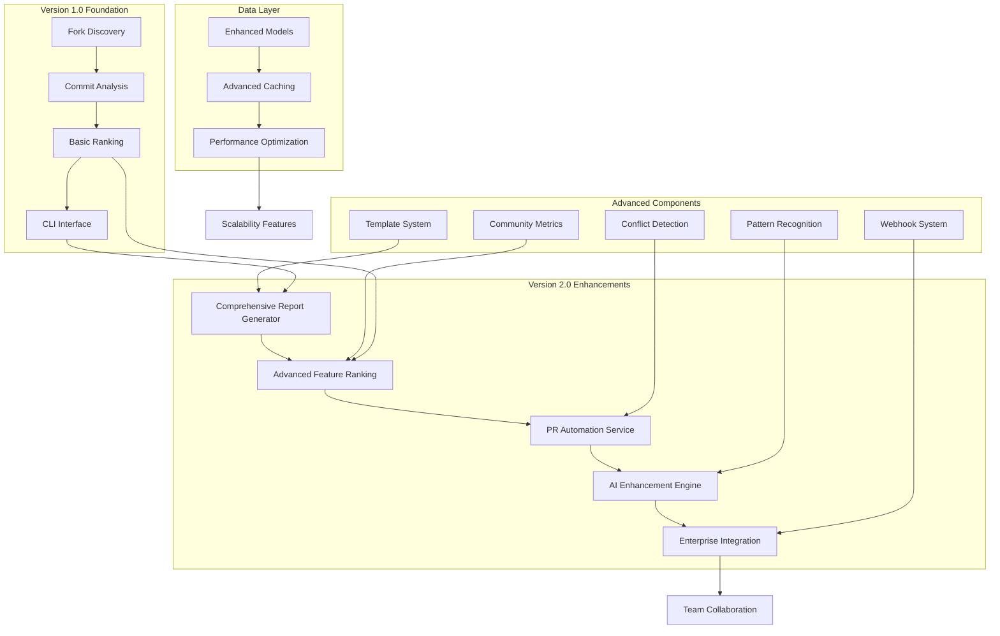

# Forkscout Version 2.0 Features Design

## Overview

This design document outlines the architecture and implementation approach for Forkscout Version 2.0 features. Building upon the solid foundation of Version 1.0's core fork analysis capabilities, Version 2.0 introduces sophisticated reporting, advanced automation, enhanced AI integration, and enterprise-grade features. The design emphasizes modularity, scalability, and backward compatibility while providing significant new value for repository maintainers and development teams.

## Architecture

### Version 2.0 Feature Architecture



## Components and Interfaces

### 1. Comprehensive Report Generation System

#### 1.1 Advanced Report Generator
```python
class ComprehensiveReportGenerator:
    """Generates rich, detailed analysis reports with advanced formatting"""
    
    def generate_executive_summary(
        self, 
        analysis_result: AnalysisResult,
        template: ExecutiveSummaryTemplate
    ) -> ExecutiveSummary:
        """Generate high-level summary for stakeholders"""
        
    def generate_technical_deep_dive(
        self, 
        analysis_result: AnalysisResult,
        include_code_snippets: bool = True
    ) -> TechnicalReport:
        """Generate detailed technical analysis with code examples"""
        
    def generate_contributor_focused_report(
        self, 
        analysis_result: AnalysisResult,
        contributor_filter: ContributorFilter = None
    ) -> ContributorReport:
        """Generate report focused on contributor insights"""
```

#### 1.2 Template System
```python
class ReportTemplateEngine:
    """Manages report templates and customization"""
    
    def load_template(self, template_name: str) -> ReportTemplate:
        """Load predefined or custom report template"""
        
    def customize_template(
        self, 
        base_template: ReportTemplate,
        customizations: TemplateCustomizations
    ) -> ReportTemplate:
        """Apply custom styling and formatting"""
        
    def render_with_template(
        self, 
        data: ReportData,
        template: ReportTemplate
    ) -> str:
        """Render report using specified template"""
```

#### 1.3 Code Snippet Extractor
```python
class CodeSnippetExtractor:
    """Extracts and formats code snippets from commits"""
    
    def extract_feature_snippets(
        self, 
        feature: Feature,
        context_lines: int = 3
    ) -> List[CodeSnippet]:
        """Extract relevant code snippets with context"""
        
    def format_with_syntax_highlighting(
        self, 
        snippet: CodeSnippet,
        language: str
    ) -> FormattedSnippet:
        """Apply syntax highlighting for display"""
        
    def generate_diff_visualization(
        self, 
        before: str,
        after: str
    ) -> DiffVisualization:
        """Create visual diff representation"""
```

### 2. Advanced Pull Request Automation

#### 2.1 PR Automation Service
```python
class AdvancedPRAutomationService:
    """Sophisticated pull request creation and management"""
    
    def create_feature_pr(
        self, 
        feature: RankedFeature,
        target_repo: Repository,
        automation_config: PRAutomationConfig
    ) -> PullRequestResult:
        """Create PR with comprehensive analysis and validation"""
        
    def batch_create_prs(
        self, 
        features: List[RankedFeature],
        target_repo: Repository,
        batch_config: BatchPRConfig
    ) -> BatchPRResult:
        """Create multiple PRs with intelligent scheduling"""
        
    def monitor_pr_status(
        self, 
        pr_ids: List[str]
    ) -> List[PRStatusUpdate]:
        """Monitor and report on PR status changes"""
```

#### 2.2 Merge Conflict Detection Engine
```python
class MergeConflictDetector:
    """Advanced merge conflict detection and resolution guidance"""
    
    def analyze_potential_conflicts(
        self, 
        feature: Feature,
        target_branch: str
    ) -> ConflictAnalysis:
        """Analyze potential merge conflicts before PR creation"""
        
    def generate_resolution_suggestions(
        self, 
        conflicts: List[MergeConflict]
    ) -> List[ResolutionSuggestion]:
        """Provide intelligent conflict resolution suggestions"""
        
    def create_conflict_resolution_guide(
        self, 
        conflict_analysis: ConflictAnalysis
    ) -> ConflictResolutionGuide:
        """Generate step-by-step resolution guide"""
```

#### 2.3 Contribution Compliance Validator
```python
class ContributionComplianceValidator:
    """Validates features against repository contribution guidelines"""
    
    def parse_contribution_guidelines(
        self, 
        repo: Repository
    ) -> ContributionGuidelines:
        """Parse and understand repository contribution requirements"""
        
    def validate_feature_compliance(
        self, 
        feature: Feature,
        guidelines: ContributionGuidelines
    ) -> ComplianceReport:
        """Validate feature against all compliance requirements"""
        
    def generate_compliance_checklist(
        self, 
        feature: Feature,
        guidelines: ContributionGuidelines
    ) -> ComplianceChecklist:
        """Generate checklist for manual compliance verification"""
```

### 3. Enhanced Feature Ranking System

#### 3.1 Community Engagement Analyzer
```python
class CommunityEngagementAnalyzer:
    """Analyzes community engagement metrics for feature ranking"""
    
    def calculate_engagement_score(
        self, 
        fork: Fork
    ) -> EngagementScore:
        """Calculate comprehensive engagement score"""
        
    def analyze_contributor_reputation(
        self, 
        contributor: Contributor
    ) -> ReputationScore:
        """Analyze contributor reputation and expertise"""
        
    def assess_feature_adoption(
        self, 
        feature: Feature,
        similar_features: List[Feature]
    ) -> AdoptionMetrics:
        """Assess how widely a feature has been adopted"""
```

#### 3.2 Feature Similarity Detector
```python
class FeatureSimilarityDetector:
    """Detects and groups similar features across forks"""
    
    def detect_similar_features(
        self, 
        features: List[Feature],
        similarity_threshold: float = 0.8
    ) -> List[FeatureGroup]:
        """Group features by similarity"""
        
    def calculate_feature_similarity(
        self, 
        feature1: Feature,
        feature2: Feature
    ) -> SimilarityScore:
        """Calculate similarity score between two features"""
        
    def rank_within_groups(
        self, 
        feature_groups: List[FeatureGroup]
    ) -> List[RankedFeatureGroup]:
        """Rank features within similarity groups"""
```

#### 3.3 Advanced Scoring Engine
```python
class AdvancedScoringEngine:
    """Sophisticated feature scoring with multiple factors"""
    
    def calculate_comprehensive_score(
        self, 
        feature: Feature,
        context: ScoringContext
    ) -> ComprehensiveScore:
        """Calculate score using all available factors"""
        
    def apply_custom_scoring_rules(
        self, 
        feature: Feature,
        custom_rules: List[ScoringRule]
    ) -> CustomScore:
        """Apply user-defined scoring rules"""
        
    def generate_score_explanation(
        self, 
        score: ComprehensiveScore
    ) -> ScoreExplanation:
        """Generate detailed explanation of score calculation"""
```

### 4. AI Enhancement Engine

#### 4.1 Pattern Recognition System
```python
class PatternRecognitionEngine:
    """Identifies patterns and trends across fork ecosystems"""
    
    def identify_recurring_patterns(
        self, 
        commits: List[Commit]
    ) -> List[RecurringPattern]:
        """Identify common patterns across commits"""
        
    def analyze_architectural_trends(
        self, 
        features: List[Feature]
    ) -> ArchitecturalTrends:
        """Analyze architectural patterns and trends"""
        
    def detect_bug_fix_patterns(
        self, 
        bug_fixes: List[BugFix]
    ) -> BugFixPatterns:
        """Identify common bug fix patterns"""
```

#### 4.2 Enhanced AI Analysis
```python
class EnhancedAIAnalyzer:
    """Advanced AI-powered analysis with contextual understanding"""
    
    def analyze_architectural_impact(
        self, 
        commit: Commit,
        codebase_context: CodebaseContext
    ) -> ArchitecturalImpact:
        """Analyze architectural implications of changes"""
        
    def generate_integration_complexity_assessment(
        self, 
        feature: Feature,
        target_codebase: Codebase
    ) -> IntegrationComplexity:
        """Assess complexity of integrating feature"""
        
    def provide_improvement_recommendations(
        self, 
        analysis_result: AnalysisResult
    ) -> List[ImprovementRecommendation]:
        """Generate recommendations for repository improvement"""
```

### 5. Enterprise Integration System

#### 5.1 Webhook Integration
```python
class WebhookIntegrationService:
    """Manages webhook integrations with external systems"""
    
    def register_webhook(
        self, 
        webhook_config: WebhookConfig
    ) -> WebhookRegistration:
        """Register webhook for analysis events"""
        
    def send_feature_notification(
        self, 
        feature: RankedFeature,
        webhook_endpoints: List[WebhookEndpoint]
    ) -> NotificationResult:
        """Send feature discovery notifications"""
        
    def handle_webhook_responses(
        self, 
        responses: List[WebhookResponse]
    ) -> WebhookHandlingResult:
        """Process responses from webhook endpoints"""
```

#### 5.2 Team Collaboration System
```python
class TeamCollaborationService:
    """Enables team-based feature review and decision making"""
    
    def create_feature_review_session(
        self, 
        features: List[RankedFeature],
        team_members: List[TeamMember]
    ) -> ReviewSession:
        """Create collaborative review session"""
        
    def collect_team_feedback(
        self, 
        review_session: ReviewSession
    ) -> TeamFeedback:
        """Collect and aggregate team feedback"""
        
    def generate_consensus_report(
        self, 
        team_feedback: TeamFeedback
    ) -> ConsensusReport:
        """Generate report on team consensus"""
```

#### 5.3 API Integration Layer
```python
class APIIntegrationLayer:
    """Provides API endpoints for external tool integration"""
    
    def get_analysis_results(
        self, 
        repo_id: str,
        filters: AnalysisFilters = None
    ) -> APIAnalysisResult:
        """Get analysis results via API"""
        
    def trigger_analysis(
        self, 
        repo_url: str,
        analysis_config: AnalysisConfig
    ) -> AnalysisJob:
        """Trigger analysis via API"""
        
    def subscribe_to_updates(
        self, 
        subscription_config: SubscriptionConfig
    ) -> Subscription:
        """Subscribe to analysis updates"""
```

## Data Models

### Enhanced Data Models

```python
@dataclass
class ComprehensiveScore:
    """Enhanced scoring with detailed breakdown"""
    overall_score: float
    component_scores: Dict[str, float]
    confidence_level: float
    score_explanation: str
    contributing_factors: List[ScoringFactor]

@dataclass
class FeatureGroup:
    """Group of similar features"""
    group_id: str
    similarity_theme: str
    features: List[Feature]
    group_score: float
    recommended_feature: Feature

@dataclass
class ConflictAnalysis:
    """Detailed merge conflict analysis"""
    has_conflicts: bool
    conflict_locations: List[ConflictLocation]
    conflict_severity: ConflictSeverity
    resolution_difficulty: ResolutionDifficulty
    suggested_approach: ResolutionApproach

@dataclass
class EngagementScore:
    """Community engagement metrics"""
    stars_score: float
    forks_score: float
    activity_score: float
    contributor_reputation: float
    adoption_indicators: List[AdoptionIndicator]
    overall_engagement: float

@dataclass
class ExecutiveSummary:
    """High-level summary for stakeholders"""
    key_findings: List[KeyFinding]
    top_recommendations: List[Recommendation]
    impact_assessment: ImpactAssessment
    resource_requirements: ResourceRequirements
    timeline_estimate: TimelineEstimate
```

## Performance and Scalability

### Advanced Caching Strategy

```python
class AdvancedCacheManager:
    """Sophisticated caching for Version 2.0 features"""
    
    def cache_analysis_results(
        self, 
        analysis_result: AnalysisResult,
        cache_policy: CachePolicy
    ) -> CacheEntry:
        """Cache analysis results with intelligent policies"""
        
    def implement_incremental_caching(
        self, 
        repo: Repository,
        last_analysis: datetime
    ) -> IncrementalCacheStrategy:
        """Implement incremental analysis caching"""
        
    def optimize_cache_warming(
        self, 
        popular_repos: List[Repository]
    ) -> CacheWarmingPlan:
        """Optimize cache warming for popular repositories"""
```

### Parallel Processing Engine

```python
class ParallelProcessingEngine:
    """Advanced parallel processing for large-scale analysis"""
    
    def process_forks_in_parallel(
        self, 
        forks: List[Fork],
        max_workers: int = None
    ) -> ParallelProcessingResult:
        """Process multiple forks concurrently"""
        
    def implement_work_stealing(
        self, 
        work_queue: WorkQueue
    ) -> WorkStealingResult:
        """Implement work-stealing for load balancing"""
        
    def optimize_resource_utilization(
        self, 
        system_resources: SystemResources
    ) -> ResourceOptimization:
        """Optimize CPU and memory utilization"""
```

### 6. Promising Forks Discovery System

#### 6.1 Promising Forks Analyzer
```python
class PromisingForksAnalyzer:
    """Intelligent discovery and ranking of promising forks"""
    
    def analyze_promising_forks(
        self, 
        repository: Repository,
        criteria: PromisingForksCriteria
    ) -> List[PromisingFork]:
        """Analyze and rank forks based on promising criteria"""
        
    def calculate_activity_score(
        self, 
        fork: Fork,
        time_window_days: int = 365
    ) -> ActivityScore:
        """Calculate comprehensive activity score for fork"""
        
    def assess_contribution_potential(
        self, 
        fork: Fork,
        upstream_repo: Repository
    ) -> ContributionPotential:
        """Assess potential value of fork's contributions"""
```

#### 6.2 Fork Filtering Engine
```python
class ForkFilteringEngine:
    """Advanced filtering system for fork discovery"""
    
    def apply_activity_filters(
        self, 
        forks: List[Fork],
        activity_criteria: ActivityCriteria
    ) -> List[Fork]:
        """Filter forks based on activity metrics"""
        
    def apply_engagement_filters(
        self, 
        forks: List[Fork],
        engagement_criteria: EngagementCriteria
    ) -> List[Fork]:
        """Filter forks based on community engagement"""
        
    def apply_temporal_filters(
        self, 
        forks: List[Fork],
        temporal_criteria: TemporalCriteria
    ) -> List[Fork]:
        """Filter forks based on age and timing criteria"""
```

#### 6.3 Promising Forks Display System
```python
class PromisingForksDisplayService:
    """Display and visualization for promising forks"""
    
    def display_promising_forks_table(
        self, 
        promising_forks: List[PromisingFork]
    ) -> RichTable:
        """Display promising forks in formatted table"""
        
    def generate_activity_visualization(
        self, 
        fork: PromisingFork
    ) -> ActivityVisualization:
        """Generate visual representation of fork activity"""
        
    def create_comparison_matrix(
        self, 
        promising_forks: List[PromisingFork]
    ) -> ComparisonMatrix:
        """Create comparison matrix for fork evaluation"""
```

## Security and Compliance

### Enterprise Security Features

```python
class EnterpriseSecurityManager:
    """Security features for enterprise deployments"""
    
    def implement_rbac(
        self, 
        users: List[User],
        roles: List[Role]
    ) -> RBACConfiguration:
        """Implement role-based access control"""
        
    def audit_user_actions(
        self, 
        user_action: UserAction
    ) -> AuditLogEntry:
        """Log user actions for compliance"""
        
    def encrypt_sensitive_data(
        self, 
        data: SensitiveData
    ) -> EncryptedData:
        """Encrypt sensitive analysis data"""
```

## Testing Strategy

### Advanced Testing Framework

```python
class AdvancedTestSuite:
    """Comprehensive testing for Version 2.0 features"""
    
    def test_report_generation_accuracy(self):
        """Test accuracy of generated reports"""
        
    def test_pr_automation_reliability(self):
        """Test reliability of PR automation"""
        
    def test_feature_ranking_consistency(self):
        """Test consistency of feature ranking"""
        
    def test_enterprise_integration(self):
        """Test enterprise integration features"""
        
    def test_performance_under_load(self):
        """Test performance with large repositories"""
```

This design provides a comprehensive framework for implementing Forkscout Version 2.0 features while maintaining compatibility with the Version 1.0 foundation and ensuring scalability for enterprise use cases.