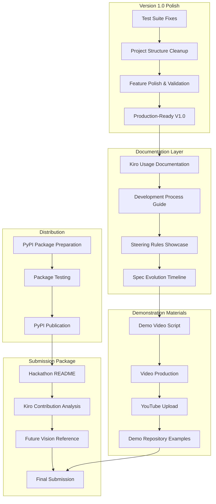

# Hackathon Submission Preparation Design

## Overview

This design outlines the strategic approach for preparing the Forklift project for the Code with Kiro Hackathon submission. Based on the functionality assessment showing the project is 75% complete with strong core capabilities, the design focuses on polishing existing features, creating compelling demonstration materials, and showcasing sophisticated Kiro usage while moving advanced features to Version 2.0 to ensure a production-ready Version 1.0 submission.

## Version Strategy

### Version 1.0 (Hackathon Submission Focus)
- **Polished Core Features**: Reliable fork discovery, analysis, and basic ranking
- **Professional CLI Interface**: Clean, error-free command-line interface with all step-by-step commands
- **Quality Assurance**: 100% test pass rate and clean project structure
- **Commit Explanations**: Working AI-powered commit analysis and categorization
- **Performance**: Efficient caching and responsive user experience
- **Professional Presentation**: Comprehensive documentation and clean codebase

### Future Development Reference
- **Version 2.0 Specification**: Separate spec created for advanced features (PR automation, enhanced ranking, comprehensive reports)
- **Enterprise Vision**: Planned features for scheduled analysis, webhook integration, team collaboration
- **Sustainable Architecture**: Current foundation designed to support future enhancements

## Architecture

### Submission Preparation Architecture



## Components and Interfaces

### 1. Quality Assurance Components

#### 1.1 Test Suite Validator
```python
class TestSuiteValidator:
    """Validates and fixes test suite issues for production readiness"""
    
    def identify_collection_errors(self) -> List[TestCollectionError]:
        """Identify and catalog test collection errors"""
        
    def fix_import_issues(self, errors: List[TestCollectionError]) -> FixResult:
        """Fix import and dependency issues in test files"""
        
    def validate_test_coverage(self) -> CoverageReport:
        """Validate test coverage meets quality standards"""
```

#### 1.2 Project Structure Cleaner
```python
class ProjectStructureCleaner:
    """Cleans and organizes project structure for professional presentation"""
    
    def identify_temporary_files(self) -> List[TemporaryFile]:
        """Identify temporary and development files to remove"""
        
    def organize_development_artifacts(self) -> OrganizationResult:
        """Organize development artifacts in proper directories"""
        
    def validate_gitignore_configuration(self) -> GitignoreValidation:
        """Ensure .gitignore properly excludes development files"""
```

#### 1.3 Feature Polish Validator
```python
class FeaturePolishValidator:
    """Validates existing features work reliably for demonstration"""
    
    def validate_cli_commands(self) -> List[CommandValidation]:
        """Validate all CLI commands work without errors"""
        
    def test_analysis_pipeline(self) -> PipelineValidation:
        """Test complete analysis pipeline with real repositories"""
        
    def validate_error_handling(self) -> ErrorHandlingReport:
        """Ensure graceful error handling throughout the system"""
```

### 2. Documentation Components

#### 2.1 Kiro Usage Documentation System
```python
class KiroUsageDocumenter:
    """Documents comprehensive Kiro usage throughout development"""
    
    def analyze_spec_evolution(self) -> SpecEvolutionReport:
        """Analyze how 14 specs evolved during development"""
        
    def document_steering_rules_impact(self) -> SteeringRulesReport:
        """Document how 19 steering rules guided development"""
        
    def extract_kiro_contributions(self) -> KiroContributionReport:
        """Extract and quantify Kiro's contributions to the codebase"""
```

#### 2.2 Development Process Documentation
```python
class DevelopmentProcessDocumenter:
    """Documents the spec-driven development process"""
    
    def create_workflow_examples(self) -> List[WorkflowExample]:
        """Create examples of requirements → design → tasks → implementation"""
        
    def document_iterative_development(self) -> IterativeDevelopmentReport:
        """Document how specs enabled incremental feature development"""
        
    def showcase_ai_human_collaboration(self) -> CollaborationReport:
        """Showcase human-AI collaboration patterns"""
```

### 3. Demonstration Components

#### 3.1 Demo Video Production System
```python
class DemoVideoProducer:
    """Manages demo video creation and production"""
    
    def create_video_script(self) -> VideoScript:
        """Create 3-minute demo video script"""
        
    def prepare_demo_scenarios(self) -> List[DemoScenario]:
        """Prepare compelling demo scenarios with real repositories"""
        
    def generate_kiro_development_showcase(self) -> KiroDevelopmentShowcase:
        """Generate segments showing Kiro development process"""
```

#### 3.2 Demo Repository Preparation
```python
class DemoRepositoryPreparator:
    """Prepares demonstration repositories and examples"""
    
    def select_showcase_repositories(self) -> List[Repository]:
        """Select repositories that best demonstrate tool capabilities"""
        
    def prepare_quick_start_examples(self) -> List[QuickStartExample]:
        """Prepare examples for judges to quickly test the tool"""
        
    def create_demo_configurations(self) -> List[DemoConfiguration]:
        """Create optimized configurations for demonstration"""
```

### 4. Distribution Components

#### 4.1 PyPI Package Manager
```python
class PyPIPackageManager:
    """Manages PyPI package preparation and distribution"""
    
    def prepare_package_metadata(self) -> PackageMetadata:
        """Prepare comprehensive package metadata for PyPI"""
        
    def build_distribution_package(self) -> DistributionPackage:
        """Build wheel and source distributions"""
        
    def validate_package_installation(self) -> ValidationResult:
        """Validate package installs and runs correctly"""
```

### 5. Submission Components

#### 5.1 Hackathon Submission Manager
```python
class HackathonSubmissionManager:
    """Manages complete hackathon submission preparation"""
    
    def create_submission_readme(self) -> str:
        """Create comprehensive submission README"""
        
    def generate_kiro_contribution_analysis(self) -> KiroContributionAnalysis:
        """Generate detailed analysis of Kiro's contributions"""
        
    def document_team_roles(self) -> TeamRoleDocumentation:
        """Document team member roles and contributions"""
```

## Data Models

### Core Models

```python
@dataclass
class HackathonSubmission:
    """Complete hackathon submission package"""
    project_category: ProjectCategory
    demo_video_url: str
    repository_url: str
    kiro_usage_writeup: str
    team_roles: Dict[str, TeamMemberRole]
    kiro_contribution_percentage: float
    submission_materials: List[SubmissionMaterial]

@dataclass
class KiroContributionAnalysis:
    """Analysis of Kiro's contributions to the project"""
    total_lines_of_code: int
    kiro_generated_lines: int
    kiro_assisted_lines: int
    manually_written_lines: int
    contribution_percentage: float
    feature_breakdown: Dict[str, KiroContribution]
    spec_driven_components: List[str]

@dataclass
class TeamMemberRole:
    """Individual team member role and contributions"""
    name: str
    role: str
    responsibilities: List[str]
    contributions: List[str]
    kiro_collaboration_examples: List[str]

@dataclass
class VideoScript:
    """Demo video script structure"""
    duration_seconds: int
    segments: List[VideoSegment]
    kiro_showcase_segments: List[KiroShowcaseSegment]
    tool_demonstration_segments: List[ToolDemoSegment]

@dataclass
class SpecEvolutionReport:
    """Report on how specs evolved during development"""
    total_specs: int
    spec_timeline: List[SpecEvolution]
    feature_to_spec_mapping: Dict[str, str]
    iterative_development_examples: List[str]
```

### Report Generation Models

```python
@dataclass
class ReportTemplate:
    """Template for generating comprehensive reports"""
    sections: List[ReportSection]
    formatting_options: FormattingOptions
    feature_summary_template: str
    ranking_display_template: str

@dataclass
class RankedFeature:
    """Feature with comprehensive ranking information"""
    feature: Feature
    overall_score: float
    category_rank: int
    global_rank: int
    community_engagement_score: float
    similarity_group: str
    recommendation_strength: RecommendationStrength
```

## Error Handling

### Submission Preparation Error Handling

```python
class SubmissionPreparationError(Exception):
    """Base exception for submission preparation issues"""
    pass

class CoreFeatureIncompleteError(SubmissionPreparationError):
    """Raised when core features are not complete enough for submission"""
    pass

class VideoProductionError(SubmissionPreparationError):
    """Raised when video production fails"""
    pass

class PyPIPackageError(SubmissionPreparationError):
    """Raised when PyPI package preparation fails"""
    pass

class DocumentationGenerationError(SubmissionPreparationError):
    """Raised when documentation generation fails"""
    pass
```

### Error Recovery Strategies

1. **Core Feature Completion Failures**
   - Graceful degradation to partial functionality
   - Clear documentation of limitations
   - Alternative demonstration approaches

2. **Video Production Issues**
   - Fallback to screen recording tools
   - Alternative video hosting platforms
   - Simplified demonstration approach

3. **Package Distribution Problems**
   - Local installation instructions
   - Docker container alternative
   - Direct repository installation

## Testing Strategy

### Submission Validation Testing

```python
class SubmissionValidationTests:
    """Tests to validate submission completeness"""
    
    def test_core_features_complete(self):
        """Verify all core features are functional"""
        
    def test_demo_video_requirements(self):
        """Verify demo video meets hackathon requirements"""
        
    def test_pypi_package_installation(self):
        """Verify package installs correctly from PyPI"""
        
    def test_documentation_completeness(self):
        """Verify all required documentation is present"""
        
    def test_kiro_usage_documentation(self):
        """Verify Kiro usage is properly documented"""
```

### Integration Testing for New Features

```python
class NewFeatureIntegrationTests:
    """Integration tests for newly completed features"""
    
    def test_report_generation_integration(self):
        """Test complete report generation workflow"""
        
    def test_pr_automation_integration(self):
        """Test PR automation with real repositories"""
        
    def test_feature_ranking_integration(self):
        """Test enhanced feature ranking system"""
```

## Performance Considerations

### Submission Preparation Performance

1. **Report Generation Optimization**
   - Template caching for faster report generation
   - Parallel processing for large feature sets
   - Incremental report updates

2. **Video Production Efficiency**
   - Automated screen recording scripts
   - Batch processing for multiple demo scenarios
   - Optimized video encoding settings

3. **Package Build Optimization**
   - Cached dependency resolution
   - Parallel testing across Python versions
   - Automated build validation

## Security Considerations

### Submission Security

1. **API Key Management**
   - Ensure no API keys in demo materials
   - Secure token handling in video demonstrations
   - Environment variable documentation

2. **Repository Access**
   - Use public repositories for demonstrations
   - Avoid exposing private repository data
   - Secure handling of GitHub tokens

3. **Package Distribution Security**
   - Code signing for PyPI packages
   - Dependency vulnerability scanning
   - Secure build pipeline

## Deployment and Distribution

### Hackathon Submission Deployment

1. **Repository Preparation**
   - Clean project structure
   - Remove temporary files
   - Ensure .kiro directory is properly included

2. **PyPI Distribution**
   - Automated package building
   - Version management
   - Release documentation

3. **Demo Environment Setup**
   - Docker containers for consistent demos
   - Cloud deployment for judge access
   - Quick-start documentation

## Monitoring and Analytics

### Submission Success Metrics

1. **Completion Tracking**
   - Core feature completion percentage
   - Documentation completeness score
   - Submission material readiness

2. **Quality Metrics**
   - Test coverage for new features
   - Documentation quality assessment
   - Demo video production quality

3. **Kiro Usage Analytics**
   - Percentage of Kiro-generated code
   - Spec-driven development effectiveness
   - AI-human collaboration success metrics

This design provides a comprehensive framework for completing the Forklift project and preparing it for a successful hackathon submission that showcases both the tool's capabilities and the sophisticated use of Kiro's development features.