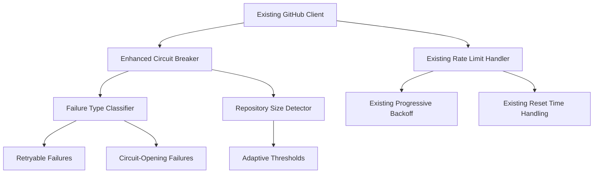

# Design Document

## Overview

This design addresses the specific issue where the circuit breaker opens during large repository analysis (>2000 forks), preventing completion of the operation. The existing rate limiting system is comprehensive and working correctly, but the circuit breaker's failure threshold of 5 is too aggressive for large-scale operations where temporary failures are expected and should be handled gracefully.

The core issue is that when analyzing thousands of forks, even with proper rate limiting, some API calls will fail due to network issues, temporary GitHub API problems, or repository access issues. The current circuit breaker treats these as circuit-opening failures, but for large repositories, we need to distinguish between systematic failures (which should open the circuit) and expected transient failures (which should not).

## Architecture

### Problem Analysis

The current system has excellent rate limiting but fails on large repositories because:

1. **Circuit Breaker Too Aggressive**: 5 failures opens the circuit, but with 2000+ forks, 5 failures is normal
2. **No Failure Type Distinction**: Rate limit failures should not count toward circuit breaker threshold
3. **No Repository Size Awareness**: Large repositories need different failure tolerance
4. **No Graceful Degradation**: Circuit opening stops all processing instead of continuing with successful forks

### Solution Components



### Key Changes

1. **Enhance existing CircuitBreaker** to be repository-size aware
2. **Add failure classification** to distinguish rate limits from real failures  
3. **Implement graceful degradation** when circuit opens
4. **Add configuration options** for large repository processing

## Components and Interfaces

### 1. Enhanced Circuit Breaker (Modify Existing)

The existing `CircuitBreaker` class needs enhancement to handle large repositories:

```python
from dataclasses import dataclass
from enum import Enum
from typing import Optional, Callable, Any

class FailureType(Enum):
    RATE_LIMIT = "rate_limit"           # Should NOT count toward circuit breaker
    NETWORK_ERROR = "network_error"     # Should count, but with higher tolerance
    REPOSITORY_ACCESS = "repository_access"  # Should NOT count (expected for some forks)
    API_ERROR = "api_error"            # Should count
    TIMEOUT = "timeout"                # Should count, but with higher tolerance

@dataclass
class CircuitBreakerConfig:
    """Enhanced configuration for circuit breaker."""
    # Standard thresholds
    base_failure_threshold: int = 5
    large_repo_failure_threshold: int = 25  # Much higher for large repos
    
    # Timeout settings
    timeout_seconds: float = 60.0
    large_repo_timeout_seconds: float = 30.0  # Faster recovery for large repos
    
    # Repository size thresholds
    large_repo_fork_threshold: int = 1000
    
    # Failure type weights (how much each failure type counts toward threshold)
    failure_weights: dict[FailureType, float] = None
    
    def __post_init__(self):
        if self.failure_weights is None:
            self.failure_weights = {
                FailureType.RATE_LIMIT: 0.0,        # Rate limits don't count
                FailureType.REPOSITORY_ACCESS: 0.1,  # Repository access barely counts
                FailureType.NETWORK_ERROR: 0.5,      # Network errors count less
                FailureType.TIMEOUT: 0.5,            # Timeouts count less  
                FailureType.API_ERROR: 1.0,          # API errors count full
            }

class EnhancedCircuitBreaker:
    """Enhanced circuit breaker that's aware of repository size and failure types."""
    
    def __init__(self, config: CircuitBreakerConfig, repository_size: int = 0):
        self.config = config
        self.repository_size = repository_size
        self.weighted_failure_count = 0.0  # Use weighted count instead of simple count
        self.failure_history: list[tuple[float, FailureType]] = []  # Track failure types
        self.last_failure_time: Optional[float] = None
        self.state = "closed"
    
    @property
    def failure_threshold(self) -> int:
        """Get adaptive failure threshold based on repository size."""
        if self.repository_size >= self.config.large_repo_fork_threshold:
            return self.config.large_repo_failure_threshold
        return self.config.base_failure_threshold
    
    def classify_failure(self, exception: Exception) -> FailureType:
        """Classify failure type based on exception."""
        from forklift.github.exceptions import (
            GitHubRateLimitError,
            GitHubNotFoundError,
            GitHubAuthenticationError
        )
        
        if isinstance(exception, GitHubRateLimitError):
            return FailureType.RATE_LIMIT
        elif isinstance(exception, (GitHubNotFoundError, GitHubAuthenticationError)):
            return FailureType.REPOSITORY_ACCESS
        elif isinstance(exception, asyncio.TimeoutError):
            return FailureType.TIMEOUT
        elif isinstance(exception, httpx.NetworkError):
            return FailureType.NETWORK_ERROR
        else:
            return FailureType.API_ERROR
    
    def should_open_circuit(self, failure_type: FailureType) -> bool:
        """Determine if circuit should open based on weighted failure count."""
        # Add weighted failure to count
        weight = self.config.failure_weights.get(failure_type, 1.0)
        self.weighted_failure_count += weight
        
        # Track failure history for analysis
        self.failure_history.append((time.time(), failure_type))
        
        # Clean old failures (older than 5 minutes)
        cutoff_time = time.time() - 300
        self.failure_history = [
            (timestamp, ftype) for timestamp, ftype in self.failure_history
            if timestamp > cutoff_time
        ]
        
        # Recalculate weighted count from recent history
        self.weighted_failure_count = sum(
            self.config.failure_weights.get(ftype, 1.0)
            for _, ftype in self.failure_history
        )
        
        return self.weighted_failure_count >= self.failure_threshold
```

### 2. Graceful Degradation Handler

Instead of complex batch processing (which already exists), we need graceful degradation when the circuit opens:

```python
from typing import List, TypeVar, Callable, Any
from dataclasses import dataclass

T = TypeVar('T')
R = TypeVar('R')

@dataclass
class DegradationConfig:
    """Configuration for graceful degradation."""
    continue_on_circuit_open: bool = True
    circuit_open_retry_interval: float = 30.0  # Retry every 30 seconds
    max_circuit_open_retries: int = 10  # Try for 5 minutes total
    skip_failed_items: bool = True  # Skip items that consistently fail

class GracefulDegradationHandler:
    """Handles graceful degradation when circuit breaker opens."""
    
    def __init__(self, config: DegradationConfig):
        self.config = config
        self.circuit_open_start_time: Optional[float] = None
        self.circuit_open_retry_count = 0
    
    async def handle_circuit_open(
        self,
        remaining_items: List[T],
        processor_func: Callable[[T], Awaitable[R]],
        circuit_breaker: EnhancedCircuitBreaker,
        operation_name: str
    ) -> List[tuple[T, R]]:
        """Handle processing when circuit breaker is open."""
        
        if not self.config.continue_on_circuit_open:
            raise Exception(f"Circuit breaker is open for {operation_name}, stopping processing")
        
        logger.warning(
            f"Circuit breaker is open for {operation_name}. "
            f"Will retry every {self.config.circuit_open_retry_interval}s for up to "
            f"{self.config.max_circuit_open_retries} attempts."
        )
        
        successful_results = []
        
        while self.circuit_open_retry_count < self.config.max_circuit_open_retries:
            # Wait for retry interval
            await asyncio.sleep(self.config.circuit_open_retry_interval)
            
            # Try to process remaining items one by one
            still_remaining = []
            
            for item in remaining_items:
                try:
                    # Try individual item processing
                    result = await circuit_breaker.call(
                        lambda: processor_func(item),
                        f"{operation_name}_individual_retry"
                    )
                    successful_results.append((item, result))
                    
                except Exception as e:
                    if self.config.skip_failed_items:
                        logger.warning(f"Skipping failed item in {operation_name}: {e}")
                        # Don't add to still_remaining - effectively skip it
                    else:
                        still_remaining.append(item)
            
            remaining_items = still_remaining
            
            if not remaining_items:
                logger.info(f"All remaining items processed successfully for {operation_name}")
                break
                
            self.circuit_open_retry_count += 1
            logger.info(
                f"Circuit breaker retry {self.circuit_open_retry_count}/{self.config.max_circuit_open_retries} "
                f"for {operation_name}. {len(remaining_items)} items still pending."
            )
        
        if remaining_items:
            logger.warning(
                f"Circuit breaker recovery failed for {operation_name}. "
                f"{len(remaining_items)} items could not be processed."
            )
        
        return successful_results
```

### 3. Repository Size Detection

Add repository size detection to automatically configure circuit breaker:

```python
class RepositorySizeDetector:
    """Detects repository characteristics to configure resilience parameters."""
    
    @staticmethod
    async def detect_repository_size(github_client: GitHubClient, repo_url: str) -> int:
        """Detect the number of forks for a repository."""
        try:
            # Extract owner/repo from URL
            owner, repo = extract_owner_repo_from_url(repo_url)
            
            # Get repository info to check fork count
            repo_info = await github_client.get_repository(owner, repo)
            fork_count = repo_info.get('forks_count', 0)
            
            logger.info(f"Detected {fork_count} forks for {repo_url}")
            return fork_count
            
        except Exception as e:
            logger.warning(f"Could not detect repository size for {repo_url}: {e}")
            return 0  # Default to small repository behavior
    
    @staticmethod
    def get_recommended_config(fork_count: int) -> CircuitBreakerConfig:
        """Get recommended circuit breaker configuration based on repository size."""
        
        if fork_count >= 2000:
            # Very large repositories - very high tolerance
            return CircuitBreakerConfig(
                base_failure_threshold=5,
                large_repo_failure_threshold=50,  # Very high threshold
                large_repo_fork_threshold=2000,
                timeout_seconds=60.0,
                large_repo_timeout_seconds=20.0,  # Quick recovery
            )
        elif fork_count >= 1000:
            # Large repositories - high tolerance  
            return CircuitBreakerConfig(
                base_failure_threshold=5,
                large_repo_failure_threshold=25,
                large_repo_fork_threshold=1000,
                timeout_seconds=60.0,
                large_repo_timeout_seconds=30.0,
            )
        elif fork_count >= 500:
            # Medium repositories - moderate tolerance
            return CircuitBreakerConfig(
                base_failure_threshold=5,
                large_repo_failure_threshold=15,
                large_repo_fork_threshold=500,
                timeout_seconds=60.0,
                large_repo_timeout_seconds=45.0,
            )
        else:
            # Small repositories - standard behavior
            return CircuitBreakerConfig()  # Use defaults
```

### 4. Integration with Existing GitHub Client

Modify the existing GitHub client to use the enhanced circuit breaker:

```python
class GitHubClientEnhancement:
    """Enhancement to existing GitHub client for large repository support."""
    
    @staticmethod
    async def create_resilient_client(
        config: GitHubConfig,
        repository_url: Optional[str] = None
    ) -> GitHubClient:
        """Create a GitHub client with repository-size-aware resilience."""
        
        # Detect repository size if URL provided
        fork_count = 0
        if repository_url:
            # Create temporary client to detect size
            temp_client = GitHubClient(config)
            fork_count = await RepositorySizeDetector.detect_repository_size(
                temp_client, repository_url
            )
        
        # Get recommended configuration
        circuit_breaker_config = RepositorySizeDetector.get_recommended_config(fork_count)
        
        # Create enhanced circuit breaker
        enhanced_circuit_breaker = EnhancedCircuitBreaker(
            circuit_breaker_config,
            repository_size=fork_count
        )
        
        # Create client with enhanced circuit breaker
        return GitHubClient(
            config=config,
            rate_limit_handler=None,  # Use existing default
            circuit_breaker=enhanced_circuit_breaker,  # Use enhanced version
            error_handler=None  # Use existing default
        )

# Command-line integration
class CLIEnhancement:
    """Enhancement to CLI for large repository support."""
    
    @staticmethod
    def add_resilience_options(parser: argparse.ArgumentParser) -> None:
        """Add command-line options for resilience configuration."""
        
        resilience_group = parser.add_argument_group('resilience', 'Options for large repository processing')
        
        resilience_group.add_argument(
            '--circuit-breaker-threshold',
            type=int,
            help='Override circuit breaker failure threshold (default: auto-detect based on repository size)'
        )
        
        resilience_group.add_argument(
            '--continue-on-circuit-open',
            action='store_true',
            default=True,
            help='Continue processing when circuit breaker opens (default: True)'
        )
        
        resilience_group.add_argument(
            '--skip-failed-forks',
            action='store_true', 
            default=True,
            help='Skip forks that consistently fail instead of stopping (default: True)'
        )
        
        resilience_group.add_argument(
            '--circuit-open-retry-interval',
            type=float,
            default=30.0,
            help='Seconds to wait between retries when circuit is open (default: 30)'
        )
```

## Data Models

### Enhanced Analysis Result

```python
@dataclass
class ResilientAnalysisResult:
    """Enhanced analysis result with resilience information."""
    repository_url: str
    total_forks: int
    successful_forks: List[ForkAnalysisResult]
    failed_forks: List[FailedForkResult]
    processing_summary: ProcessingSummary
    circuit_breaker_events: List[CircuitBreakerEvent]
    performance_metrics: PerformanceMetrics

@dataclass
class FailedForkResult:
    """Information about a fork that failed to process."""
    fork_url: str
    failure_type: FailureType
    error_message: str
    retry_count: int
    last_attempt_time: datetime

@dataclass
class ProcessingSummary:
    """Summary of processing statistics."""
    total_processing_time: timedelta
    total_batches: int
    successful_batches: int
    failed_batches: int
    average_batch_time: timedelta
    circuit_breaker_activations: int

@dataclass
class CircuitBreakerEvent:
    """Record of circuit breaker state changes."""
    timestamp: datetime
    event_type: str  # opened, closed, half_open
    failure_count: int
    failure_type: FailureType
    operation_name: str
```

## Error Handling

### Failure Classification Strategy

```python
class FailureClassifier:
    """Classifies different types of failures for appropriate handling."""
    
    @staticmethod
    def classify_github_error(exception: Exception) -> FailureType:
        """Classify GitHub API errors."""
        if isinstance(exception, GitHubRateLimitError):
            return FailureType.RATE_LIMIT
        elif isinstance(exception, GitHubRepositoryNotFoundError):
            return FailureType.REPOSITORY_ACCESS
        elif isinstance(exception, asyncio.TimeoutError):
            return FailureType.TIMEOUT
        elif isinstance(exception, httpx.NetworkError):
            return FailureType.NETWORK_ERROR
        else:
            return FailureType.API_ERROR
    
    @staticmethod
    def is_retryable(failure_type: FailureType) -> bool:
        """Determine if a failure type should be retried."""
        return failure_type in [
            FailureType.RATE_LIMIT,
            FailureType.NETWORK_ERROR,
            FailureType.TIMEOUT,
            FailureType.API_ERROR
        ]
    
    @staticmethod
    def get_retry_delay(failure_type: FailureType, attempt: int) -> float:
        """Get appropriate retry delay for failure type."""
        base_delays = {
            FailureType.RATE_LIMIT: 60.0,
            FailureType.NETWORK_ERROR: 5.0,
            FailureType.TIMEOUT: 10.0,
            FailureType.API_ERROR: 2.0,
            FailureType.REPOSITORY_ACCESS: 0.0  # Don't retry
        }
        
        base_delay = base_delays.get(failure_type, 5.0)
        return min(base_delay * (2 ** attempt), 300.0)  # Max 5 minutes
```

### Recovery Strategies

```python
class RecoveryStrategyManager:
    """Manages different recovery strategies based on failure patterns."""
    
    def __init__(self, circuit_breaker: AdaptiveCircuitBreaker):
        self.circuit_breaker = circuit_breaker
    
    async def handle_circuit_breaker_open(
        self,
        operation_name: str,
        remaining_items: List[Any]
    ) -> RecoveryAction:
        """Determine recovery action when circuit breaker opens."""
        
        if len(remaining_items) > 1000:
            # For large remaining sets, wait and resume
            return RecoveryAction.WAIT_AND_RESUME
        elif len(remaining_items) > 100:
            # For medium sets, reduce batch size and continue
            return RecoveryAction.REDUCE_BATCH_SIZE
        else:
            # For small sets, switch to individual processing
            return RecoveryAction.INDIVIDUAL_PROCESSING
    
    async def adjust_processing_parameters(
        self,
        failure_pattern: dict[FailureType, int],
        current_config: BatchConfig
    ) -> BatchConfig:
        """Adjust processing parameters based on failure patterns."""
        
        new_config = BatchConfig(**current_config.__dict__)
        
        # Reduce batch size if many failures
        total_failures = sum(failure_pattern.values())
        if total_failures > 10:
            new_config.batch_size = max(10, current_config.batch_size // 2)
        
        # Increase retry delay for rate limit issues
        if failure_pattern.get(FailureType.RATE_LIMIT, 0) > 5:
            new_config.retry_delay_seconds *= 2
        
        return new_config
```

## Testing Strategy

### Integration Tests

```python
class TestLargeRepositoryResilience:
    """Integration tests for large repository analysis resilience."""
    
    @pytest.mark.integration
    async def test_large_repository_analysis_with_failures(self):
        """Test analysis of large repository with simulated failures."""
        
    @pytest.mark.integration
    async def test_circuit_breaker_recovery(self):
        """Test circuit breaker opening and recovery during large analysis."""
        
    @pytest.mark.integration
    async def test_batch_processing_with_partial_failures(self):
        """Test batch processing continues despite individual fork failures."""
        
    @pytest.mark.integration
    async def test_progress_tracking_and_resumption(self):
        """Test progress tracking and operation resumption."""

### Performance Tests

```python
class TestLargeRepositoryPerformance:
    """Performance tests for large repository analysis."""
    
    @pytest.mark.performance
    async def test_memory_usage_with_large_fork_lists(self):
        """Test memory usage remains reasonable with >2000 forks."""
        
    @pytest.mark.performance
    async def test_processing_time_scales_linearly(self):
        """Test processing time scales reasonably with fork count."""
```

### Contract Tests

```python
class TestResilienceContracts:
    """Contract tests for resilience components."""
    
    @pytest.mark.contract
    async def test_adaptive_circuit_breaker_contract(self):
        """Test adaptive circuit breaker maintains expected interface."""
        
    @pytest.mark.contract
    async def test_batch_processor_contract(self):
        """Test batch processor handles all expected input types."""
```

## Implementation Plan

The implementation will be done in phases:

1. **Phase 1**: Adaptive Circuit Breaker - Implement the enhanced circuit breaker with failure classification
2. **Phase 2**: Batch Processing - Add batch processing with failure recovery
3. **Phase 3**: Progress Tracking - Implement progress tracking and resumable operations
4. **Phase 4**: Integration - Integrate all components into the main analysis workflow
5. **Phase 5**: Configuration - Add command-line options for resilience parameters
6. **Phase 6**: Testing - Comprehensive testing with real large repositories