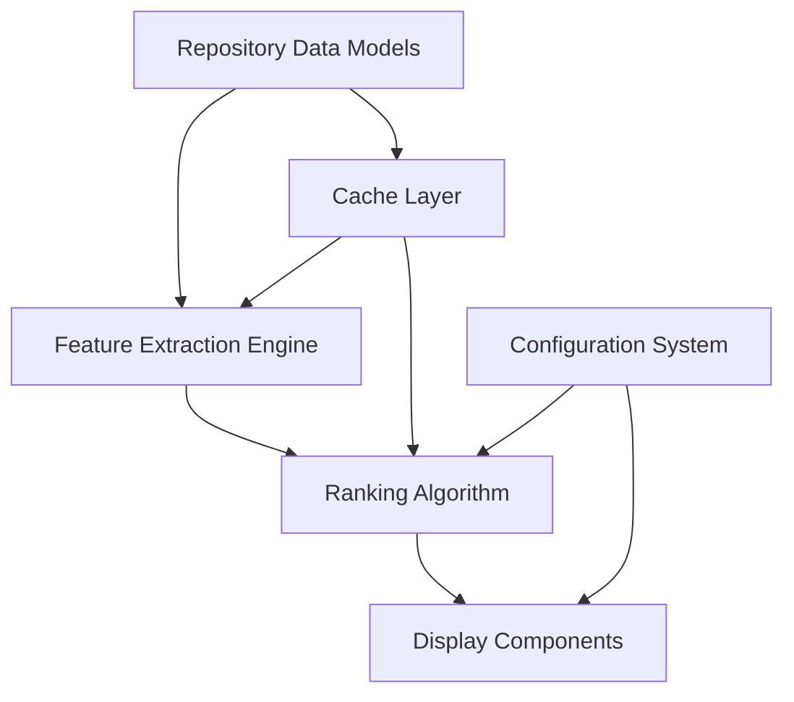

# AI-Assisted Development Patterns in Forkscout

## Overview

This document showcases complex AI-assisted development patterns demonstrated in the Forkscout project. These patterns illustrate how Kiro's AI capabilities can be leveraged for sophisticated software development workflows that go beyond simple code generation.

## Pattern Categories

### 1. Iterative Refinement Patterns
### 2. Multi-Component Integration Patterns  
### 3. Quality-Driven Development Patterns
### 4. Documentation-First Patterns
### 5. Test-Driven AI Patterns

---

## 1. Iterative Refinement Patterns

### Pattern: Spec Evolution Through Implementation

**Description**: Specs are refined iteratively as implementation reveals new requirements and edge cases.

**Example**: GitHub API Optimization Spec

**Initial Spec** (simplified):
```markdown
## Requirement 1: Reduce API Calls
**User Story**: As a user, I want faster analysis, so that I can get results quickly.

#### Acceptance Criteria
1. WHEN analyzing repositories THEN the system SHALL reduce API calls by 50%
```

**After Implementation Learning**:
```markdown
## Requirement 1: Intelligent API Call Optimization
**User Story**: As a user, I want faster analysis with maintained accuracy, so that I can get comprehensive results quickly.

#### Acceptance Criteria
1. WHEN analyzing repositories THEN the system SHALL reduce API calls by 60% through intelligent caching
2. WHEN cache misses occur THEN the system SHALL batch API calls for efficiency
3. WHEN rate limits are approached THEN the system SHALL implement exponential backoff
4. WHEN cached data expires THEN the system SHALL refresh only stale data
```

**AI-Assisted Refinement Process**:
1. **Initial Implementation**: AI generated basic caching mechanism
2. **Performance Analysis**: Hooks identified bottlenecks and inefficiencies
3. **Requirement Evolution**: AI suggested additional requirements based on implementation learnings
4. **Enhanced Implementation**: AI generated optimized solution addressing new requirements

**Code Evolution Example**:

```python
# Initial AI-generated implementation
class SimpleCache:
    def __init__(self):
        self.cache = {}
    
    def get(self, key):
        return self.cache.get(key)
    
    def set(self, key, value):
        self.cache[key] = value

# After iterative refinement with AI assistance
class IntelligentAPICache:
    def __init__(self, ttl_seconds=3600, max_size=1000):
        self.cache = {}
        self.ttl = ttl_seconds
        self.max_size = max_size
        self.access_times = {}
        self.batch_queue = []
    
    async def get_or_fetch_batch(self, keys, fetch_func):
        """Intelligent batching with cache awareness"""
        cached_results = {}
        missing_keys = []
        
        for key in keys:
            cached_value = self._get_if_fresh(key)
            if cached_value is not None:
                cached_results[key] = cached_value
            else:
                missing_keys.append(key)
        
        if missing_keys:
            # Batch fetch missing data
            fresh_results = await fetch_func(missing_keys)
            for key, value in fresh_results.items():
                self._set_with_eviction(key, value)
                cached_results[key] = value
        
        return cached_results
```

### Pattern: Requirement Discovery Through Testing

**Description**: AI discovers missing requirements by analyzing test failures and edge cases.

**Example**: Repository Analysis Feature

**Original Test** (AI-generated):
```python
def test_analyze_repository():
    analyzer = RepositoryAnalyzer()
    result = analyzer.analyze("owner/repo")
    assert result is not None
```

**AI-Discovered Edge Cases**:
```python
@pytest.mark.parametrize("repo_scenario", [
    ("empty_repo", "owner/empty-repo"),
    ("private_repo", "owner/private-repo"), 
    ("archived_repo", "owner/archived-repo"),
    ("fork_repo", "owner/fork-repo"),
    ("large_repo", "owner/large-repo"),
    ("non_existent", "owner/does-not-exist")
])
def test_analyze_repository_edge_cases(repo_scenario):
    scenario_name, repo_path = repo_scenario
    analyzer = RepositoryAnalyzer()
    
    if scenario_name == "non_existent":
        with pytest.raises(RepositoryNotFoundError):
            analyzer.analyze(repo_path)
    elif scenario_name == "private_repo":
        with pytest.raises(AccessDeniedError):
            analyzer.analyze(repo_path)
    else:
        result = analyzer.analyze(repo_path)
        assert result is not None
        # Scenario-specific assertions
        if scenario_name == "empty_repo":
            assert result.commit_count == 0
        elif scenario_name == "archived_repo":
            assert result.is_archived is True
```

**Resulting Requirement Updates**:
```markdown
## Requirement 2.3: Handle Repository Edge Cases
**User Story**: As a user, I want the system to handle various repository states gracefully, so that I get appropriate feedback for all scenarios.

#### Acceptance Criteria
1. WHEN analyzing an empty repository THEN the system SHALL return valid results with zero commits
2. WHEN analyzing a private repository THEN the system SHALL raise AccessDeniedError with helpful message
3. WHEN analyzing an archived repository THEN the system SHALL include archived status in results
4. WHEN analyzing a non-existent repository THEN the system SHALL raise RepositoryNotFoundError
```

---

## 2. Multi-Component Integration Patterns

### Pattern: Cross-Component AI Orchestration

**Description**: AI coordinates development across multiple components to ensure consistency and integration.

**Example**: Commit Explanation Feature Integration

**Components Involved**:
- GitHub API Client
- AI Summary Engine  
- Display Formatter
- Cache Manager
- CLI Interface

**AI Orchestration Process**:

1. **Interface Design Phase**:
```python
# AI-generated interface contracts
class CommitExplanationEngine:
    async def explain_commit(self, commit_data: CommitData) -> CommitExplanation:
        """Generate explanation for a single commit"""
        pass
    
    async def explain_commits_batch(self, commits: List[CommitData]) -> List[CommitExplanation]:
        """Generate explanations for multiple commits efficiently"""
        pass

class CommitExplanation:
    summary: str
    impact_assessment: str
    technical_details: List[str]
    confidence_score: float
```

2. **Implementation Coordination**:
```python
# AI coordinated the implementation across components
class GitHubClient:
    async def get_commit_details(self, commit_sha: str) -> CommitData:
        # Enhanced to provide data needed by explanation engine
        commit_data = await self._fetch_commit(commit_sha)
        commit_data.file_changes = await self._fetch_file_changes(commit_sha)
        commit_data.diff_stats = await self._calculate_diff_stats(commit_sha)
        return commit_data

class CacheManager:
    async def cache_commit_explanation(self, commit_sha: str, explanation: CommitExplanation):
        # Cache structure designed to support explanation data
        cache_key = f"commit_explanation:{commit_sha}"
        await self.set(cache_key, explanation.model_dump(), ttl=86400)

class DisplayFormatter:
    def format_commit_explanation(self, explanation: CommitExplanation) -> str:
        # Formatting coordinated with explanation structure
        return self._render_explanation_template(explanation)
```

3. **Integration Validation**:
```python
# AI-generated integration tests
@pytest.mark.integration
async def test_commit_explanation_full_pipeline():
    """Test complete commit explanation pipeline"""
    # Setup components
    github_client = GitHubClient(token=test_token)
    cache_manager = CacheManager()
    explanation_engine = CommitExplanationEngine()
    formatter = DisplayFormatter()
    
    # Test full pipeline
    commit_data = await github_client.get_commit_details("abc123")
    explanation = await explanation_engine.explain_commit(commit_data)
    
    # Verify cache integration
    await cache_manager.cache_commit_explanation("abc123", explanation)
    cached_explanation = await cache_manager.get_commit_explanation("abc123")
    assert cached_explanation == explanation
    
    # Verify display integration
    formatted_output = formatter.format_commit_explanation(explanation)
    assert "Summary:" in formatted_output
    assert explanation.summary in formatted_output
```

### Pattern: Dependency-Aware Development

**Description**: AI understands component dependencies and implements features in the correct order.

**Example**: Feature Ranking System

**Dependency Analysis**:


**AI-Driven Implementation Order**:

1. **Phase 1: Foundation Components**
```python
# AI implemented data models first
@dataclass
class Repository:
    name: str
    owner: str
    stars: int
    forks: int
    # ... other fields

@dataclass  
class Feature:
    name: str
    description: str
    repository: Repository
    significance_score: float
```

2. **Phase 2: Core Services**
```python
# AI implemented extraction engine after models were stable
class FeatureExtractionEngine:
    def __init__(self, cache_manager: CacheManager):
        self.cache = cache_manager
    
    async def extract_features(self, repo: Repository) -> List[Feature]:
        # Implementation depends on stable Repository model
        pass
```

3. **Phase 3: Business Logic**
```python
# AI implemented ranking after extraction was working
class FeatureRankingEngine:
    def __init__(self, config: RankingConfig):
        self.config = config
    
    def rank_features(self, features: List[Feature]) -> List[RankedFeature]:
        # Implementation depends on stable Feature model and config
        pass
```

4. **Phase 4: Presentation Layer**
```python
# AI implemented display components last
class FeatureDisplayFormatter:
    def format_ranked_features(self, ranked_features: List[RankedFeature]) -> str:
        # Implementation depends on all previous components
        pass
```

---

## 3. Quality-Driven Development Patterns

### Pattern: AI-Assisted Code Review

**Description**: AI performs comprehensive code analysis and suggests improvements before human review.

**Example**: Cache Validation Implementation

**Initial AI Implementation**:
```python
def validate_repository_data(data: dict) -> Repository:
    return Repository(**data)
```

**AI Code Review Analysis**:
```python
# AI identified issues and generated improvements
def validate_repository_data(data: dict) -> Repository:
    """
    Validate and reconstruct Repository from cached data.
    
    AI Analysis:
    - Missing error handling for malformed data
    - No validation of required fields
    - No schema version checking
    - No logging for debugging
    """
    
    # AI-suggested improvements
    if not isinstance(data, dict):
        raise CacheValidationError(f"Expected dict, got {type(data)}")
    
    # Check schema version
    schema_version = data.get('_schema_version', '1.0')
    if schema_version != CURRENT_SCHEMA_VERSION:
        logger.warning(f"Schema version mismatch: {schema_version} vs {CURRENT_SCHEMA_VERSION}")
        data = migrate_schema(data, schema_version)
    
    # Validate required fields
    required_fields = ['name', 'owner', 'url', 'html_url']
    missing_fields = [field for field in required_fields if field not in data]
    if missing_fields:
        raise CacheValidationError(f"Missing required fields: {missing_fields}")
    
    try:
        return Repository(**data)
    except ValidationError as e:
        logger.error(f"Repository validation failed: {e}")
        raise CacheValidationError(f"Invalid repository data: {e}") from e
```

**AI-Generated Tests**:
```python
class TestRepositoryValidation:
    def test_valid_data_succeeds(self):
        valid_data = {
            'name': 'test-repo',
            'owner': 'test-owner',
            'url': 'https://api.github.com/repos/test-owner/test-repo',
            'html_url': 'https://github.com/test-owner/test-repo',
            '_schema_version': '1.0'
        }
        result = validate_repository_data(valid_data)
        assert result.name == 'test-repo'
    
    def test_missing_required_fields_raises_error(self):
        invalid_data = {'name': 'test-repo'}  # Missing required fields
        with pytest.raises(CacheValidationError, match="Missing required fields"):
            validate_repository_data(invalid_data)
    
    def test_schema_version_migration(self):
        old_data = {
            'name': 'test-repo',
            'owner': 'test-owner', 
            'github_url': 'https://github.com/test-owner/test-repo',  # Old field name
            '_schema_version': '0.9'
        }
        result = validate_repository_data(old_data)
        assert result.html_url == 'https://github.com/test-owner/test-repo'
```

### Pattern: Performance-Aware AI Development

**Description**: AI considers performance implications during development and suggests optimizations.

**Example**: Repository Analysis Optimization

**Initial Implementation**:
```python
async def analyze_repositories(repo_urls: List[str]) -> List[AnalysisResult]:
    results = []
    for url in repo_urls:
        result = await analyze_single_repository(url)
        results.append(result)
    return results
```

**AI Performance Analysis**:
```python
# AI identified performance bottlenecks and suggested improvements
async def analyze_repositories(repo_urls: List[str]) -> List[AnalysisResult]:
    """
    Analyze multiple repositories with performance optimizations.
    
    AI Performance Analysis:
    - Sequential processing is inefficient for I/O-bound operations
    - No connection pooling for HTTP requests
    - No caching of repeated requests
    - No rate limiting consideration
    - No error isolation between repositories
    """
    
    # AI-suggested optimizations
    semaphore = asyncio.Semaphore(10)  # Limit concurrent requests
    
    async def analyze_with_semaphore(url: str) -> Optional[AnalysisResult]:
        async with semaphore:
            try:
                return await analyze_single_repository(url)
            except Exception as e:
                logger.error(f"Failed to analyze {url}: {e}")
                return None
    
    # Process repositories concurrently
    tasks = [analyze_with_semaphore(url) for url in repo_urls]
    results = await asyncio.gather(*tasks, return_exceptions=True)
    
    # Filter out None results and exceptions
    return [r for r in results if isinstance(r, AnalysisResult)]
```

**AI-Generated Performance Tests**:
```python
@pytest.mark.performance
async def test_repository_analysis_performance():
    """Test that repository analysis meets performance requirements"""
    repo_urls = [f"https://github.com/user/repo{i}" for i in range(50)]
    
    start_time = time.time()
    results = await analyze_repositories(repo_urls)
    duration = time.time() - start_time
    
    # AI-determined performance requirements
    assert duration < 30.0, f"Analysis took {duration}s, expected < 30s"
    assert len(results) >= len(repo_urls) * 0.9, "Should successfully analyze 90% of repositories"
```

---

## 4. Documentation-First Patterns

### Pattern: Living Documentation

**Description**: AI maintains documentation that evolves with code changes and stays current.

**Example**: API Documentation Evolution

**Initial API Method**:
```python
async def get_repository_forks(self, owner: str, repo: str) -> List[Fork]:
    """Get forks of a repository"""
    # Simple implementation
    pass
```

**After Feature Enhancement**:
```python
async def get_repository_forks(
    self, 
    owner: str, 
    repo: str,
    include_inactive: bool = False,
    min_stars: int = 0,
    sort_by: str = "updated",
    limit: Optional[int] = None
) -> PaginatedResult[Fork]:
    """
    Get forks of a repository with advanced filtering and sorting.
    
    This method retrieves forks of the specified repository with comprehensive
    filtering options to help identify the most relevant forks.
    
    Args:
        owner: Repository owner username
        repo: Repository name
        include_inactive: Include forks with no recent activity (default: False)
        min_stars: Minimum star count for included forks (default: 0)
        sort_by: Sort criteria - 'updated', 'stars', 'created' (default: 'updated')
        limit: Maximum number of forks to return (default: None for all)
    
    Returns:
        PaginatedResult containing Fork objects with metadata
    
    Raises:
        RepositoryNotFoundError: If the repository doesn't exist
        AccessDeniedError: If the repository is private and not accessible
        RateLimitExceededError: If GitHub API rate limit is exceeded
    
    Example:
        >>> client = GitHubClient(token="your_token")
        >>> forks = await client.get_repository_forks(
        ...     "microsoft", "vscode", 
        ...     min_stars=10, 
        ...     sort_by="stars",
        ...     limit=50
        ... )
        >>> print(f"Found {len(forks.items)} active forks")
        Found 42 active forks
    
    Note:
        This method uses intelligent caching to reduce API calls. Results
        are cached for 1 hour and automatically refreshed when stale.
    """
    # Enhanced implementation
    pass
```

**AI-Generated Usage Examples**:
```python
# examples/fork_analysis_examples.py
"""
Examples of using the GitHub fork analysis features.

These examples demonstrate various use cases and patterns for analyzing
repository forks using the Forkscout library.
"""

async def example_basic_fork_analysis():
    """Basic fork analysis example"""
    client = GitHubClient(token=os.getenv("GITHUB_TOKEN"))
    
    # Get forks with basic filtering
    forks = await client.get_repository_forks(
        "microsoft", "vscode",
        min_stars=5
    )
    
    print(f"Found {len(forks.items)} forks with 5+ stars")
    for fork in forks.items[:10]:
        print(f"  {fork.full_name}: {fork.stars} stars")

async def example_advanced_fork_filtering():
    """Advanced fork filtering and analysis"""
    client = GitHubClient(token=os.getenv("GITHUB_TOKEN"))
    
    # Get highly active forks
    active_forks = await client.get_repository_forks(
        "facebook", "react",
        include_inactive=False,
        min_stars=50,
        sort_by="updated",
        limit=20
    )
    
    # Analyze fork characteristics
    for fork in active_forks.items:
        analysis = await client.analyze_fork_activity(fork)
        print(f"{fork.full_name}:")
        print(f"  Recent commits: {analysis.recent_commits}")
        print(f"  Unique features: {len(analysis.unique_features)}")
```

### Pattern: Context-Aware Documentation

**Description**: AI generates documentation that considers the broader project context and user needs.

**Example**: Feature Documentation with Context

**AI-Generated Feature Guide**:
```markdown
# Commit Explanation Feature Guide

## Overview

The commit explanation feature provides AI-powered analysis of Git commits to help developers understand the purpose, impact, and technical details of code changes. This feature integrates seamlessly with the existing fork analysis workflow.

## Integration with Forkscout Workflow

The commit explanation feature enhances the standard Forkscout analysis process:

1. **Fork Discovery**: Standard fork discovery process
2. **Commit Analysis**: NEW - Analyze commits in interesting forks
3. **Feature Ranking**: Enhanced with commit-based insights
4. **Report Generation**: Includes commit explanations in output

## Usage Patterns

### Pattern 1: Analyzing Recent Fork Activity
```bash
# Analyze forks and explain recent commits
forkscout analyze microsoft/vscode --explain-commits --recent-only
```

### Pattern 2: Understanding Feature Differences
```bash
# Focus on commits that introduce new features
forkscout analyze facebook/react --explain-commits --feature-commits-only
```

### Pattern 3: Comprehensive Fork Analysis
```bash
# Full analysis with commit explanations
forkscout analyze torvalds/linux --explain-commits --include-all
```

## Technical Implementation

The commit explanation feature uses a multi-stage AI pipeline:

1. **Commit Classification**: Categorize commits by type (feature, bugfix, refactor)
2. **Impact Analysis**: Assess the scope and significance of changes
3. **Technical Summary**: Generate human-readable explanations
4. **Context Integration**: Connect commits to broader project patterns

## Performance Considerations

- **Caching**: Commit explanations are cached for 24 hours
- **Rate Limiting**: Respects GitHub API limits with intelligent batching
- **Selective Analysis**: Only analyzes commits that meet significance thresholds
- **Parallel Processing**: Processes multiple commits concurrently

## Configuration Options

```yaml
# forkscout.yaml
commit_explanation:
  enabled: true
  max_commits_per_fork: 50
  significance_threshold: 0.7
  cache_duration: 86400  # 24 hours
  ai_model: "gpt-3.5-turbo"
```

## Error Handling

The feature gracefully handles various error conditions:

- **API Rate Limits**: Implements exponential backoff
- **Large Commits**: Truncates diff analysis for very large changes
- **AI Service Unavailable**: Falls back to basic commit metadata
- **Invalid Commits**: Skips malformed or inaccessible commits

## Examples and Use Cases

See the [examples directory](../examples/) for comprehensive usage examples and common patterns.
```

---

## 5. Test-Driven AI Patterns

### Pattern: AI-Generated Test Scenarios

**Description**: AI generates comprehensive test scenarios based on requirements and edge case analysis.

**Example**: Repository Validation Testing

**AI Requirement Analysis**:
```python
# AI analyzed the requirement and generated test scenarios
"""
Requirement: "System SHALL validate repository data before processing"

AI Analysis of Test Scenarios Needed:
1. Valid repository data (happy path)
2. Missing required fields
3. Invalid field types
4. Malformed URLs
5. Empty/null values
6. Extremely large values
7. Special characters in names
8. Unicode handling
9. Schema version mismatches
10. Nested object validation
"""
```

**AI-Generated Test Suite**:
```python
class TestRepositoryValidation:
    """Comprehensive repository validation tests generated by AI"""
    
    @pytest.fixture
    def valid_repo_data(self):
        return {
            'name': 'test-repo',
            'owner': 'test-owner',
            'url': 'https://api.github.com/repos/test-owner/test-repo',
            'html_url': 'https://github.com/test-owner/test-repo',
            'clone_url': 'https://github.com/test-owner/test-repo.git',
            'stars': 42,
            'forks': 7,
            'created_at': '2023-01-15T10:30:00Z',
            '_schema_version': '1.0'
        }
    
    def test_valid_repository_data_succeeds(self, valid_repo_data):
        """Test that valid repository data is accepted"""
        repo = validate_repository_data(valid_repo_data)
        assert repo.name == 'test-repo'
        assert repo.owner == 'test-owner'
        assert repo.stars == 42
    
    @pytest.mark.parametrize("missing_field", [
        'name', 'owner', 'url', 'html_url', 'clone_url'
    ])
    def test_missing_required_fields_raise_error(self, valid_repo_data, missing_field):
        """Test that missing required fields raise appropriate errors"""
        del valid_repo_data[missing_field]
        with pytest.raises(ValidationError, match=missing_field):
            validate_repository_data(valid_repo_data)
    
    @pytest.mark.parametrize("field,invalid_value,expected_error", [
        ('stars', 'not-a-number', 'must be an integer'),
        ('forks', -1, 'must be non-negative'),
        ('url', 'not-a-url', 'invalid URL format'),
        ('created_at', 'invalid-date', 'invalid datetime format'),
        ('name', '', 'cannot be empty'),
        ('owner', None, 'cannot be null'),
    ])
    def test_invalid_field_values_raise_errors(self, valid_repo_data, field, invalid_value, expected_error):
        """Test that invalid field values raise appropriate errors"""
        valid_repo_data[field] = invalid_value
        with pytest.raises(ValidationError, match=expected_error):
            validate_repository_data(valid_repo_data)
    
    @pytest.mark.parametrize("name", [
        'repo-with-hyphens',
        'repo_with_underscores', 
        'repo.with.dots',
        'repo123',
        'UPPERCASE-REPO',
        'mixed-Case_Repo.123'
    ])
    def test_valid_repository_names_accepted(self, valid_repo_data, name):
        """Test that various valid repository name formats are accepted"""
        valid_repo_data['name'] = name
        repo = validate_repository_data(valid_repo_data)
        assert repo.name == name
    
    @pytest.mark.parametrize("name", [
        '',  # Empty
        ' ',  # Whitespace only
        'repo with spaces',  # Spaces not allowed
        'repo/with/slashes',  # Slashes not allowed
        'a' * 101,  # Too long
    ])
    def test_invalid_repository_names_rejected(self, valid_repo_data, name):
        """Test that invalid repository names are rejected"""
        valid_repo_data['name'] = name
        with pytest.raises(ValidationError):
            validate_repository_data(valid_repo_data)
    
    def test_unicode_handling(self, valid_repo_data):
        """Test that Unicode characters are handled correctly"""
        valid_repo_data['name'] = 'repo-测试'
        valid_repo_data['owner'] = 'user-用户'
        repo = validate_repository_data(valid_repo_data)
        assert repo.name == 'repo-测试'
        assert repo.owner == 'user-用户'
    
    def test_schema_version_migration(self, valid_repo_data):
        """Test that old schema versions are migrated correctly"""
        # Simulate old schema format
        valid_repo_data['_schema_version'] = '0.9'
        valid_repo_data['github_url'] = valid_repo_data.pop('html_url')  # Old field name
        
        repo = validate_repository_data(valid_repo_data)
        assert repo.html_url == 'https://github.com/test-owner/test-repo'
    
    def test_extremely_large_values_handled(self, valid_repo_data):
        """Test that extremely large values are handled appropriately"""
        valid_repo_data['stars'] = 999999999
        valid_repo_data['forks'] = 999999999
        repo = validate_repository_data(valid_repo_data)
        assert repo.stars == 999999999
        assert repo.forks == 999999999
```

### Pattern: Property-Based Testing with AI

**Description**: AI generates property-based tests that verify system behavior across a wide range of inputs.

**Example**: Fork Analysis Properties

```python
from hypothesis import given, strategies as st

class TestForkAnalysisProperties:
    """Property-based tests for fork analysis generated by AI"""
    
    @given(st.lists(
        st.builds(
            dict,
            name=st.text(min_size=1, max_size=100, alphabet=st.characters(whitelist_categories=('Lu', 'Ll', 'Nd', 'Pd'))),
            stars=st.integers(min_value=0, max_value=1000000),
            forks=st.integers(min_value=0, max_value=100000),
            updated_at=st.datetimes(min_value=datetime(2008, 1, 1), max_value=datetime.now())
        ),
        min_size=0,
        max_size=1000
    ))
    def test_fork_ranking_properties(self, fork_data_list):
        """Test that fork ranking maintains expected properties"""
        # AI-identified properties that should always hold
        ranker = ForkRanker()
        ranked_forks = ranker.rank_forks(fork_data_list)
        
        # Property 1: Ranking preserves input count
        assert len(ranked_forks) == len(fork_data_list)
        
        # Property 2: Rankings are in descending order
        scores = [fork.ranking_score for fork in ranked_forks]
        assert scores == sorted(scores, reverse=True)
        
        # Property 3: All scores are non-negative
        assert all(score >= 0 for score in scores)
        
        # Property 4: Forks with more stars should generally rank higher
        # (allowing for some exceptions due to other factors)
        high_star_forks = [f for f in ranked_forks if f.stars > 100]
        low_star_forks = [f for f in ranked_forks if f.stars < 10]
        
        if high_star_forks and low_star_forks:
            avg_high_star_rank = sum(f.rank for f in high_star_forks) / len(high_star_forks)
            avg_low_star_rank = sum(f.rank for f in low_star_forks) / len(low_star_forks)
            assert avg_high_star_rank < avg_low_star_rank
    
    @given(st.text(min_size=1, max_size=200))
    def test_repository_name_validation_properties(self, repo_name):
        """Test repository name validation properties"""
        # AI-identified validation properties
        validator = RepositoryNameValidator()
        
        try:
            is_valid = validator.validate(repo_name)
            
            if is_valid:
                # Property: Valid names should not contain spaces
                assert ' ' not in repo_name
                
                # Property: Valid names should not be empty after stripping
                assert repo_name.strip() != ''
                
                # Property: Valid names should not exceed length limit
                assert len(repo_name) <= 100
                
                # Property: Valid names should not start/end with special chars
                assert not repo_name.startswith(('.', '-', '_'))
                assert not repo_name.endswith(('.', '-', '_'))
                
        except ValidationError:
            # If validation fails, the name should violate at least one property
            violates_property = (
                ' ' in repo_name or
                repo_name.strip() == '' or
                len(repo_name) > 100 or
                repo_name.startswith(('.', '-', '_')) or
                repo_name.endswith(('.', '-', '_'))
            )
            assert violates_property
```

## Conclusion

These AI-assisted development patterns demonstrate the sophisticated capabilities of Kiro in the Forkscout project. The patterns show how AI can:

1. **Learn and Adapt**: Iteratively refine requirements and implementations based on learnings
2. **Coordinate Complex Systems**: Orchestrate development across multiple components
3. **Maintain Quality**: Continuously analyze and improve code quality
4. **Generate Living Documentation**: Create and maintain comprehensive, current documentation
5. **Ensure Comprehensive Testing**: Generate thorough test suites that cover edge cases and properties

The integration of these patterns creates a development environment where AI acts as an intelligent partner, enhancing human creativity and productivity while maintaining the highest standards of software engineering excellence.