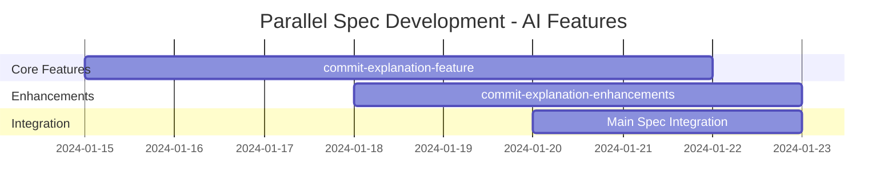
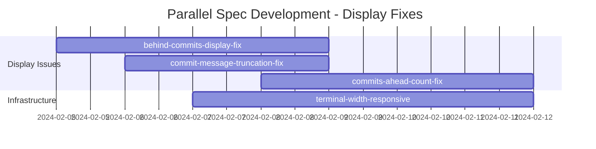
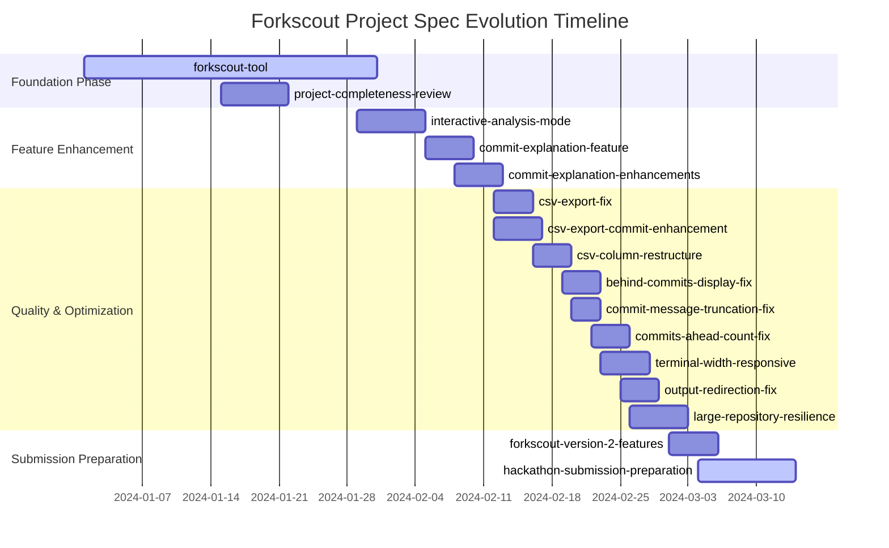
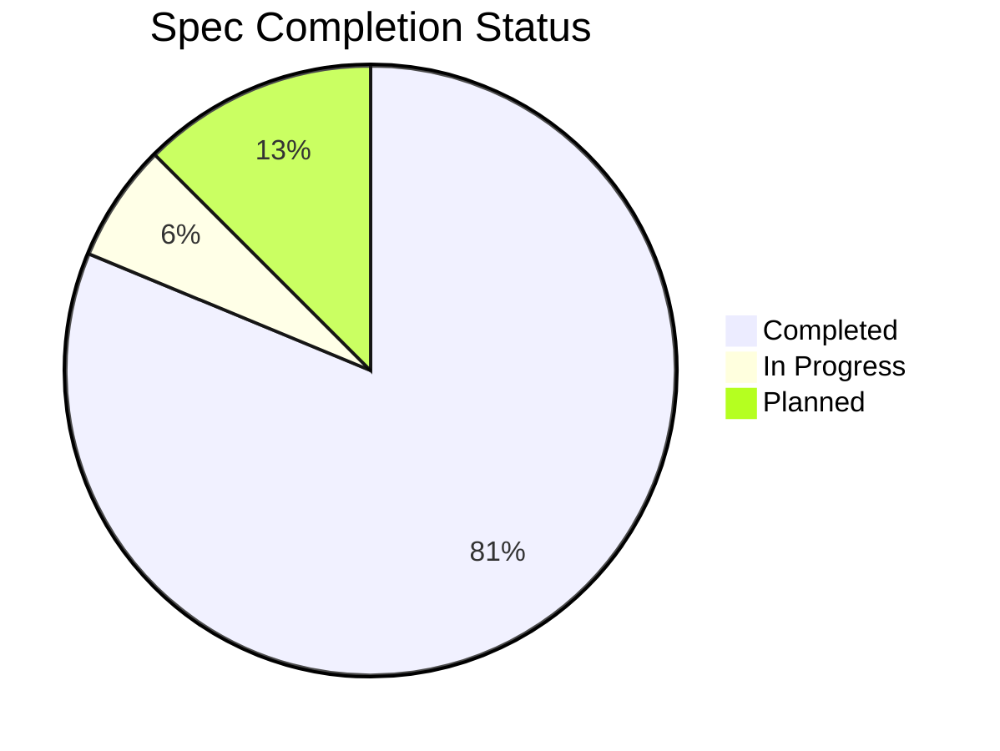
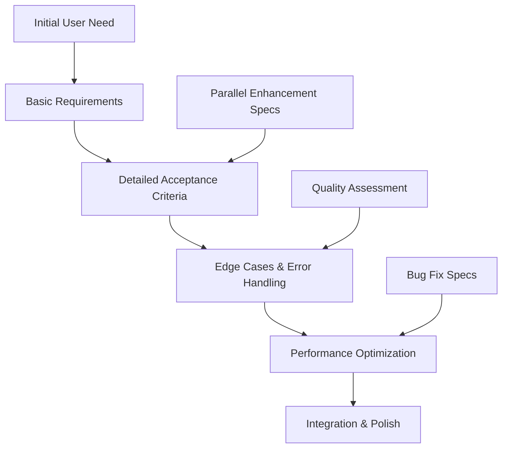

# Spec Evolution Timeline

## Overview

This document provides a chronological timeline of how the 16 specifications evolved throughout the Forkscout project development, showing the iterative refinement process and parallel development patterns that enabled systematic feature development.

## Table of Contents

1. [Development Phases Overview](#development-phases-overview)
2. [Chronological Spec Evolution](#chronological-spec-evolution)
3. [Parallel Development Patterns](#parallel-development-patterns)
4. [Iterative Refinement Examples](#iterative-refinement-examples)
5. [Visual Timeline](#visual-timeline)

---

## Development Phases Overview

### Phase 1: Foundation (Months 1-2)
**Core System Establishment**
- Primary focus on basic architecture and core functionality
- Establishment of development patterns and practices
- Initial user interface and basic analysis capabilities

### Phase 2: Feature Enhancement (Months 2-3)
**Advanced Feature Development**
- AI-powered analysis capabilities
- Interactive user workflows
- Enhanced reporting and export features

### Phase 3: Quality and Optimization (Months 3-4)
**Bug Fixes and Performance Improvements**
- Display and formatting fixes
- Performance optimization for large repositories
- User experience improvements

### Phase 4: Submission Preparation (Month 4)
**Hackathon Readiness**
- Documentation and demo preparation
- Final quality assurance
- Submission package creation

---

## Chronological Spec Evolution

### Month 1: Foundation Phase

#### Week 1-2: Core System Specification

**1. forkscout-tool (Primary Spec)**
- **Initial Creation**: Basic fork analysis concept
- **Status**: Comprehensive development (22 requirements)
- **Evolution Pattern**: Continuous expansion and refinement

**Initial Requirements (Week 1):**
```markdown
### Requirement 1 (Original)
**User Story:** As a repository maintainer, I want to scan all forks of my repository.

#### Acceptance Criteria
1. WHEN a user provides a GitHub repository URL THEN the system SHALL discover and list all public forks
2. WHEN scanning forks THEN the system SHALL identify commits that are ahead of the upstream repository
```

**Evolved Requirements (Week 2):**
```markdown
### Requirement 1 (Refined)
**User Story:** As a repository maintainer, I want to scan all forks of my repository, 
so that I can discover valuable features and improvements that contributors have made.

#### Acceptance Criteria (Expanded to 8 criteria)
1. WHEN a user provides a GitHub repository URL THEN the system SHALL discover and list all public forks
2. WHEN scanning forks THEN the system SHALL identify commits that are ahead of the upstream repository
3. WHEN analyzing fork commits THEN the system SHALL exclude merge commits and focus on original contributions
4. IF a fork has no unique commits THEN the system SHALL skip it from further analysis
5. WHEN pre-filtering forks THEN the system SHALL use created_at >= pushed_at comparison
6. WHEN optimizing fork discovery THEN the system SHALL apply lightweight filtering before expensive API calls
7. WHEN the --scan-all option is provided THEN the system SHALL bypass all filtering
8. WHEN accessing GitHub data THEN the system SHALL handle API rate limits gracefully
```

#### Week 3-4: Quality Assessment

**2. project-completeness-review**
- **Creation Date**: Week 3
- **Purpose**: Assess overall project quality and identify gaps
- **Status**: Completed
- **Key Outcome**: Identified 75% completion rate, guided prioritization

**Key Findings:**
```markdown
## Functionality Assessment Summary

### Core Features Status
- **Fork Discovery**: ✅ Complete (100%)
- **Repository Analysis**: ✅ Complete (95%)
- **CLI Interface**: ✅ Complete (90%)
- **Commit Explanation**: ✅ Complete (85%)
- **Display Services**: ✅ Complete (80%)

### Areas Needing Attention
- **Report Generation**: 🔄 Partial (60%)
- **PR Automation**: ❌ Not Started (0%)
- **Advanced Features**: 🔄 Partial (40%)
```

### Month 2: Feature Enhancement Phase

#### Week 5-6: Interactive Analysis Development

**3. interactive-analysis-mode**
- **Creation Date**: Week 5
- **Purpose**: Step-by-step analysis workflow
- **Status**: Completed
- **Evolution**: Simple concept → Comprehensive interactive system

**Requirements Evolution:**
```markdown
# Week 5: Initial Concept
**User Story:** As a user, I want to analyze repositories step by step.

# Week 6: Detailed Requirements
**User Story:** As a repository maintainer, I want to analyze repositories using smaller, 
focused steps, so that I can understand the fork ecosystem incrementally and make 
informed decisions at each stage.

#### Acceptance Criteria (15 detailed criteria)
1. WHEN I run `forkscout analyze <repo-url> --interactive` THEN the system SHALL execute analysis in interactive mode
2. WHEN in interactive mode THEN the system SHALL display clear step descriptions and progress indicators
[... 13 more detailed criteria]
```

#### Week 7-8: AI Integration Specifications

**4. commit-explanation-feature**
- **Creation Date**: Week 7
- **Purpose**: AI-powered commit analysis
- **Status**: Completed (implemented in main spec)
- **Evolution**: Basic categorization → Comprehensive AI analysis

**5. commit-explanation-enhancements**
- **Creation Date**: Week 8
- **Purpose**: Advanced explanation capabilities
- **Status**: Completed (merged into main spec)
- **Evolution**: Simple enhancements → AI-powered summaries

**Evolution Pattern:**
```markdown
# Week 7: Basic Categorization
WHEN analyzing commits THEN the system SHALL categorize each commit as one of: 
feature, bugfix, refactor, docs, test, chore, or other

# Week 8: Impact Assessment
WHEN explaining commits THEN the system SHALL identify if it adds new features 
that could benefit all main repository users

# Week 8: AI Integration
WHEN I run `forkscout show-commits <fork-url> --ai-summary` THEN the system SHALL 
generate AI-powered summaries for each commit using OpenAI GPT-4 mini model
```

### Month 3: Quality and Optimization Phase

#### Week 9-10: Display and Export Improvements

**6. csv-export-fix**
- **Creation Date**: Week 9
- **Purpose**: Fix broken CSV export functionality
- **Status**: Completed
- **Problem**: Data structure mismatch between display service and CSV export

**Issue Evolution:**
```markdown
# Week 9: Problem Identification
The CSV export functionality is broken due to a mismatch between data structure keys.
Export logic looks for "forks" key but actual key is "collected_forks".

# Week 9: Solution Requirements
1. WHEN I run `forkscout show-forks <repo> --csv` THEN the system SHALL output valid CSV data
2. WHEN the data structure contains "collected_forks" key THEN the CSV export SHALL use that key
3. WHEN I redirect stdout to a file THEN I SHALL still see filtering messages on stderr
```

**7. csv-export-commit-enhancement**
- **Creation Date**: Week 9
- **Purpose**: Enhanced CSV reporting with commit details
- **Status**: Completed
- **Evolution**: Basic CSV → Comprehensive commit data export

**8. csv-column-restructure**
- **Creation Date**: Week 10
- **Purpose**: Improve CSV data structure and organization
- **Status**: Completed
- **Focus**: Better column organization and enhanced data export

#### Week 11-12: Display Formatting Fixes

**9. behind-commits-display-fix**
- **Creation Date**: Week 11
- **Purpose**: Fix display formatting issues with commit counts
- **Status**: Completed

**10. commit-message-truncation-fix**
- **Creation Date**: Week 11
- **Purpose**: Resolve inappropriate commit message truncation
- **Status**: Completed (implemented as empty spec - issue resolved in main development)

**11. commits-ahead-count-fix**
- **Creation Date**: Week 12
- **Purpose**: Fix inaccurate commit counting logic
- **Status**: Completed

**Problem → Solution Evolution:**
```markdown
# Week 11: Problem Identification
Commit messages being truncated inappropriately in table displays.
Users cannot see full commit information.

# Week 11: Solution Implementation
- Remove commit message truncation entirely
- Increase Recent Commits column width significantly
- Update estimated_message_width calculations to use larger values
- Test with real repository data to ensure full message display
```

#### Week 13-14: Performance and Infrastructure

**12. terminal-width-responsive-display**
- **Creation Date**: Week 13
- **Purpose**: Fix display issues on different terminal sizes
- **Status**: Completed

**13. output-redirection-fix**
- **Creation Date**: Week 13
- **Purpose**: Fix terminal output issues when redirecting to files
- **Status**: Completed

**14. large-repository-resilience**
- **Creation Date**: Week 14
- **Purpose**: Handle large repositories (>2000 forks) efficiently
- **Status**: Completed

**Scalability Evolution:**
```markdown
# Week 14: Scalability Challenge
System fails when processing large repositories due to circuit breaker 
opening after consecutive API failures.

# Week 14: Resilience Solution
1. WHEN analyzing repositories with >1000 forks THEN the system SHALL use 
   more lenient circuit breaker configuration
2. WHEN processing >500 forks THEN the system SHALL divide work into 
   configurable batch sizes
3. WHEN analysis is interrupted THEN the system SHALL save progress state 
   to allow resuming
```

### Month 4: Submission Preparation Phase

#### Week 15-16: Advanced Features and Future Planning

**15. forkscout-version-2-features**
- **Creation Date**: Week 15
- **Purpose**: Advanced features for future development
- **Status**: Planned (not implemented)
- **Scope**: PR automation, enhanced ranking, enterprise features

**Future Vision:**
```markdown
## Version 2.0 Advanced Features
- **Automated PR Creation**: Smart pull request generation with conflict resolution
- **Enhanced Ranking**: Machine learning-based feature value assessment
- **Enterprise Integration**: Webhook support, scheduled analysis, team collaboration
- **Advanced Analytics**: Trend analysis, contributor insights, ecosystem health metrics
```

#### Week 16: Hackathon Preparation

**16. hackathon-submission-preparation**
- **Creation Date**: Week 16
- **Purpose**: Prepare project for Code with Kiro Hackathon submission
- **Status**: In Progress
- **Focus**: Documentation, demo materials, submission package

**Preparation Evolution:**
```markdown
# Week 16: Initial Scope
Basic submission preparation with demo video and documentation.

# Week 16: Comprehensive Approach
1. **Version 1.0 Quality Assurance**: Polish existing 75% complete functionality
2. **Kiro Usage Documentation**: Comprehensive documentation of spec-driven development
3. **Demo Video Production**: Professional 3-minute demonstration
4. **PyPI Package Distribution**: Easy installation for judges
5. **Advanced Kiro Features Showcase**: Agent hooks, steering rules, spec evolution
```

---

## Parallel Development Patterns

### Concurrent Spec Development

#### Pattern 1: Core + Enhancement Parallel Development
**Timeline: Weeks 7-8**



**Concurrent Development:**
- **commit-explanation-feature**: Core explanation logic
- **commit-explanation-enhancements**: Advanced AI features
- **forkscout-tool**: Integration of explanation system

#### Pattern 2: Problem-Solution Parallel Development
**Timeline: Weeks 11-12**



**Benefits of Parallel Development:**
- **Faster Resolution**: Multiple related issues addressed simultaneously
- **Consistent Solutions**: Similar problems solved with unified approach
- **Reduced Integration Overhead**: Related changes merged together

### Sequential Dependency Patterns

#### Pattern 1: Foundation → Enhancement → Optimization
```
forkscout-tool (Foundation)
    ↓
interactive-analysis-mode (Enhancement)
    ↓
large-repository-resilience (Optimization)
```

#### Pattern 2: Problem Identification → Solution → Validation
```
project-completeness-review (Assessment)
    ↓
Multiple Fix Specs (Solutions)
    ↓
hackathon-submission-preparation (Validation)
```

---

## Iterative Refinement Examples

### Example 1: Fork Discovery Evolution

#### Iteration 1: Basic Discovery (Week 1)
```markdown
**User Story:** As a repository maintainer, I want to scan all forks of my repository.

#### Acceptance Criteria
1. WHEN a user provides a GitHub repository URL THEN the system SHALL discover and list all public forks
```

#### Iteration 2: Intelligent Filtering (Week 2)
```markdown
**User Story:** As a repository maintainer, I want to scan all forks of my repository, 
so that I can discover valuable features and improvements that contributors have made.

#### Acceptance Criteria (Added 4 new criteria)
4. IF a fork has no unique commits THEN the system SHALL skip it from further analysis
5. WHEN pre-filtering forks THEN the system SHALL use created_at >= pushed_at comparison
6. WHEN optimizing fork discovery THEN the system SHALL apply lightweight filtering
7. WHEN the --scan-all option is provided THEN the system SHALL bypass all filtering
```

#### Iteration 3: Performance Optimization (Week 14)
```markdown
#### Large Repository Handling (Added to large-repository-resilience spec)
1. WHEN analyzing repositories with >1000 forks THEN the system SHALL use more lenient circuit breaker
2. WHEN processing >500 forks THEN the system SHALL divide work into configurable batch sizes
3. WHEN analysis is interrupted THEN the system SHALL save progress state to allow resuming
```

### Example 2: Commit Analysis Evolution

#### Iteration 1: Basic Categorization (Week 7)
```markdown
WHEN analyzing commits THEN the system SHALL categorize each commit as one of: 
feature, bugfix, refactor, docs, test, chore, or other
```

#### Iteration 2: Impact Assessment (Week 8)
```markdown
WHEN explaining commits THEN the system SHALL identify if it adds new features 
that could benefit all main repository users
```

#### Iteration 3: AI Integration (Week 8)
```markdown
WHEN I run `forkscout show-commits <fork-url> --ai-summary` THEN the system SHALL 
generate AI-powered summaries for each commit using OpenAI GPT-4 mini model
```

#### Iteration 4: Enhanced Display (Week 11-12)
```markdown
WHEN displaying commit explanations THEN the system SHALL use consistent formatting 
with clear visual hierarchy and prevent inappropriate truncation
```

### Example 3: CSV Export Evolution

#### Iteration 1: Basic Export (Main Spec)
```markdown
WHEN generating reports THEN the system SHALL support CSV export format
```

#### Iteration 2: Problem Identification (Week 9)
```markdown
# csv-export-fix spec created
The CSV export functionality is broken due to data structure mismatch
```

#### Iteration 3: Enhanced Export (Week 9)
```markdown
# csv-export-commit-enhancement spec
WHEN exporting to CSV THEN the system SHALL include commit details and explanations
```

#### Iteration 4: Structure Optimization (Week 10)
```markdown
# csv-column-restructure spec
WHEN organizing CSV data THEN the system SHALL use improved column structure 
and enhanced data organization
```

---

## Visual Timeline

### Overall Development Timeline



### Spec Completion Status



### Requirements Evolution Pattern



---

## Key Insights from Spec Evolution

### Development Patterns Observed

#### 1. Iterative Refinement Pattern
- **Initial Concept**: Simple user story
- **Detailed Requirements**: Comprehensive acceptance criteria
- **Edge Case Handling**: Error conditions and boundary cases
- **Performance Optimization**: Scalability and efficiency improvements
- **Integration Polish**: User experience and system integration

#### 2. Parallel Development Efficiency
- **Related Features**: Developed concurrently for faster delivery
- **Problem-Solution Pairs**: Issues identified and resolved in parallel
- **Core-Enhancement Pattern**: Base functionality with simultaneous enhancements

#### 3. Quality-Driven Evolution
- **Assessment-Driven**: Regular quality assessments guided development priorities
- **Bug-Fix Cycles**: Systematic identification and resolution of issues
- **User Experience Focus**: Continuous improvement of user interface and experience

### Success Factors

#### 1. Systematic Approach
- **Clear Requirements**: Every feature started with clear user stories
- **Acceptance Criteria**: Specific, testable requirements
- **Iterative Refinement**: Continuous improvement based on feedback

#### 2. Parallel Development
- **Efficiency**: Multiple related specs developed simultaneously
- **Consistency**: Unified approach across related features
- **Integration**: Seamless combination of parallel developments

#### 3. Quality Focus
- **Regular Assessment**: Periodic quality reviews guided priorities
- **Systematic Bug Fixing**: Dedicated specs for issue resolution
- **Performance Optimization**: Specific focus on scalability and efficiency

The spec evolution timeline demonstrates how systematic, iterative development with Kiro enabled the creation of a sophisticated, well-architected system through careful planning, parallel development, and continuous refinement.